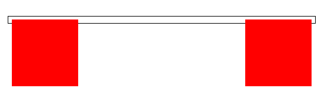
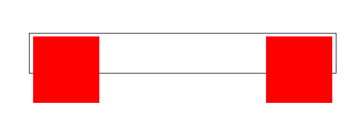
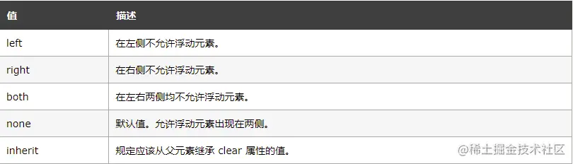
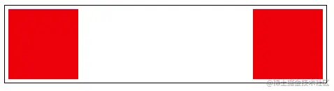
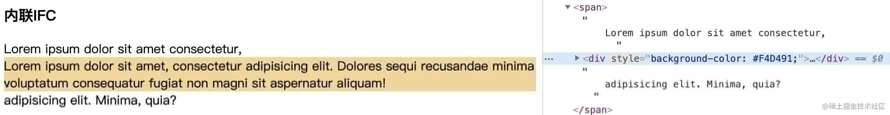
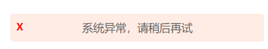
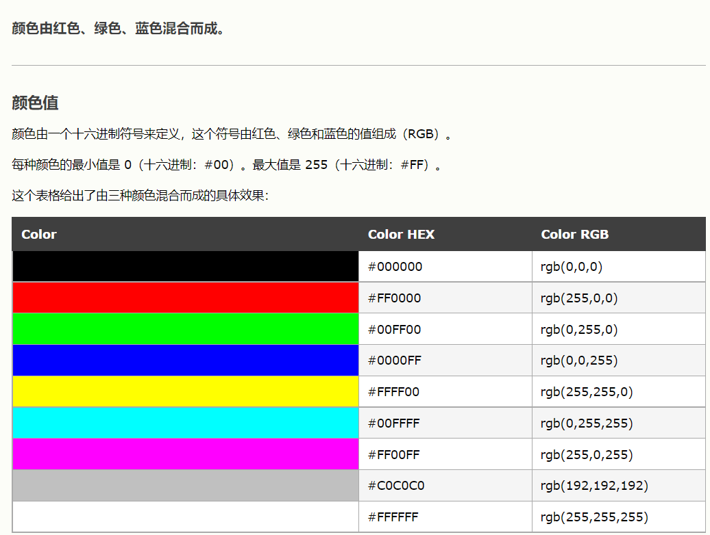
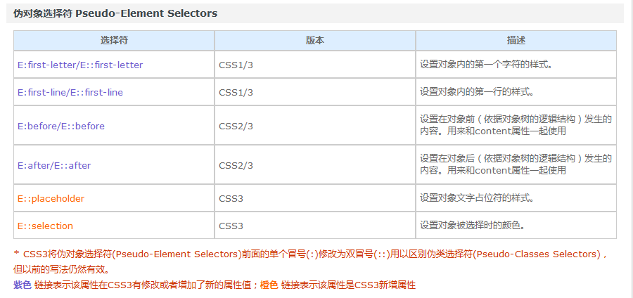

##  标准盒模型和IE盒模型

> 我们目前所学习的知识中，以标准盒子模型为准。

标准盒子模型：


IE盒子模型：


上图显示：

在 CSS 盒子模型 (Box Model) 规定了元素处理元素的几种方式：

- width和height：**内容**的宽度、高度（不是盒子的宽度、高度）。
- padding：内边距。
- border：边框。
- margin：外边距。

CSS盒模型和IE盒模型的区别：

- 在 **标准盒子模型**中，**width 和 height 指的是内容区域**的宽度和高度。增加内边距、边框和外边距不会影响内容区域的尺寸，但是会增加元素框的总尺寸。
- **IE盒子模型**中，**width 和 height 指的是内容区域+border+padding**的宽度和高度。

注：Android中也有margin和padding的概念，意思是差不多的，如果你会一点Android，应该比较好理解吧。区别在于，Android中没有border这个东西，而且在Android中，margin并不是控件的一部分，我觉得这样做更合理一些，呵呵。

## 清除浮动

示例代码

```html
<div class="box">
        <div class="left"></div>
        <div class="right"></div>
        <!-- <div class="clearfix"></div> -->
    </div>
```

```css
.box {}
.left {
    ...
    float: left;
}
.right {
    ...
    float: right;
}
```

如果只有子级元素浮动，父元素内没有其他元素支撑便会塌陷



**1.一浮多浮**

```
.box{float: left}
```

那么就将父级元素也跟着浮动，都脱离标准文档流

**缺点：**父级设置成浮动了，那爷爷级肯定又会受影响，又得解决爷爷级的高度坍塌，这不是无限套娃吗？？

**2.父级设置绝对定位（absoluate）**

```
.box{ position: absolute}
```

`position:absolute脱离文档流`达到父级浮动目的

缺点：`position:absolute`也会`脱离文档流`啊，影响了整体布局，这不是给自己找罪受吗？

**3.父级设置overflow:hidden**

```
.box{overflow: hidden;}
```

缺点：当文本过长，且包含过长英文时，会出现英文文本被隐藏的情况

**4.父级定宽高**

```
.box{width: 450px;
        height: 50px;}
```

缺点：父级宽高受子级元素限制，无法处理子级动态宽高带来的适配问题

//若子元素超过50px



**5.末尾添加空元素设置clear**

关于`clear`：

 `bottomDiv`设置成`clear:both`，代表了它左右都不能有浮动元素，这迫使了他往下移动，进而撑开了父级盒子的高度。

```js
<div class="box">
        <div class="left"></div>
        <div class="right"></div>
        <div class="bottomDiv"></div>
</div>

.bottomDiv {
            clear: both;
        }
```



**缺点：**增加了一个多余的`div`标签，增加了页面的`渲染负担`

**6.父级添加伪元素+clear**

```
.box::after {
            content: '.';
            height: 0;
            display: block;
            clear: both;
        }
```

**伪元素不存在文档树结构中**，优化了上面的添加clearfix元素问题

文档定位方式

## 三种文档定位方式

在讲BFC的原理之前先看看html文档的三种定位方式

**普通流**

> 元素按照其在HTML中的先后位置自上而下布局
>
> **行内元素水平排列，直到当行被占满然后换行**
>
> **块级元素则会被渲染为完整的一个新行**，除非另外指定，否则所有元素默认都是普通流定位
>
> 也就是说**普通流中元素的位置由该元素在HTML文档中的位置决定。**

**浮动**

> 在浮动定位中，元素**首先按照普通流的位置出现，然后根据浮动的方向尽可能的向左边或右边偏移**

**绝对定位**

> 在绝对定位中，元素会**整体脱离普通流**，因此绝对定位元素不会对其兄弟元素造成影响，而元素**具体的位置由绝对定位的坐标决定。**

## BFC

**什么是BFC**

**块格式化上下文（Block Formatting Context，BFC）** 

**其实BFC是上面三种布局方式中的普通流**

BFC会产生一个独立的容器，该容器内部的元素**不会在布局上影响到外部的元素**，在外部的普通流看来它和其他普通流元素无差别，文档最终会按照上面说的普通流计算布局。


**BFC的注意事项**

- 浮动定位和清除浮动时只会**应用于同一个BFC内的元素**。 
- **浮动不会影响其它BFC中元素的布局，而清除浮动只能清除同一BFC中在它前面的元素的浮动。** 
- 外边距折叠也只会发生在属于同一BFC的块级元素之间。


**浏览器对BFC的限制**

1.在BFC包含块的盒子**一个一个不重叠地垂直排列**

2.属于**同一个BFC的两个相邻Box的margin会发生折叠**，**不同BFC不会发生折叠**。

3.**每个元素的左外边距与包含块的左边界相接触**（从左向右），即使浮动元素也是如此。

4.**BFC的区域不会与float的元素区域重叠**

5.计算BFC的高度时，**浮动子元素也参与计算**


**BFC的用途**

1.防止外边距重叠

2.清除浮动


**触发条件**

- 根元素，即`HTML`标签

- 浮动元素：`float`值为`left/right`

- overflow:hidden/auto/scroll
- display`值为` inline-block、table-cell、table-caption、table、inline-table、flex、inline-flex、- - grid、inline-grid

- 定位元素：`position`值为 `absolute/fixed`


**常见使用**

**为什么overflow:hidden可以清除浮动？**

overflow: hidden使得外层元素产生了一个BFC，**BFC的高度计算包含其内部的浮动元素**，从而达到清除浮动效果


**内联元素中使用块级元素会产生什么效果？**

> 内联元素中插入块级元素会在插入的块级元素前后各产生一个匿名块与插入的块按照普通流进行定位




**🍓内联元素中使用插入浮动元素会产生什么效果？**

> 内联元素使用了display: inline-block会产生一个IFC，其内部的浮动会在内部进行浮动定位，然后整个IFC看成一个块级元素与外部进行文档流定位


## 伪类伪元素

- **伪类**：以冒号(:)开头，用于**选择处于特定状态的元素。**
- **伪元素**：以双冒号(::)开头，用于在文档中**插入虚构的元素。**

两者用法区别

- 伪类用于**向某些已经存在的选择器添加特殊效果（当状态改变时）**
- 伪元素用于**将特殊效果添加到不存在的虚拟元素中（浏览器自动创建）**


也就是说**伪类的本质还是类（class）**，作用于标签本身，只不过限定了状态条件；

而**伪元素的本质是元素（element）**，作用于该虚拟元素的内容本身。


下面的表格详细记录了各种伪类及其描述：

- [✅](https://link.juejin.cn?target=https%3A%2F%2Fcaniuse.com%2F%3Fsearch%3D%3Aactive) 代表主流浏览器都支持（至少 95% 以上）
- [❌](https://link.juejin.cn?target=https%3A%2F%2Fcaniuse.com%2F%3Fsearch%3D%3Anth-child) 代表大部分主浏览器都不支持（仅 20% 以下浏览器实现该特性）
- ⚠️ 代表部分浏览器支持（可能需要加前缀，例如 `:webkit-`或 `:-moz-`等）

| **伪类**                      | **描述**                            | **兼容性**                                                   |
| ----------------------------- | ----------------------------------- | ------------------------------------------------------------ |
| `:active`                     | 元素处于活动状态时                  | [✅](https://link.juejin.cn?target=https%3A%2F%2Fcaniuse.com%2F%3Fsearch%3D%3Aactive) |
| `:focus`                      | 元素已获取焦点时                    | [✅](https://link.juejin.cn?target=https%3A%2F%2Fcaniuse.com%2F%3Fsearch%3D%3Afocus) |
| `:hover`                      | 元素处于悬浮状态时                  | [✅](https://link.juejin.cn?target=https%3A%2F%2Fcaniuse.com%2F%3Fsearch%3D%3Ahover) |
| `:link`                       | 链接未访问时                        | [✅](https://link.juejin.cn?target=https%3A%2F%2Fcaniuse.com%2F%3Fsearch%3D%3Alink) |
| `:visited`                    | 链接已访问时                        | [✅](https://link.juejin.cn?target=https%3A%2F%2Fcaniuse.com%2F%3Fsearch%3D%3Avisited) |
| `:first-child`                | 元素是首个子元素时                  | [✅](https://link.juejin.cn?target=https%3A%2F%2Fcaniuse.com%2F%3Fsearch%3D%3Afirst-child) |
| `:last-child`                 | 元素是最后一个子元素时              | [✅](https://link.juejin.cn?target=https%3A%2F%2Fcaniuse.com%2F%3Fsearch%3D%3Alast-child) |
| `:nth-child()`                | 元素是第 n 个子元素时               | [✅](https://link.juejin.cn?target=https%3A%2F%2Fcaniuse.com%2F%3Fsearch%3D%3Anth-child) |
| `:nth-last-child()`           | 元素是倒数第 n 个子元素时           | [✅](https://link.juejin.cn?target=https%3A%2F%2Fcaniuse.com%2F%3Fsearch%3D%3Anth-last-child) |
| `:only-child`                 | 元素是唯一子元素时                  | [✅](https://link.juejin.cn?target=https%3A%2F%2Fcaniuse.com%2F%3Fsearch%3D%3Aonly-child) |
| `:first-of-type`              | 元素是首个特定类型的子元素时        | [✅](https://link.juejin.cn?target=https%3A%2F%2Fcaniuse.com%2F%3Fsearch%3D%3Afirst-of-type) |
| `:last-of-type`               | 元素是最后一个特定类型的子元素时    | [✅](https://link.juejin.cn?target=https%3A%2F%2Fcaniuse.com%2F%3Fsearch%3D%3Alast-of-type) |
| `:nth-of-type()`              | 元素是第 n 个特定类型的子元素时     | [✅](https://link.juejin.cn?target=https%3A%2F%2Fcaniuse.com%2F%3Fsearch%3D%3Anth-of-type) |
| `:nth-last-of-type()`         | 元素是倒数第 n 个特定类型的子元素时 | [✅](https://link.juejin.cn?target=https%3A%2F%2Fcaniuse.com%2F%3Fsearch%3D%3Anth-last-of-type) |
| `:only-of-type`               | 元素是唯一的特定类型的子元素时      | [✅](https://link.juejin.cn?target=https%3A%2F%2Fcaniuse.com%2F%3Fsearch%3D%3Aonly-of-type) |
| `:not`                        | 不满足指定条件时                    | [✅](https://link.juejin.cn?target=https%3A%2F%2Fcaniuse.com%2F%3Fsearch%3D%3Anot) |
| `:target`                     | 元素 id 匹配到哈希值时              | [✅](https://link.juejin.cn?target=https%3A%2F%2Fcaniuse.com%2F%3Fsearch%3D%3Atarget) |
| `:root`                       | 元素是文档树的根元素时              | [✅](https://link.juejin.cn?target=https%3A%2F%2Fcaniuse.com%2F%3Fsearch%3D%3Aroot) |
| `:lang()`                     | 匹配到指定语言时                    | [✅](https://link.juejin.cn?target=https%3A%2F%2Fcaniuse.com%2F%3Fsearch%3D%3Alang) |
| `:empty`                      | 元素处于没有子元素状态时            | [✅](https://link.juejin.cn?target=https%3A%2F%2Fcaniuse.com%2F%3Fsearch%3D%3Aempty) |
| `:invalid` 和 `:valid`        | 表单项是否有效                      | [✅](https://link.juejin.cn?target=https%3A%2F%2Fcaniuse.com%2F%3Fsearch%3D%3Avalid) |
| `:required` 和 `:optional`    | 表单项是否必填                      | [✅](https://link.juejin.cn?target=https%3A%2F%2Fcaniuse.com%2F%3Fsearch%3D%3Arequired) |
| `:in-range`和 `:out-of-range` | 表单项是否超出范围                  | [✅](https://link.juejin.cn?target=https%3A%2F%2Fcaniuse.com%2F%3Fsearch%3D%3Ain-range) |
| `:read-only`和 `:read-write`  | 表单项是否只读                      | [✅](https://link.juejin.cn?target=https%3A%2F%2Fcaniuse.com%2F%3Fsearch%3D%3Aread-only) |
| `:enabled`和 `:disabled`      | 表单项是否禁用                      | [✅](https://link.juejin.cn?target=https%3A%2F%2Fcaniuse.com%2F%3Fsearch%3D%3Aenabled) |
| `:fullscreen`                 | 当前处于全屏显示模式时              | [⚠️](https://link.juejin.cn?target=https%3A%2F%2Fcaniuse.com%2F%3Fsearch%3D%3Afullscreen) |
| `:blank`                      | 输入框处于输入为空状态时            | ❌                                                            |
| `:dir()`                      | 匹配到特定文字书写方向时            | [❌](https://link.juejin.cn?target=https%3A%2F%2Fcaniuse.com%2F%3Fsearch%3D%3Adir) |

**伪元素有哪些？**

| **伪元素**               | **选中或创建出来的元素**               | **兼容性**                                                   |
| ------------------------ | -------------------------------------- | ------------------------------------------------------------ |
| `::first-letter`         | 选中块状元素中的首字母                 | [✅](https://link.juejin.cn?target=https%3A%2F%2Fcaniuse.com%2F%3Fsearch%3D%3A%3Afirst-letter) |
| `::first-line`           | 选中首行                               | [✅](https://link.juejin.cn?target=https%3A%2F%2Fcaniuse.com%2F%3Fsearch%3D%3A%3Afirst-line) |
| `::before`               | 在之前创建一个不在文档树中的元素       | [✅](https://link.juejin.cn?target=https%3A%2F%2Fcaniuse.com%2F%3Fsearch%3D%3A%3Abefore) |
| `::after`                | 在之后创建一个不在文档树中的元素       | [✅](https://link.juejin.cn?target=https%3A%2F%2Fcaniuse.com%2F%3Fsearch%3D%3A%3Aafter) |
| `::placeholder`          | 选中表单元素的占位文本                 | [✅](https://link.juejin.cn?target=https%3A%2F%2Fcaniuse.com%2F%3Fsearch%3D%3A%3Aplaceholder) |
| `::file-selector-button` | 选中类型为 file 的 input 里面的 button | [✅](https://link.juejin.cn?target=https%3A%2F%2Fcaniuse.com%2F%3Fsearch%3D%3A%3Afile-selector-button) |
| `::selection`            | 选中被用户高亮的部分                   | [⚠️](https://link.juejin.cn?target=https%3A%2F%2Fcaniuse.com%2F%3Fsearch%3D%3A%3Aselection) |
| `::backdrop`             | 选中视觉聚焦元素后面的背景元素         | [⚠️](https://link.juejin.cn?target=https%3A%2F%2Fcaniuse.com%2F%3Fsearch%3D%3A%3Abackdrop) |
| `::marker`               | 选中 list 的 marker                    | [⚠️](https://link.juejin.cn?target=https%3A%2F%2Fcaniuse.com%2F%3Fsearch%3D%3A%3Amarker) |

**经典使用**

1.错误提示

```
<div className="error-message">系统异常，请稍后再试</div>

//css
.error-message {
  position: relative;
  color: #666666;
  padding: 12px 30px;
  background-color: #FFECE4;
  border-radius: 5px;
}

.error-message::before {
  content: '';
  background-image: url('/public/icon-error.svg');
  background-size: 15px;
  position: absolute;
  left: 10px;
  display: inline-block;
  width: 15px;
  height: 15px;
}
```



注意：创建 `::before`和 `::after`的元素时，必须要设置 content 属性，否则就不存在了。另外宿主元素的 position 别忘记设置成 relative 或 absolute 了，否则布局可能会乱掉。

## css动态样式修改

核心在于利用js来操作CSSOM以实现动态样式修改

- **js动态设置className**

```
//获取指定元素class属性
let cName = element.classList;
//使用api操作classList
```

**备注：** 使用名称`className`而不是`class`作为属性名，是因为"class" 在 JavaScript 中是个保留字。

**扩展：Element.classList**

**`Element.classList`** 是一个只读属性，返回一个元素 `class` 属性的动态 [`DOMTokenList`](https://developer.mozilla.org/zh-CN/docs/Web/API/DOMTokenList) 集合。这可以用于操作 class 集合。

相比将 [`element.className`](https://developer.mozilla.org/zh-CN/docs/Web/API/Element/className) 作为以空格分隔的字符串来使用，`classList` 是一种更方便的访问元素的类列表的方法。

**api**

```js
// 使用 classList API 移除、添加类值
div.classList.remove("foo");
div.classList.add("anotherclass");

// 添加或移除多个类值
div.classList.add("foo", "bar", "baz");
div.classList.remove("foo", "bar", "baz");

// 如果 visible 类值已存在，则移除它，否则添加它
div.classList.toggle("visible");

// 将类值 "foo" 替换成 "bar"
div.classList.replace("foo", "bar");
```


- **修改CSSStyleSheet**

**`CSSStyleSheet`** 接口代表一个 [CSS](https://developer.mozilla.org/zh-CN/docs/Web/CSS) 样式表，并允许检查和编辑样式表中的规则列表。它从父类型 [`StyleSheet`](https://developer.mozilla.org/zh-CN/docs/Web/API/StyleSheet) 继承属性和方法。

第一步：获取样式

```js
//获取文档中的styleSheets
let styleSheets=document.styleSheets
//获取需要修改的样式所在页数
let styleSheet=styleSheets[index]
//index根据目标样式所在style标签或者外链样式表在文档中的声明位置决定，从0开始计算
```

第二步：操作cssRule

1.cssRule返回一个实时的CSSRuleList

```js
//直接设置样式表中某个样式的某条属性
styleSheet.cssRules[index].style.propertyName=...
//index由该样式在一条css规则内部的声明顺序决定）
```

2.styleSheet的api（操作styleSheet的规则）

这里是插入一条css规则也就是一对大括号内容，如#someid{...}

```js
stylesheet.insertRule(rule [, index])//默认头部插入相当于stylesheet.insertRule('.test{width:100px;}',0)
stylesheet.deleteRule(index)
```

3.cssRule.styleMap

使用styleMap相当于style，但是对其使用做了封装

```
styleSheet.cssRules[index].styleMap.set(propertyName, value)
```


- **Element.style修改行内样式**

```
//对于行内样式可以使用Element.style进行修改
element.style.background=red
```


- **Element.setAttribute**

获得元素的引用，然后使用它的 [`setAttribute`](https://developer.mozilla.org/en-US/DOM/element.setAttribute) 方法，指定 CSS 属性和值，来改变该元素的样式。

```
element.setAttribute('style', cssrule-item)
//示例
 color_list.setAttribute('style', 'cursor:default;')
```

## CSS中的@规则

@media

@supports

@document*(推迟至 CSS Level 4 规范)*

## 颜色



注意：

**颜色名**

大多数的浏览器都支持颜色名集合。

**提示：**仅仅有 16 种颜色名被 W3C 的 HTML4.0 标准所支持。

它们是：aqua, black, blue, fuchsia, gray, green, lime, maroon, navy, olive, purple, red, silver, teal, white, yellow。

如果需要使用其它的颜色，需要使用十六进制的颜色值。

https://www.w3school.com.cn/html/html_colornames.asp

## CSS解析顺序

CSS匹配不是从左到右进行查找，而是**从右到左进行查找**。

如果从左到右的顺序，那么每条选择器都需要**遍历整个DOM树，性能很受影响**。

所谓**高效的CSS就是让浏览器在查找style匹配的元素的时候尽量进行少的查找,** 

所以选择器最好写的简洁一点。

## link和import引入区别


## CSS选择器

```ini
	 div 标签选择器
     .box 类名选择器
     #box　id选择器
     div p 后代选择器
     div.box 交集选择器
     div,p,span 并集选择器
     div>p 子代选择器
     * : 通配符
     div+p: 选中div后面相邻的第一个p
     div~p: 选中的div后面所有的p
```

**一些来自c3的选择器**

**1.属性选择器`[]`**

```
c3增加
^：开头  $：结尾  *：包含
```

格式：

- `E[title]` 选中页面的E元素，并且E存在 title 属性即可。

- `E[title="abc"]`选中页面的E元素，并且E需要带有title属性，且属性值**完全等于**abc。

- `E[attr~=val]` 选择具有 attr 属性且属性值为是**以空格分隔的字词列表，其中一个等于 val 的E元素**。

  - ```ini
    <li tag="lilast litest">111222</li>
    /*选择tag字词列表中包含litest的元素*/
    li[tag~="litest"] {
            color: red;
        }
    ```

- `E[attr|=val]` 选择具有attr属性，且属性值**以val开头或后续以 '-' 连接的E元素**

- ```ini
  <li tag="lilast-litest">111222</li>
  li[tag|="lilast"] {
          color: red;
      }
  ```

- `E[title^="abc"]` 选中页面的E元素，并且E需要带有 title 属性,属性值以 abc **开头**。

- `E[title$="abc"]` 选中页面的E元素，并且E需要带有 title 属性,属性值以 abc **结尾**。

- `E[title*="abc"]` 选中页面的E元素，并且E需要带有 title 属性,属性值**任意位置包含**abc。


**2.结构伪类选择器**

**第一部分**

- `E:first-child` 匹配父元素的第一个子元素E。
- `E:last-child` 匹配父元素的最后一个子元素E。
- `E:nth-child(n)` 匹配父元素的第n个子元素E。**注意**，盒子的编号是从`1`开始算起，不是从`0`开始算起。
- `E:nth-child(odd)` 匹配奇数//等价为`E:nth-child(2n)`
- `E:nth-child(even)` 匹配偶数//等价为`E:nth-child(2n+1)`
- `E:nth-last-child(n)` 匹配父元素的倒数第n个子元素E。

！！！E是子元素

```ini
<ul>
	<li>
	...
<ul>
//li:first- child
li:nth-child(-n+5)，则表示前5个 li。
li:nth-last-child(-n+5)，则表示最后5个 li。
li:nth-child(7n)，则表示选中7的倍数。。

只要记住： n 表示 0,1,2,3,4,5,6,7,8.....就很容易明白了。当然n不能等于0
```

**第二部分**

- `E:first-of-type` 匹配同类型中的第一个同级兄弟元素E。
- `E:last-of-type` 匹配同类型中的最后一个同级兄弟元素E。
- `E:nth-of-type(n)` 匹配同类型中的第n个同级兄弟元素E。
- `E:nth-last-of-type(n)` 匹配同类型中的倒数第n个同级兄弟元素E。

既然上面这几个选择器带有`type`，我们可以这样理解：先**在同级里找到所有的E类型，然后根据 n 进行匹配。**


**3.伪元素选择器**



## CSS选择器权重

即根据css规则判定的选择器优先级，权重大的会覆盖掉权重小的

**优先级顺序**

| 类型         | 权重       |
| ------------ | ---------- |
| *            | 0，0，0，0 |
| 元素/伪元素  | 0，0，0，1 |
| 类/伪类/属性 | 0，0，1，0 |
| ID           | 0，1，0，0 |
| 行内式       | 1，0，0，0 |
| !import      | 无穷大     |

 **!important>行内样式>ID选择器 > 类选择器 | 属性选择器 | 伪类选择器 > 元素选择器**

斗帝》斗圣》斗尊》斗宗...一个斗帝打无数个斗圣，一个斗圣打无数个斗尊，权重不能越级挑战，一个id选择器，秒杀所有类选择器

**注意点：**

- 如果两个权重不同的选择器作用在同一元素上，**权重值高的css规则生效**
- 如果两个相同权重的选择器作用在同一元素上：**以后面出现的选择器为最后规则.**
- 权重相同时，与元素距离近的选择器生效（如外链css规则和html中定义的规则）

## CSS中属性的继承性

**tips：记一下默认继承的剩下就是默认不继承的**

**默认继承的 ("Inherited: Yes") 的属性：**

- 所有元素默认继承：**visibility、cursor**
- **文本属性默认继承**：letter-spacing、word-spacing、white-space、line-height、color、font、 font-family、font-size、font-style、font-variant、font-weight、text-indent、text-align、text-shadow、text-transform、direction
- **列表元素默认继承**：list-style、list-style-type、list-style-position、list-style-image
- **表格元素默认继承**：border-collapse

**默认不继承的("Inherited: No") 的属性：**

- 所有元素默认不继承：all、display、overflow、contain
- 文本属性默认不继承：vertical-align、text-decoration、text-overflow
- 盒子属性默认不继承：width、height、padding、margin、border、min-width、min-height、max-width、max-height
- 背景属性默认不继承：background、background-color、background-image、background-repeat、background-position、background-attachment
- 定位属性默认不继承：float、clear、position、top、right、bottom、left、z-index
- 内容属性默认不继承：content、counter-reset、counter-increment
- 轮廓属性默认不继承：outline-style、outline-width、outline-color、outline
- 页面属性默认不继承：size、page-break-before、page-break-after
- 声音属性默认不继承：pause-before、pause-after、pause、cue-before、cue-after、cue、play-during

## visibility

CSS 属性 `visibility` 显示或隐藏元素而不更改文档的布局。该属性还可以隐藏 表格table 中的行或列

```
/* Keyword values */
visibility: visible;
visibility: hidden;
visibility: collapse;

/* Global values */
visibility: inherit;
visibility: initial;
visibility: unset;
```

- **visible**

元素正常显示。

- **hidden**

隐藏元素，但是其他元素的布局不改变，相当于此元素变成透明。要注意若将其子元素设为 `visibility: visible`，则该子元素依然可见。

子元素上定义的事件无法触发

- **collapse**

`collapse` 关键字对于不同的元素有不同的效果：

- **用于表格行、列、列组和行组，隐藏表格的行或列**，并取消隐藏部分的空间占用（与将 `display: none` 用于表格的行/列上的效果相当）。不影响其他行列但是，就好像折叠的行或列中的单元格一样。**此值允许从表中快速删除行或列，而不强制重新计算整个表的宽度和高度。**
- 折叠的弹性项目被隐藏，他们将占用的空间被删除。
- 对于 [XUL](https://developer.mozilla.org/zh-CN/docs/Mozilla/Tech/XUL) 元素，元素的计算大小始终为零，而且通常会忽略影响大小的其他样式，尽管边距仍然有效。
- 对于其他元素，折叠处理与隐藏相同。

## filter:alpha()和opacity

filter:alpha()与opacity都是用来设置透明度的，区别就在于兼容性的问题，**opacity支持高版本的浏览器，IE8以上不包含IE8.**

- **opacity**
  1.opacity的取值范围在0到1之间，1代表完全不透明。
- **filter:alpha()**
  1.filter:alpha(opacity=20）表示设置透明度为20，其中透明度范围为0-100，100为不透明。

**filter:alpha()语法**

```css
filter：alpha（opacity，finishopacity，style，startX，startY，finishX，finishY）

//finishopacity：设置渐变的透明效果时，用来指定结束时的透明度，范围也是0 到 100。
//style：设置渐变透明的样式，值为0代表统一形状、1代表线形、2代表放射状、3代表长方形。
//startX和startY：渐变透明效果的开始X和Y坐标。
//finishX和finishY：渐变透明效果结束X和Y 的坐标。
```

## 超链接的link、vlink、alink

超链接文字的状态可以通过伪类选择符＋样式规则来控制。 

一组专门的预定义的类称为伪类，主要用来处理超链接的状态。超链接文字的状态可以通过伪类选择符＋样式规则来控制。伪类选择符包括：

① **a:link**：未访问链接 ,如 .mycls a:link {color:blue}
② **a:visited**：已访问链接 ,
③ **a:active**：激活时（链接获得焦点时）链接的颜色 ,
④ **a:hover**：鼠标移到链接上时 ,

一般a:hover和a:visited链接的状态（颜色、下划线等）应该是相同的。

**前三者分别对应body元素的link、vlink、alink这三个属性。**

四个“状态”的先后过程是：a:link ->a:hover ->a:active ->a:visited。另外，a:active不能设置有无下划线（总是有的）。

## img元素底部为何有空白

CSS对于 display: inline 元素的 **vertical-align 默认值是 baseline**，这是一个西文排版才有的概念

可以看到，出现在[baseline](https://www.zhihu.com/search?q=baseline&search_source=Entity&hybrid_search_source=Entity&hybrid_search_extra={"sourceType"%3A"answer"%2C"sourceId"%3A18615056})下面的是 p 啊，q 啊,  g 啊这些字母下面的那个尾巴。

对比一下 vertical-align 的另外两个常见值，top 和 bottom:


**inline 的图片下面那一道空白正是 baseline 和 bottom 之间的这段距离**。

即使只有图片没有文字，只要是 [inline](https://www.zhihu.com/search?q=inline&search_source=Entity&hybrid_search_source=Entity&hybrid_search_extra={"sourceType"%3A"answer"%2C"sourceId"%3A18615056}) 的图片这段空白都会存在。

解决

1. line-height=0
2. font-size=0

## CSS定位

position

relative

absolute

fixed

使用 `fixed` 进行布局的元素，在一般情况下会相对于屏幕视窗来进行定位。但是如果父元素的 **`transform`, `perspective` 或 `filter` 属性不为 `none`** 时，position为`fixed` 的元素就会相对于父元素来进行定位。

static

sticky

## CSS3新特性

