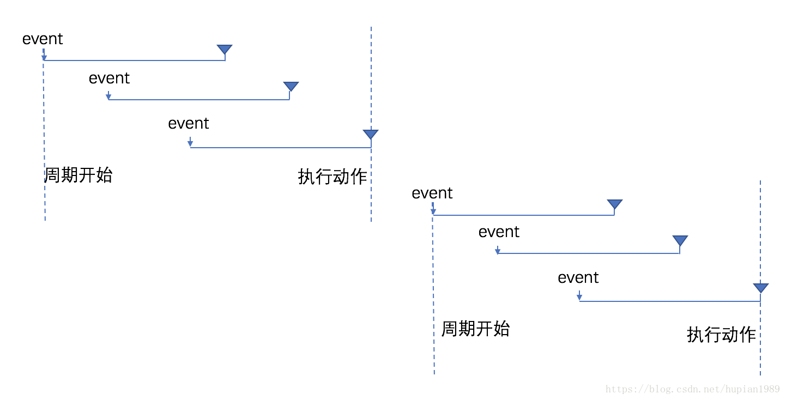
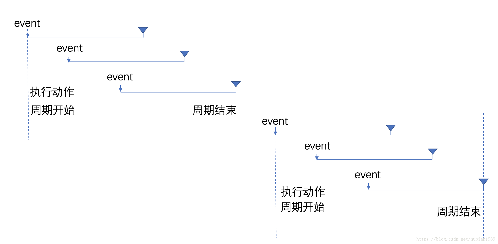

# 优化手段

## **防抖**

DOM绑定事件，当事件被触发时，设定一个周期延迟执行动作，若期间又被触发，则重新设定周期，直到周期结束，执行动作也就是说**如果连续快速的触发,只会执行最后一次**

延迟debounce，示意图：



前缘debounce， 示意图



延迟debounce，是在周期结束时执行，

前缘debounce，是在周期开始时执行。

版本1: 周期内有新事件触发，清除旧定时器，重置新定时器；这种方法，需要高频的创建定时器。

```javascript
// 暴力版： 定时器期间，有新操作时，清空旧定时器，重设新定时器
var debounce = (fn, wait) => {
	let timer, timeStamp=0;
	let context, args;
 
	let run = ()=>{
		timer= setTimeout(()=>{
			fn.apply(context,args);
		},wait);
	}
	let clean = () => {
		clearTimeout(timer);
	}
 
	return function(){
		context=this;
		args=arguments;
		let now = (new Date()).getTime();
 
		if(now-timeStamp < wait){
			console.log('reset',now);
			clean();  // clear running timer 
			run();    // reset new timer from current time
		}else{
			console.log('set',now);
			run();    // last timer alreay executed, set a new timer
		}
		timeStamp=now;
 
	}
 
}
```

版本2: 周期内有新事件触发时，重置定时器开始时间撮，定时器执行时，判断开始时间撮，若开始时间撮被推后，重新设定延时定时器。

```javascript
// 优化版： 定时器执行时，判断start time 是否向后推迟了，若是，设置延迟定时器
var debounce = (fn, wait) => {
	let timer, startTimeStamp=0;
	let context, args;
 
	let run = (timerInterval)=>{
		timer= setTimeout(()=>{
			let now = (new Date()).getTime();
			let interval=now-startTimeStamp
			if(interval<timerInterval){ // the timer start time has been reset, so the interval is less than timerInterval
				console.log('debounce reset',timerInterval-interval);
				startTimeStamp=now;
				run(wait-interval);  // reset timer for left time 
			}else{
				fn.apply(context,args);
				clearTimeout(timer);
				timer=null;
			}
			
		},timerInterval);
	}
 
	return function(){
		context=this;
		args=arguments;
		let now = (new Date()).getTime();
		startTimeStamp=now;
 
		if(!timer){
			console.log('debounce set',wait);
			run(wait);    // last timer alreay executed, set a new timer
		}
		
	}
 
}
```

前缘触发版本

```javascript
// 增加前缘触发功能
var debounce = (fn, wait, immediate=false) => {
	let timer, startTimeStamp=0;
	let context, args;
 
	let run = (timerInterval)=>{
		timer= setTimeout(()=>{
			let now = (new Date()).getTime();
			let interval=now-startTimeStamp
			if(interval<timerInterval){ // the timer start time has been reset，so the interval is less than timerInterval
				console.log('debounce reset',timerInterval-interval);
				startTimeStamp=now;
				run(wait-interval);  // reset timer for left time 
			}else{
				if(!immediate){
					fn.apply(context,args);
				}
				clearTimeout(timer);
				timer=null;
			}
			
		},timerInterval);
	}
 
	return function(){
		context=this;
		args=arguments;
		let now = (new Date()).getTime();
		startTimeStamp=now; // set timer start time
 
		if(!timer){
			console.log('debounce set',wait);
			if(immediate) {
				fn.apply(context,args);
			}
			run(wait);    // last timer alreay executed, set a new timer
		}
		
	}
}
```

**但当触发有间断，且间断大于我们设定的时间间隔时，动作就会有多次执行。** 

**loadsh插件实现防抖**

loadsh对外暴露'_'

防抖函数：`_.debounce(func, [wait=0], [options=])`

## **节流**

特点在连续高频触发事件时，动作会被定期执行，响应平滑。

在规定的间隔时间范围内不会重复触发回调，只有**大于这个时间间隔才会触发回调，把频繁触发变为少量触发**

简单版

```javascript
//简单版： 定时器期间，只执行最后一次操作
var throttling = (fn, wait) => {
	let timer;
	let context, args;
 
	let run = () => {
		timer=setTimeout(()=>{
			fn.apply(context,args);
			clearTimeout(timer);
			timer=null;
		},wait);
	}
 
	return function () {
		context=this;
		args=arguments;
		if(!timer){
			console.log("throttle, set");
			run();
		}else{
			console.log("throttle, ignore");
		}
	}
 
}
```

增加前缘触发（触发第一次就直接发出响应，然后屏蔽之后的触发）

```javascript
/// 增加前缘
var throttling = (fn, wait, immediate) => {
	let timer, timeStamp=0;
	let context, args;
 
	let run = () => {
		timer=setTimeout(()=>{
			if(!immediate){
				fn.apply(context,args);
			}
			clearTimeout(timer);
			timer=null;
		},wait);
	}
 
	return function () {
		context=this;
		args=arguments;
		if(!timer){
			console.log("throttle, set");
			if(immediate){
				fn.apply(context,args);
			}
			run();
		}else{
			console.log("throttle, ignore");
		}
	}
 
}
```

**防抖节流异同**

防抖节流两者很相似，结果上都是屏蔽了一部分用户的操作，即让浏览器忽略用户的短时间内大量无效重复操作


- **防抖应用场景：**频繁操作点赞和取消点赞的时候，search搜索联想，用户在不断输入值时，点击提交


- **节流应用场景**：一般在onresize/mousemove/onscroll等事件中，防止过多的请求造成服务器压力

**对两者本质探讨**

防抖：用户操作频繁，但只执行一次

节流：用户操作很频繁，但是把频繁操作变为少量操作（可以给浏览器足够的解析时间）

## 多子级标签事件的委派优化

**场景**

有上千个a标签，当点击标签时候实现具体业务逻辑

1.为每一个a标签添加@click事件

事件过多造成极大的负担

最优方案：父级div设置一个@click事件，为每一个a标签添加自定义属性，因为父级div之下可能有很多不同的标签，而在这里添加自定义属性为了唯一识别a标签

```
<a href="" :data-categoryName="c2.categoryName">
```

利用event.target事件获取dom

然后利用节点的dataset方法获取自定义属性

```
let element=event.target;
let {categoryname}=element.dataset
//注意 dateset获取到的是小写
```

## axios封装


## 如何中断已经发出的请求