# 算法基础

## 时间复杂度

统计的是算法的**「计算操作数量」，而不是「运行的绝对时间」**

计算操作数量和运行绝对时间呈正相关关系，并不相等

常见时间复杂度排列

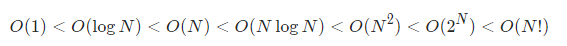

- **常数 O(1) ：**

运行次数与 N 大小呈常数关系，即不随输入数据大小 N的变化而变化。

- **对数O(logN)**

对数阶与指数阶相反，指数阶为 “每轮分裂出两倍的情况” ，而对数阶是 “每轮排除一半的情况” 。对数阶常出现于「二分法」、「分治」等算法中，体现着 “一分为二” 或 “一分为多” 的算法思想

```js
function binary(N){
	let count=0;
	let i=N;
	while(i>1){
	i=i/2//每次循环减半
	count++;
	}
	return count
}
```

假设需要循环m次，则有 `2^m=N`，两边同时对数运算得到 `m=log2 N`

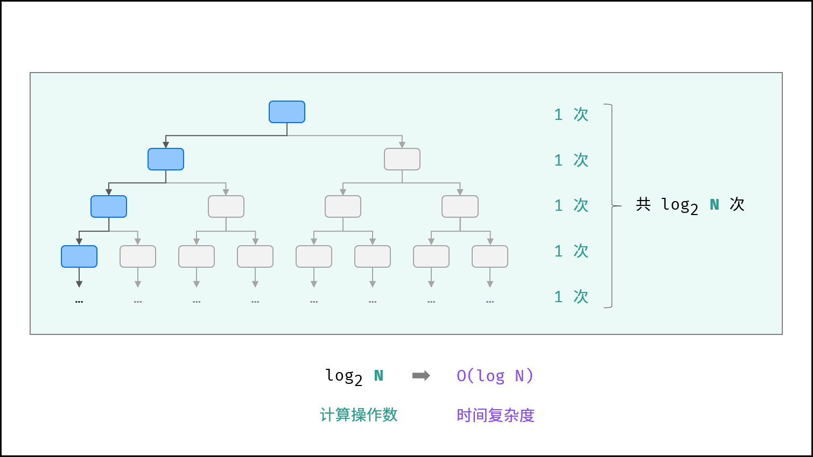

- **线性 O(N)**

循环运行次数与 N大小呈线性关系，时间复杂度为 O(N)。

如单层N的for循环

- **线性对数O(NlogN)**

两层循环相互独立

第一层和第二层时间复杂度分别为 O(logN) 和 O(N) 

则总体时间复杂度为 O(NlogN) ；

```js
function nlogn(N){
let count=0;
let i=N;
    while(i>1){
    i=i/2;
        for(let j=0;j<N;j++){
        count++
        }
    }
    return count;
}
```

线性对数阶常出现于排序算法，例如**「快速排序」、「归并排序」、「堆排序」**等

- **平方O(N^2)**

两层循环相互独立，都与 N呈线性关系，因此总体与 N 呈平方关系

如冒泡排序

- **指数O(2^N)**

生物学科中的 “细胞分裂” 即是指数级增长。

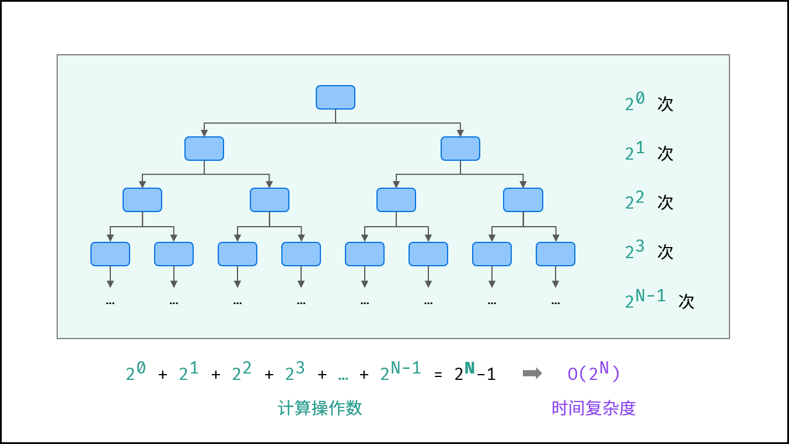

- **阶乘O(N!)**

阶乘阶对应数学上常见的 “全排列” 。即给定 N个互不重复的元素，求其所有可能的排列方案，则方案数量为：
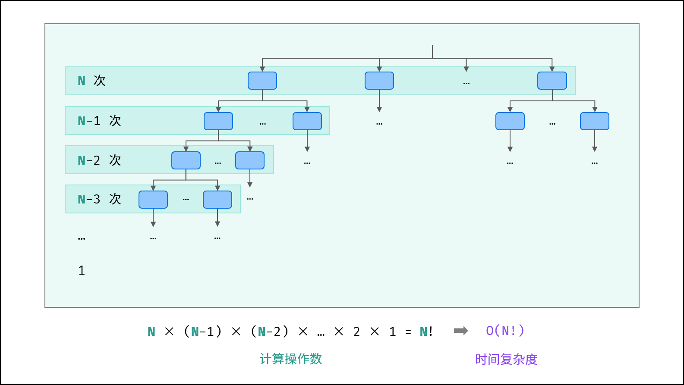

## 空间复杂度

**概念定义**
空间复杂度涉及的空间类型有：

- **输入空间：** **存储输入数据**所需的空间大小；
- **暂存空间：** 算法运行过程中，**存储所有中间变量和对象等数据所需的空间大小**；
- **输出空间：** 算法运行返回时，**存储输出数据**所需的空间大小；

通常情况下，空间复杂度指在输入数据大小为 N 时，算法运行所使用的**「暂存空间」+「输出空间」**的总体大小。

**常见算法空间复杂度**

常见的算法空间复杂度有：
												**O(1) < O(logN) < O(N) < O(N^2) < O(2^N)**

- **常量O(1)**

普通常量、变量、对象、元素数量**与输入数据大小 N无关的集合**，皆使用常数大小的空间。

- **对数 O(log N)**

对数阶常出现于分治算法的栈帧空间累计、数据类型转换等，

例如：

快速排序 ，平均空间复杂度为O(logN) ，最差空间复杂度为 O(N) 。

- **线性O(N)**

元素数量与 **N呈线性关系的任意类型集合（常见于一维数组、链表、哈希表、普通递归等）**，皆使用线性大小的空间。

递归示例：

```js
/*
* @Params N {Number}
*/
function algorithm(N){
    if(N<=1) return 1;
    return algorithm(N-1)+1;
}
```

在递归阶段会形成N个未返回的 algorithm 函数

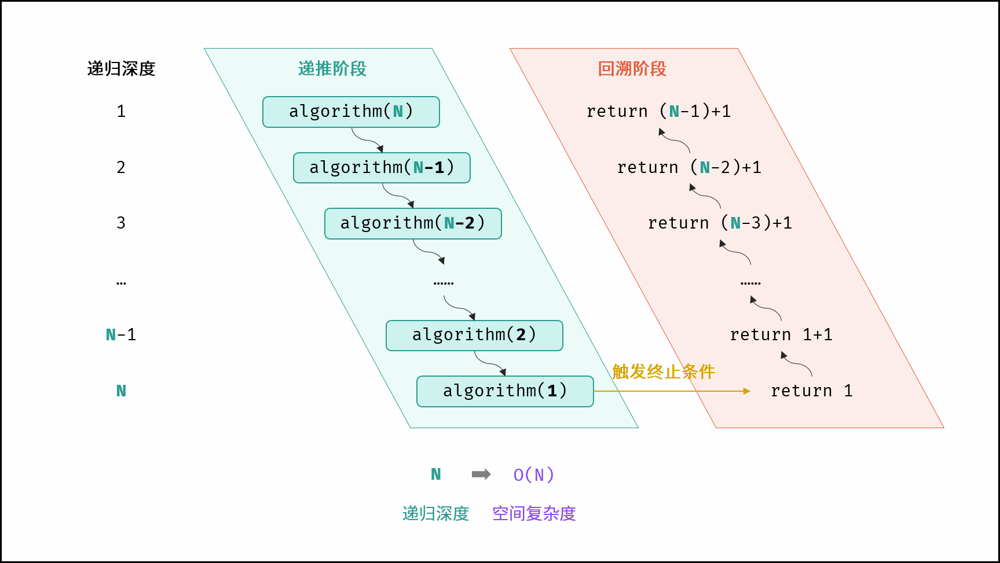

- **平方O(n^2)**

元素数量与 N呈平方关系的任意类型集合（常见于矩阵），皆使用平方大小的空间

```
let N=5;
let num_matrix=new Array(N).fill(0).map(_=>new Array(N).fill(0))
```

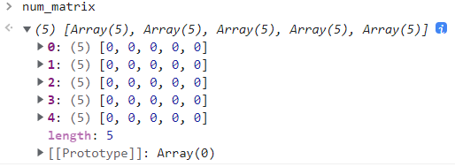

递归过程创建内存大小通常也会导致平方的内存开销

```js
function algorithm(N){
    if(N<=0) return 0
    let emptyArray=new Array(N)
    return algorithm(N-1);
}
```

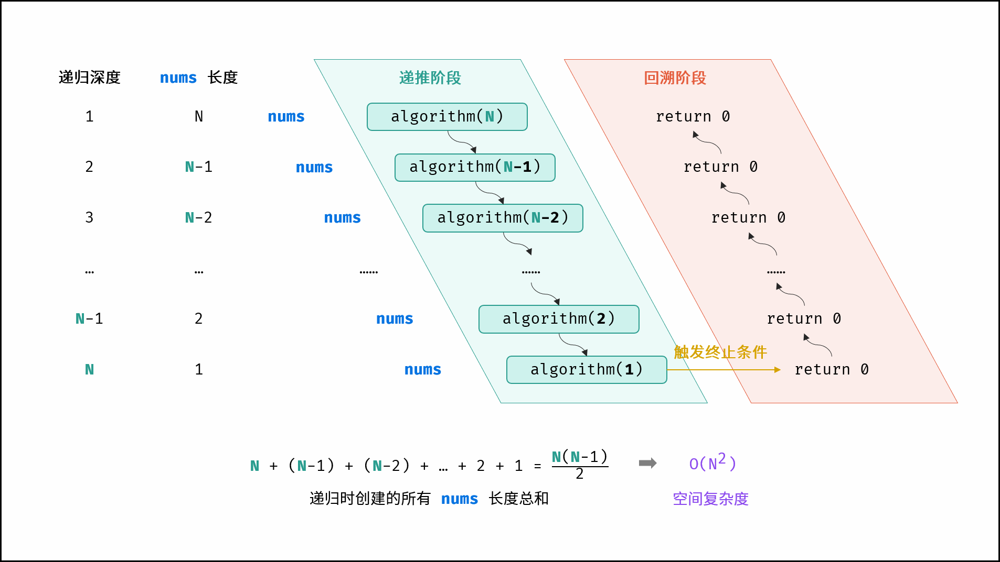

- **指数O(2^N)**

指数阶常见于二叉树、多叉树。例如，高度为 N 的「满二叉树」的节点数量为 2^N-1占用 O(2^N) 大小的空间；

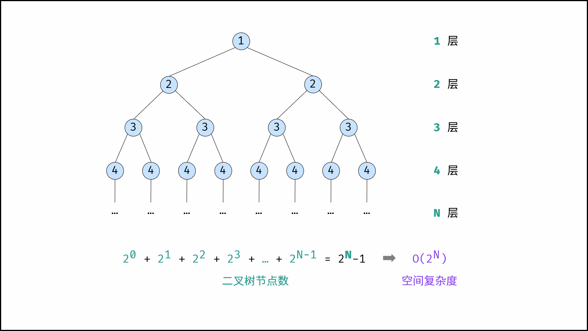

## 算法的可逆与否

加密算法分为可逆、不可逆加密算法。

而不可逆加密算法又分为[对称加密](https://so.csdn.net/so/search?q=对称加密&spm=1001.2101.3001.7020)和非对称加密

- 不可逆加密：不可逆加密算法最大的特点就是不需要密钥，但是HMAC是需要密钥的！
  - 常见的不可逆加密算法有**MD5，HMAC，SHA1、SHA-224、SHA-256、SHA-384，和SHA-512。其中SHA-224、SHA-256、SHA-384，和SHA-512我们可以统称为SHA2加密算法，**SHA加密算法的安全性要比MD5更高，而SHA2加密算法比SHA1的要高。其中SHA后面的数字表示的是加密后的字符串长度，SHA1默认会产生一个160位的信息摘要。
  - 由于这些加密都是不可逆的，因此比较常用的场景就是**用户密码加密**，其验证过程就是通过比较两个加密后的字符串是否一样来确认身份的。网上也有很多自称是可以破解MD5密码的网站，其原理也是一样，就是有一个巨大的资源库，存放了许多字符串及对应的MD5加密后的字符串，通过你输入的MD5加密串来进行比较，如果过你的密码复杂度比较低，还是有很大机率验证出来的。
- 可逆加密：数据的加密和解密都需要使用秘钥操作
  - 对称加密：常见的对称加密算法有DES、3DES、AES128、AES192、AES256
  - 非对称加密 ：常见的非对称加密有RSA、SM2，RS256 (采用SHA-256 的 RSA 签名)
- Base64转码：把字符串转换成以“==”结尾的字符串。如：Z38cPD5XbiPZ41LKQmhZAw==！

# 排序算法

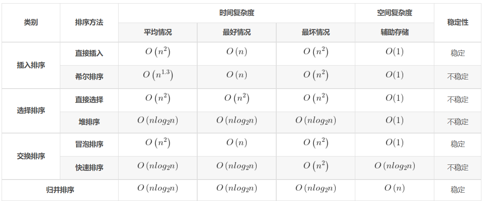


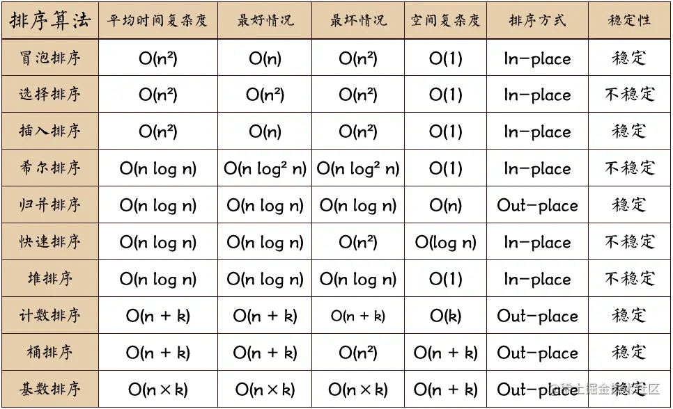

**！！！其中不稳定的排序有：选择、希尔、快速、堆**

## 冒泡排序

顾名思义，冒泡，相邻元素两两比较，每次遍历冒泡出一个元素

这里做了一点优化

如果在一次冒泡中没有元素的交换，即后续未排序列表已经有序了，则isSorted为true，退出循环

```js
//冒泡排序
const bubbleSort = function (nums) {
//冒泡次数，nums.length-1
//只要排列完倒数第二个元素，最后一个元素自动有序
    for (let i = 0; i < nums.length - 1; i++) {
    let isSorted = true;
        for (let j = 0; j < nums.length - 1 - i; j++) {
            if (nums[j] > nums[j + 1]) {
                isSorted = false;
                [nums[j], nums[j + 1]] = [nums[j + 1], nums[j]];
            }
        }
    if (isSorted)
    break;
}
   
```

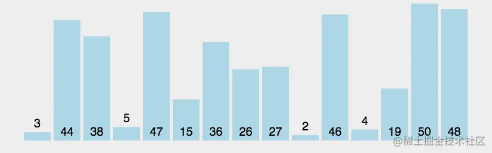

## 选择排序

每次选择满足要求（最小/最大）的一项和当前指定位置项交换，直到列表尾部，全部有序

```js
const selectSort = function (nums) {
    let len = nums.length;
    let curIndex = null;
    //排序len-1次，最后一个自动有序
    for (let i = 0; i < len - 1; i++) {
        curIndex = i;
        //i之前有序，从i开始往后寻找符合要求数据
        for (let j = i + 1; j < len; j++) {
            curIndex = nums[j] < nums[curIndex] ? j : curIndex;
        }
        if (curIndex != i) {//若下标变化则交换
            [nums[curIndex], nums[i]] = [nums[i], nums[curIndex]]
        }
    }
}
```

## 快速排序

**时间复杂度**

- 最好`nlogn`

快速排序形成一颗递归树，假设最好情况每次取到当前数列的中间元素为轴，那么相当于一直在执行二分操作

```
n个元素列表执行m次二分
n=2^m;
m=log2n;
每次最多对长度为n的区间进行划分，共需n-1次关键字的比较，时间复杂度为O(n)
```

即最好情况下为`O(nlogn)`

- 最坏情况`O(n^2)`

在最坏的情况下，待排序的序列为**正序或者逆序，每次划分只得到一个比上一次划分少一个记录的子序列**，注意另一个为空。

如果递归树画出来，它就是一棵斜树。此时需要执行n‐1次递归调用

**空间复杂度**

就空间复杂度来说，主要是递归造成的栈空间的使用

最好情况，递归树的深度为log2n，其空间复杂度也就为**O(logn)**

最坏情况，需要进行n‐1递归调用，其空间复杂度为**O(n)**

平均情况，空间复杂度也为**O(logn)**

**稳定性**

关键字的比较和交换是跳跃进行的，因此，快速排序是一种不稳定的排序方法


以升序排列为例，快速排序就是每次找到一个轴点，小于它的交换到它左边，大于它的自然在右边

**在递归的过程中从局部有序直到全部有序**

每次 **partition** 操作找到右边界元素合法位置，使右边界元素有序

然后对左右两边进行快速排序，递归直到 **low<=high** 触发边界条件，达到局部有序，递归完全结束后所有局部构成全局有序

```js
//快速排序
    const partition = function (arr, left, right) {
        let index = left;
        for (let i = left; i < right; i++) {
            if (arr[i] < arr[right]) {
                [arr[i], arr[index]] = [arr[index], arr[i]];
                index++;
            }
        }
        [arr[right], arr[index]] = [arr[index], arr[right]];
        return index;
    }
    const quickSort = function (arr, low, high) {
        if(low<high){
        let piovt = partition(arr, low, high);
        //左右两边都进行快速排序
        quickSort(arr, piovt + 1, high);
        quickSort(arr, low, piovt - 1); 
    	}  
    }
  
```

## 二分查找

二分法又可以被称为二分查找，它描述了在有序集合中搜索特定值的过程。广义的二分查找是将问题的规模尽可能的缩小到原有的一半。

二分查找（非递归实现）

```js
var binarySearch = function (nums, target) {
    let start = 0, end = nums.length - 1
    while (start <= end) {
        let mid = Math.floor((start + end) / 2)
        if (nums[mid] == target) {
            return mid
        } else if (nums[mid] > target) {
            end = mid - 1
        } else if(nums[mid] < target){
            start = mid + 1
        }
    }
    return -1
};
```

二分查找（递归实现）

```js
var binarySearch = function (nums, target, start, end) {
    if (start > end) {
        return -1;
    }
    let mid = Math.floor((start + end) / 2)
    if (nums[mid] === target) {
        return mid
    } else if (nums[mid] > target) {
        return binarySearch(nums, target, start, mid - 1)
    } else if (nums[mid] < target) {
        return binarySearch(nums, target, mid + 1, end)
    }
};
```

## 归并排序

归并采用的是分治思想

1.将一个数组不断二分直到每个小组只有一个元素

2.然后在回溯的过程中不断调用merge合并各个对应的小组，使得每次合并之前各个小组内部保持有序

3.回溯到顶层，合并左右两个部分完成排序


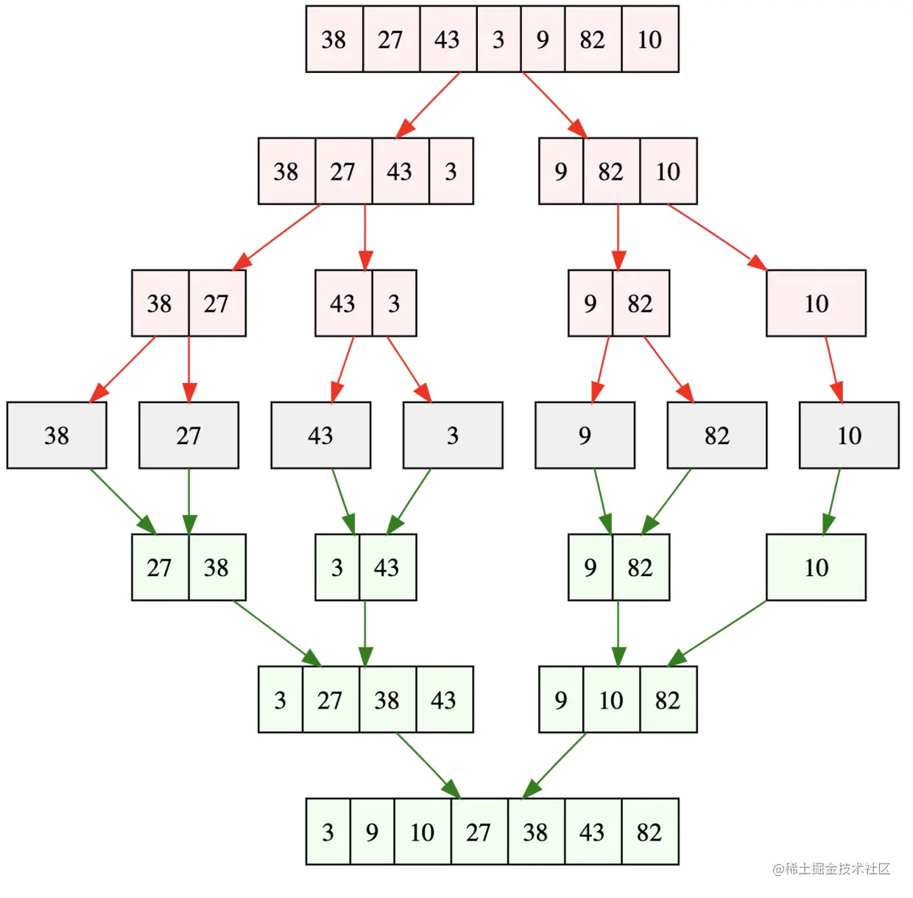

**分析**

- 第一，归并排序是原地排序算法吗 ？ 
  - 这是因为归并排序的合并函数，在合并两个有序数组为一个有序数组时，**需要借助额外的存储空间**。 实际上，**尽管每次合并操作都需要申请额外的内存空间，但在合并完成之后，临时开辟的内存空间就被释放掉了**。在任意时刻，CPU 只会有一个函数在执行，也就**只会有一个临时的内存空间在使用。临时内存空间最大也不会超过 n 个数据的大小，所以空间复杂度是 O(n)**。 所以，**归并排序不是原地排序算法。**
- 第二，归并排序是稳定的排序算法吗 ？ 
  - merge 方法里面的 left[0] <= right[0] ，**保证了值相同的元素，在合并前后的先后顺序不变。归并排序是一种稳定的排序方法**。
- 第三，归并排序的时间复杂度是多少 ？ 
  - 从效率上看，归并排序可算是排序算法中的`佼佼者`。假设数组长度为 n，那么拆分数组共需 logn 步, 又每步都是一个普通的合并子数组的过程，时间复杂度为 O(n)，故其综合时间复杂度为 O(nlogn)。 最佳情况：T(n) = O(nlogn)。 最差情况：T(n) = O(nlogn)。 平均情况：T(n) = O(nlogn)。


```js
function mergeSort(arr) { //采用自上而下的递归方法
　　var len = arr.length;
　　if(len < 2) {
　　　　return arr;
　　}
　　var middle = Math.floor(len / 2),
　　left = arr.slice(0, middle),
　　right = arr.slice(middle);
　　return merge(mergeSort(left), mergeSort(right));
}


function merge(left, right){
　　var result = [];
　　console.time('归并排序耗时');
　　while (left.length && right.length) {
　　　　if (left[0] <= right[0]) {
　　　　　　result.push(left.shift());
　　　　} else {
　　　　　　result.push(right.shift());
　　　　}
　　}

　　while (left.length){
　　　　result.push(left.shift());
　　}
　　while (right.length){
　　　　result.push(right.shift());
　　}
　　console.timeEnd('归并排序耗时');
　　return result;
}

```


## 堆排序

 **堆排序**
  堆排序基本介绍

- 堆排序是利用堆这种数据结构而设计的一种排序算法，**堆排序是一种选择排序**，它的最坏，最好，平均时间复杂度均为O(nlogn)，它也是不稳定排序。
- 堆是具有以下性质的完全二叉树：每个结点的值都大于或等于其左右孩子结点的值，称为大顶堆, 注意 : 没有要求结点的左孩子的值和右孩子的值的大小关系。
- 每个结点的值都小于或等于其左右孩子结点的值，称为小顶堆

**堆排序的基本思想**
1.将待排序序列构造成一个大顶堆
2.此时，整个序列的最大值就是堆顶的根节点。
3.将其与末尾元素进行交换，此时末尾就为最大值。
4.然后将剩余n-1个元素重新构造成一个堆，这样会得到n个元素的次小值。如此反复执行，便能得到一个有序序列了。

可以看到在构建大顶堆的过程中，元素的个数逐渐减少，最后就得到一个有序序列了.

**二叉树预备知识**

最后一个非叶子结点：N/2-1向下取整（Math.floor(arr.length/2)-1）

N结点的左子树：2*N+1

N结点的右子树：2*N+2

```javascript
function heapSort(arr) {
    let temp;
    //1.将无序序列构成一个堆，根据升序降序需求选择大顶堆或小顶堆
    //最后一个值的序号为arr.length-1，根据顺序存储二叉树，
    //n节点的左子树为2*n+1,右子树为2*n+2，
    //那么最后一个非叶子节点的值应该为Math.floor((arr.length-1-1)/2) 
    //= Math.floor((arr.length)/2 -1)
    //=Math.floor(arr.length / 2) - 1
    for (let i = Math.floor(arr.length / 2) - 1; i >= 0; i--) {
        adjustHeap(arr, i, arr.length)
    }
    //2.将堆顶元素与末尾元素交换，将最大元素“沉”到数组末端
    //3.重新调整结构，使其满足堆条件，然后继续交换堆顶元素和当前末尾元素,
    //  反复执行调整+交换步骤，直到整个序列有序
    for (let j = arr.length - 1; j > 0; j--) {
        //交换
        temp = arr[j];
        arr[j] = arr[0];
        arr[0] = temp;
        adjustHeap(arr, 0, j);
    }
}

//将一个数组(二叉树),调整成一个大顶堆
/**
 * 将以i对应的非叶子节点的树调整成一个大顶堆
 * @param {要调整的数组} arr 
 * @param {表示非叶子节点在数组中的索引} i 
 * @param {对多少个元素进行调整，length是在逐渐减少} length 
 */
function adjustHeap(arr, i, length) {
    let temp = arr[i];//先取出当前元素的值，保存在临时变量
    //开始调整
    //说明 调整非叶子节点的顺序时从下到上，从左到右
    //从最下层开始，逐层将大的值往上提
    //1.k=i*2+1是i节点的左子节点
    for (let k = i * 2 + 1; k < length; k = k * 2 + 1) {
        if (k + 1 < length && arr[k] < arr[k + 1]) {
            //说明左子节点的值小于右子节点的值
            k++//k指向右子节点
        }
        if (arr[k] > temp) {
            //如果子节点大于父节点
            arr[i] = arr[k]//把较大的值赋给当前节点
            //i指向k，继续循环比较，使的以当前i顶点的二叉树满足大顶堆的条件
            //k为i节点的左子节点或右子节点，因为从下往上调整的，
            //我们可以认为左子节点树或右子节点树已经是一个大顶堆，
            //当这个大顶堆的顶点被某值X替换后，大顶堆被破坏结构，
            //此时我们需要从原来的大顶堆右边节点树找到一个位置，将X放入该位置，从而重新形成大顶堆结构
            //其实是从把最右边的一排节点逐层上移，X被安放在最右边的一排节点中合适的位置
            i = k;
        } else {
            break;//调整非叶子节点的顺序时从下到上，从左到右,所以可以中断
        }
        //当for循环结束后，我们已经将以i为父节点的树的最大值，放在了最顶上（局部）
        arr[i] = temp;//将temp值放到调整后的位置
    }
}
```

## 优先队列

构造大根堆，采取递归方式

```
  init () {
    // 从倒数第一个非叶子节点（从下往上，从右往左数）依次重新排列节点顺序
    let lastParentNodeIndex = Math.floor(this.queue.length / 2) - 1
    for (let i = lastParentNodeIndex; i >= 0; i--) {
      this.buildChildNodes(i)
    }
  }

  buildChildNodes (index) {
    // 在数组中某个节点的左右子节点分别为 2*i+1 和 2*i+2
    // this.queue中存储着数组
    let arr = this.queue
    let left = index * 2 + 1
    let right = index * 2 + 2
    let maxIndex = index
    let length = arr.length

    // 找出值最大的节点下标
    if (left < length && arr[left] > arr[maxIndex]) {
      maxIndex = left
    }
  
    if (right < length && arr[right] > arr[maxIndex]) {
      maxIndex = right
    }

    if (maxIndex != index) {
      // 如果最大值不是父节点的话，需要交换父子节点位置
      // 并且对父节点交换后的子树递归地进行重新排列
      this.swap(index, maxIndex)
      this.buildChildNodes(maxIndex)
    }
  }

```

大顶堆的其他方法补充
获取堆顶元素，也就是最大值peak方法，很简单，只要返回第一个元素即可：

```
peak () {
  return this.queue[0]
}
```


添加一个元素push方法，只需要往数组中push该元素，然后重新调整二叉树就行：

```
push (val) {
 this.queue.push(val)
  this.init()
}
```

出队列pop方法，pop方法可以仿照push方法，把数组第一个元素剔除后再重新调整二叉树，但把数组第一个元素剔除的操作是需要O(N)的时间复杂度的，所以，我们可以先保存数组第一个元素，然后将数组的最后一个元素pop出来赋值给第一个元素（时间复杂度为O(1)），然后再重新调整二叉树，并将保存的值返回：

```
pop () {
 // pop操作，就是将根节点拿出后，用最后一个节点填充根节点然后重新构建
  // 这样重新构建前的操作就是O(1)
  // 如果直接把根节点shift出去再重构建则，重新构建前的操作就是O(n)
  let val = this.queue[0]
  this.queue[0] = this.queue.pop()
  this.init()
  return val
}
```


将队列排序，也就是堆排序，因为上面的pop方法每次都会出队列一个最大值，所以只要pop N次就可以了：

```
sort () {
  // 排序的话就是把队列一个个pop出来
  var res = []
  var length = this.queue.length
  for (var i = 0; i < length; i++) {
    res.push(this.pop())
  }
  this.queue = res
  return res
}
```

## 插入排序


**思想**

- 通过构建有序序列，对于未排序数据，在已排序序列中从后向前扫描，找到相应位置并插入。

- 插入排序因而在从后向前扫描过程中，需要反复把已排序元素逐步向后挪位，为最新元素提供插入空间。

```js
const insertSort=function(nums){
let len=nums.length;
    for(let i=1;i<len;i++){
        let cur=nums[i];
        let preIndex=i-1;
        while(preIndex>=0&&nums[preIndex]>cur){
            nums[preIndex+1]=nums[preIndex]
            preIndex--;
        }
        nums[preIndex+1]=cur;
    }
}
```

## 希尔排序

**思想**

- 先将整个待排序的记录序列分割成为若干子序列。
- 分别进行直接插入排序。
- 待整个序列中的记录基本有序时，再对全体记录进行依次直接插入排序。


```js
const shellSort=function(nums){
let len=nums.length,gap=1,temp;
    //动态调整gap
    while(gap<len/3){
        gap=gap*3+1;
    }
    for(gap;gap>0;gap=Math.floor(gap/3)){
        for(let i=gap;i<len;i++){
            temp=nums[i];
            let j=i-gap;
            //在本次gap划分中找到temp的合适位置
            for(;j>=0&&nums[j]>temp;j-=gap){
                nums[j+gap]=nums[j]
            }
            nums[j+gap]=temp;
        }
    }
    return nums
}
```

第一，希尔排序是原地排序算法吗 ？ 

希尔排序过程中，只涉及相邻数据的交换操作，只需要常量级的临时空间，空间复杂度为 O(1) 。所以，希尔排序是`原地排序`算法。

第二，希尔排序是稳定的排序算法吗 ？ 

我们知道，单次直接插入排序是稳定的，它不会改变相同元素之间的相对顺序，但在多次不同的插入排序过程中，相同的元素可能在各自的插入排序中移动，可能导致相同元素相对顺序发生变化。 因此，希尔排序`不稳定`。

第三，希尔排序的时间复杂度是多少 ？

最佳情况：T(n) = O(n logn)。 最差情况：T(n) = O(n (log(n))2)。 平均情况：T(n) = 取决于间隙序列。

# 页面置换算法

在进程运行的过程中，若其访问的页面不存在内存中，则会产生缺页中断

如果此时内存中没有空闲的页面，操作系统就需要在内存中选择一个页面将其移出，从而可以将需要访问的页面调入内存中。而用来选择淘汰哪一页的算法就叫做页面置换算法。

## OPT最佳置换算法

每次选择淘汰的页面将是**以后永不使用或者最长时间内不在被访问的页面**。这样可以保证最低的缺页率。

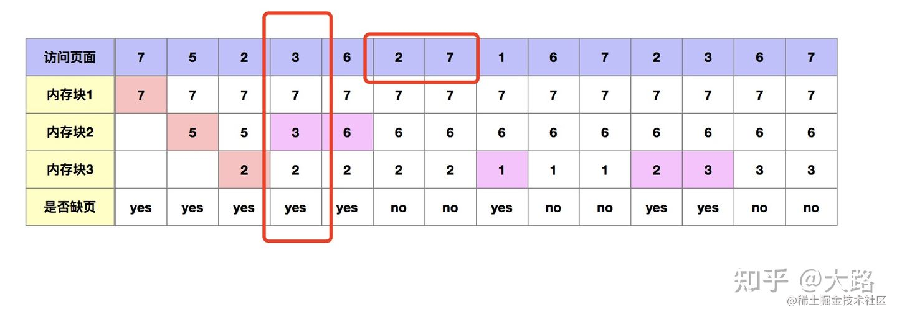

在第4步中，需要把3号页面调入内存，从7，5，2中选择一个页面进行淘汰。

按照最佳置换算法规则，往后寻找2和7会被先后访问，所以把5号页面淘汰，即最长时间内不在被访问的页面。

## FIFO先进先出算法

每次淘汰的页面是最早进入内存的页面

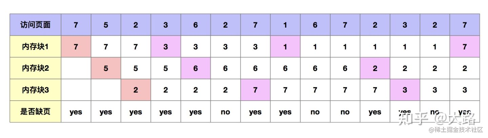

## LRU最近最久未使用算法

每次淘汰的页面是最近最久未使用的页面，**基于时间**

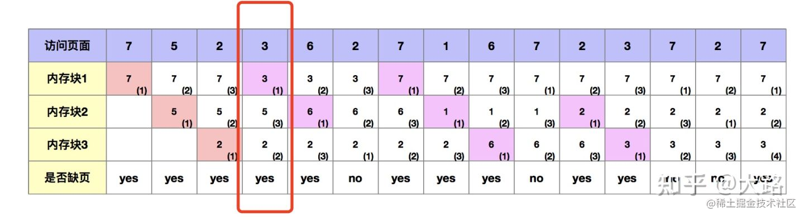

在第四步中需要把3号页面调入内存，此时需要从7、5、2中选择一个页面进行淘汰。

按照LRU规则，7号页面上次被访问以来所经历的时间为3，他为最大的，所以把7号页面淘汰出去。

## LFU最近最少使用算法

每次淘汰的页面是最近最久未使用的页面，**基于访问次数**

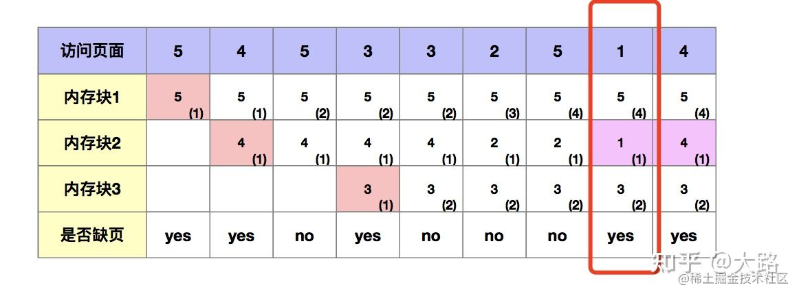

第八步中需要把1号页面调入内存，从5、2、3中选择一个页面进行淘汰。

按照LFU规则，2号页面最近一段时间内使用次数为1，他是最小的。所以把2号页面淘汰出去。

若按照时间为标准的LRU，则会淘汰3页面

# 树

## 二叉树

### 概念与性质

二叉树，二叉树字面意思就是一个树只能分两个叉。左面的叉叫做左孩子，右面的叉叫做右孩子。

 即**满足每个结点度不大于2，孩子结点次序确定的树**

- **层结点**

二叉树的第 i 层上最多有 `2^(i-1)` 个结点 (i>=1)

- **总结点**

深度为 k 的二叉树最多有 `2^k-1` 个结点 (k>=1)

- **深度**

具有n个结点的完全二叉树深度为 `(log2 n)+1` 向下取整

e.g.12个结点

log2 12=3.5849625	向下取整3	3+1=4	结果为4层

- **性质1**

对于任意一棵二叉树，**度为0的结点数等于度为2的结点数+1**。

- **性质2**

**从1开始计数（1为根节点）**

结点为 i 的双亲结点为 `i/2 向下取整`，左孩子为 `2*i`，右孩子为 `2*i+1`

**从0开始计数（0为根节点）**

结点为 i 的双亲结点为 `i/2 向下取整`，左孩子为 `2*i+1`，右孩子为 `2*i+2`

- **性质3**

假设根节点编号从0开始计数，最后一个非叶子结点编号：`N/2` 向下取整后 -1**（Math.floor(arr.length/2)-1）**

### 二叉树遍历

- **先序遍历**

  - 遍历顺序：根结点->左子树->右子树

  - js递归

  - ```js
    /**
    * 先序遍历二叉树, root为指向二叉树(或某一子树)根结点的指针
    * @Params BiTree root
    */
    function PreOrder(root) {
    	if (root!=null){
    		Visit(root.data);  		/*访问根结点*/
    		PreOrder(root.LChild);  /*先序遍历左子树*/
    		PreOrder(root.RChild);  /*先序遍历右子树*/
    	}
    }
    ```

  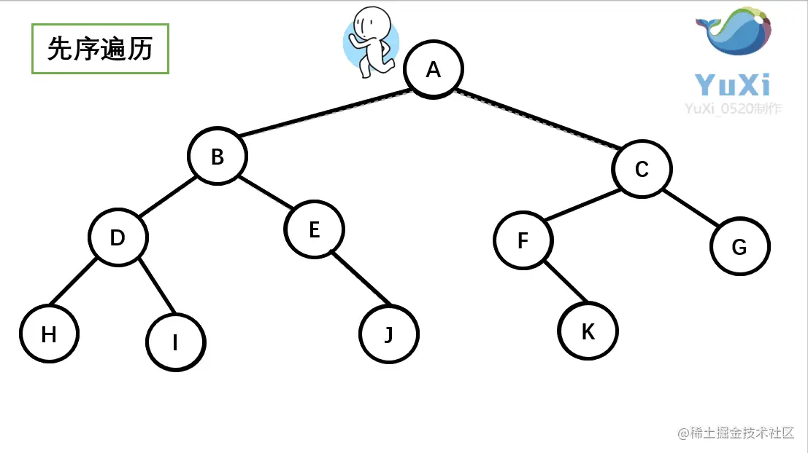

  ​	围绕二叉树的外圈开始跑（遇到缝隙就钻进去）

- **中序遍历**

  - 遍历顺序：左子树->根结点->右子树

  - js递归

  - ```js
    /**
    * 中序遍历二叉树, root为指向二叉树(或某一子树)根结点的指针
    * @Params BiTree root
    */
    function InOrder(root){
        if(!root){
            InOrder(root.LChild);//中序遍历左子树
            visit(root.data);	 //访问根节点
            InOrder(root.RChild);//中序遍历右子树
        }
    }
    ```

  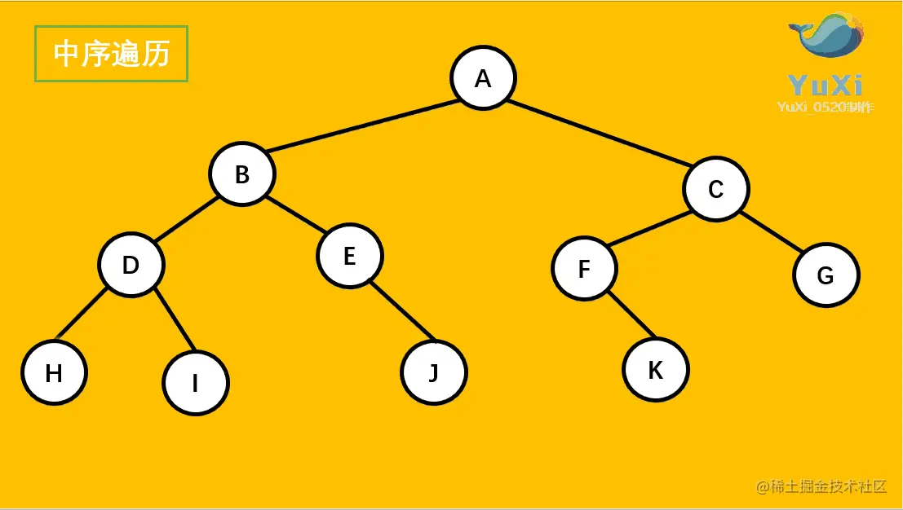

  ​	从最左侧到最右侧依次投影到同一水平线上面

- **后序遍历**

  - 遍历顺序：左子树->右子树->根结点

  - js递归

  - ```js
    /**
    *后序遍历二叉树, root为指向二叉树(或某一子树)根结点的指针
    * @Params BiTree root
    */
    function PostOrder(root){
        if(!root){
            PostOrder(LChild)	//后序遍历左子树
            PostOrder(RChild)	//后序遍历右子树
            visit(root.data)	//访问根节点
        }
    }
    ```

    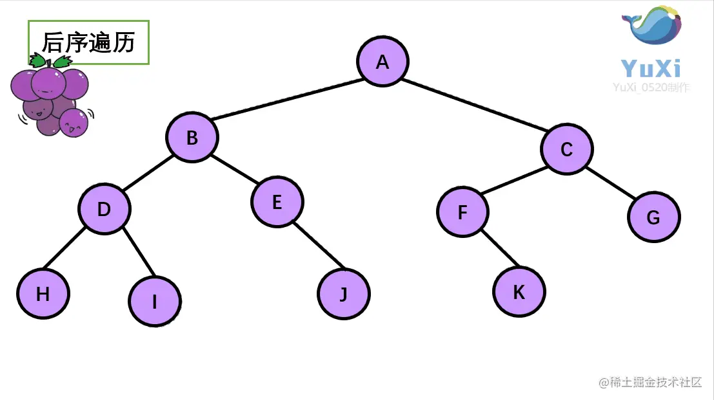

    按照先序的跑法，就像剪葡萄，只能一个个剪，不能让超过1个的葡萄一起掉下来

- **层次遍历**


- **深度遍历**


### js相关实现树基本操作

- **js根据参数序列顺序生成完全二叉树**

```js
function CreateBiTree(str) {
    //根节点
    let rootNode = { val: str[0], LChild: null, RChild: null }
    //叶子节点队列
    var leafStack = [rootNode];
    let len = str.length;
    let i = 1;
    while (i < len) {
        //队头叶子节点出队
        let cur = leafStack.shift();
        //生成左孩子结点并压入队尾
        //x=val	返回值为val
        leafStack.push(cur.LChild = { val: str[i++], LChild: null, RChild: null })
        //判断是否到达参数尾
        if (i <= len) {
            break;
        }
        //生成右孩子结点并压入队尾
        leafStack.push(cur.RChild = { val: str[i++], LChild: null, RChild: null })
    }
    return rootNode;
}
```

- **js求二叉树叶子结点个数**

```js
function leafNum(root){
let leafCount=0;
    if(root!=null){
        leafCount+=leafNum(root.LChild);
        leafCount+=leafNum(root.RChild);
            if(root.LChild==null&&root.RChild==null){
            leafCount++
            }
    }
    return leafCount;
}
```

- **js求二叉树深度**

```js
const PostTreeDepth = function (root) {
    let lh = rh = max = 0
    if (root != null) {
        lh = PostTreeDepth(root.LChild);
        rh = PostTreeDepth(root.RChild);
        max = lh > rh ? lh : rh;//左右子树比较最大深度存放max
    } else {
        return 0
    }
    return max += 1//加上自身这一层
}
```


## 满二叉树

满二叉树就是满的，意思是每一层都是最大的结点，不能有空。

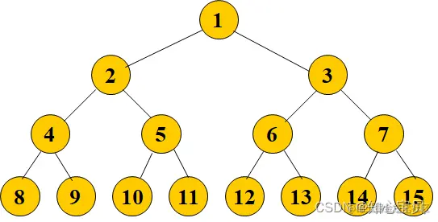

## 完全二叉树

- 结点按照编号**从左到右依次构建二叉树，**不存在无左孩子、却有右孩子的情况（有就不是）
- 满二叉树（完全二叉树的特殊情况）一定是完全二叉树，完全二叉树不一定是满二叉树

## 最小生成树

将最小生成树拆分成： 最小 + 生成 + 树 

树：
• 树中没有环
• 所有的顶点都要在树中
• 对于N条顶点，有N-1条边

最小：
一个图，可以有很多生成树，我们把一棵树的权值相加，得到权值和。

因此不同的生成树就会有不同的权值和，而**最小生成树就是权值和最小生成树。**

**如何求最小生成树？**

> • Kruskal算法（克鲁斯卡尔）

从一个点出发，直接选择权值最小的边，不能成环

> • Prim算法（普里姆算法） 从顶点出发间接选择权值最小的边

将连通网中的所有顶点分为两类（假设为 A 类和 B 类）。**初始状态下，所有顶点位于 B 类；A为空**

选择任意一个顶点，将其从 B 类移动到 A 类；

从 B 类的所有顶点出发，**找出一条连接着 A 类中的某个顶点且权值最小的边**，将此边连接着的 A 类中的顶点移动到 B 类；

重复执行第 3 步，**直至 B 类中的所有顶点全部移动到 A 类**，恰好可以找到 N-1 条边。

## 二叉排序树

**二叉排序树又称为二叉搜索树，是一种重要的数据结构**

需要注意的是，在使用二分搜索中，搜索数组中每一个数字的函数调用栈重叠起来，就是一个平衡的或者说是接近平衡的二叉排序树，也就是说使用有序数组进行二分搜索实际上和在一个二叉排序树搜索一个节点干的事情是一样的。

并且，对于**一棵二叉排序树的深度优先中序遍历结果，就是一个有序的数组**。

二叉排序树首先要求该树是一棵二叉树，之后要求在这棵树中

- 所有子树的根节点的左子树上的节点值或者说是权重要均小于(或大于)根节点，
- 而右子树上的所有节点值或者说是权重均大于(或小于)根节点。如图所示：

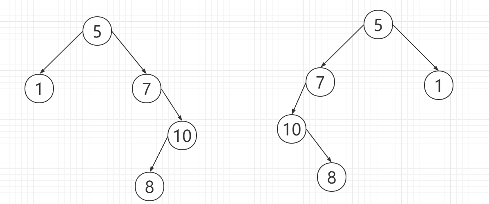

  二者均为二叉排序树，其中的左右的大小关系根据具体情况而定。

依据数组顺序构造二叉排序树

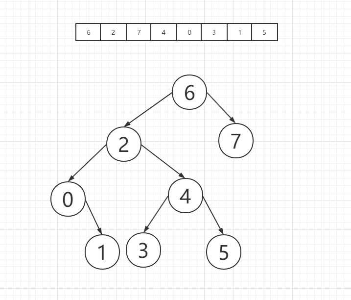

## 扁平列表转树

