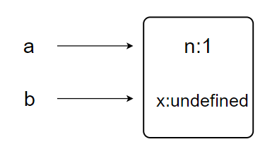

# Javascript部分

## 八种数据类型

```
undefined	null	Object	String	Number	Symbol	Boolean	BigInt	
```

其中 Symbol 和 BigInt 是 ES6 新增类型

- 栈：原始数据类型（Undefined、Null、Boolean、Number、String）
- 堆：引用数据类型（对象、数组和函数）

## js可枚举类型

在JavaScript中，对象的属性分为**可枚举**和**不可枚举**之分，它们是由属性的**enumerable**值决定的。

可枚举性决定了这个属性能否被 **for…in** 查找遍历到

- **基本包装类型的原型属性是不可枚举的**，如Object, Array, Number等，如果你写出这样的代码遍历其中的属性：


它的输出结果会是空。这是因为Number中内置的属性是不可枚举的，所以不能被for…in访问到。

- **判断可枚举属性**

Object对象的`propertyIsEnumerable()`方法可以判断此对象是否包含某个属性，并且这个属性是否可枚举。

```js
let test={'key1':111};
test.propertyIsEnumerable('key1');//true
```


- **获取对象自身的可枚举属性**
  - for...in //遍历对象**自身的和原型上的可枚举的属性**
  - Object.keys() //只返回对象**自身的所有可枚举的属性**的键名

## 数据检测方式

- typeof

其中**数组、对象、null 都会被判断为 object**，其他判断都正确。

```
typeof(null)		//Object
typeof(undefined)	//undefined
typeof(NaN)			//number
typeof(Function)	//function
```

- instanceof

instanceof **只能正确判断引用数据类型**，而不能判断基 本数据类型。//基本数据类型没有__proto__

```
2 instanceof Number		//false
[] instanceof Array		//true
```

其内部运行机制是判断在其 原型链中能否找到该类型的原型

instanceof 运算符可以用来测试一个对象在其原型链 中是否存在一个构造函数的 prototype 属性。

- **constructor**

constructor 有两个作用

一是判断数据的类型

二是对象实例通过 constrcutor 对象访问它的构造函数。

！！！**需要注意，如果创建一个对象 来改变它的原型，constructor 就不能用来判断数据类型了**

```
function Fn(){};	
let f=new Fn();
f.constructor===Fn	//true
Fn.prototype=new Array();
let test=new Fn();
test.constructor===Fn	//false
```

- **Object.prototype.toString.call()**

 toString 是 Object 的原型方法

而 Array、function 等类 型作为 Object 的实例，都重写了 toString 方法。

不同的对象类型调 用 toString 方法时，根据原型链的知识，调用的是对应的重写之后的 toString 方法（function 类型返回内容为函数体的字符串，Array 类型返回元素组成的字符串…）

所以采用 obj.toString() 不能得到其对象类型，应该调用 Object 原型上的 toString方法

## 为什么 0.1 + 0.2 != 0.3

因为 JS 采用 IEEE 754 双精度版本（64位），并且只要采用 IEEE 754 的语言都有该问题。

我们都知道计算机表示十进制是采用二进制表示的，所以 `0.1` 在二进制表示为

```js
// (0011) 表示循环
0.1 = 2^-4 * 1.10011(0011)
```

那么如何得到这个二进制的呢，我们可以来演算下


小数算二进制和整数不同。乘法计算时，只计算小数位，整数位用作每一位的二进制，并且得到的第一位为最高位。所以我们得出 `0.1 = 2^-4 * 1.10011(0011)`，那么 `0.2` 的演算也基本如上所示，只需要去掉第一步乘法，所以得出 `0.2 = 2^-3 * 1.10011(0011)`。

回来继续说 IEEE 754 双精度。六十四位中符号位占一位，整数位占十一位，其余五十二位都为小数位。因为 `0.1` 和 `0.2` 都是无限循环的二进制了，所以在小数位末尾处需要判断是否进位（就和十进制的四舍五入一样）。

所以 `2^-4 * 1.10011...001` 进位后就变成了 `2^-4 * 1.10011(0011 * 12次)010` 。那么把这两个二进制加起来会得出 `2^-2 * 1.0011(0011 * 11次)0100` , 这个值算成十进制就是 `0.30000000000000004`

下面说一下原生解决办法，如下代码所示

```js
parseFloat((0.1 + 0.2).toFixed(10))
```


## null 和 undefined 区别

- 同

Undefined 和 Null 都是基本数据类型，这两个基本数据类型 分别都只有一个值，就是 undefined 和 null。

undefined 代表的含义是未定义，null 代表的含义是空对象

- 异

当对这两种类型使用 typeof 进行判断时

Null 类型化会返回 “object”，这是一个历史遗留的问题。

**当使用双等号对两种类型的 值进行比较时会返回 true，使用三个等号时会返回 false**

## 实现intanceof

判断构造函数的 prototype 属性是否出现 在对象的原型链中的任何位置。

**使用Object.getPrototypeof(obj)方法获取对象的prototype属性**

```javascript
function myIntanceof=function(obj,initial){
let proto=Object.getPrototypeOf(obj);
	while(proto){
        if(initial.prototype===proto){
        return true;
        }
        proto=Object.getPrototypeOf(proto);
	}
	return false;
}
```

## valueOf&&toString

undefined和null没有toString()和valueOf()

**区别**
这两个方法解决了JavaScript值运算和显示的问题

- **valueOf()会把数据类型转换成原始类型**，也就是说原来是什么类型，转换后还是什么类型，日期类型除外
- **toString()会把数据类型转换成string类型**，也就是说不管原来是什么类型，转换后一律是string类型


**使用场景**
1、valueOf()偏向于运算，toString()偏向于显示
2、**对象转换时，优先调用toString()**
3、强转字符串的情况下，优先调用toString()方法；强转数字的情况下优先调用valueOf()
4、正常情况下，优先调用toString()
5、在**有运算操作符的情况下valueOf()的优先级高于toString()**，这里需要注意的是当调用valueOf()方法无法运算后还是会再调用toString()

**总结**


## 双等号和三等号比较

`==`

**类型相同**

- 如果两个值类型相同，进行 === 比较。

**类型不同**

如果两个值类型不同，他们可能相等。根据下面规则进行**类型转换**再比较：

只处理下面几种情况

**巧记：string,number,boolean随便比较**

- 如果**一个是null、一个是undefined**，那么相等（null==undefined //true）

- 如果**一个是字符串，一个是数值**，**把字符串转换成数值再进行比较**。

- 如果**任一值是Boolean**，为 true，把它转换成 1 再比较；为false，把它转换成 0 再比较。

- 如果**一个是对象，另一个是数值或字符串**，把对象转换成基础类型的值再比较。对象转换成基础类型，利用它的toString或者valueOf方法。 **js核心内置类，会尝试valueOf先于toString**。例外的是Date，**Date利用的是toString转换**。非js核心的对象，会比较麻烦，有兴趣的同学可以研究一下

**任何其他组合，都不相等。**

一些判断

```
null==undefined		//true
{}=={}				//false
```

null和undefined相等是因为二者都是假值吗？
当然不是，**因为null和undefined根本就没有valueOf方法.**

```javascript
console.log(null == false); //false
console.log(null == 0); //false
console.log(undefined == false); //false
console.log(undefined == 0); //false
console.log(undefined == null); //true
console.log(null.valueOf()); //Cannot read property 'valueOf' of null
console.log(undefined.valueof()); //Cannot read property 'valueOf' of null
```

所以二者相等仅仅是因为在语言设计时，设计者觉得二者很像，才使他们相等。

```
false == ''		//true
false == []		//true
0 == []			//true
'' == []		//true
[] == []		//false	其他组和类型
false==undefined//false
```

可以用一张图来表达 == 返回true的几个假值：


`=== `

这个比较简单，我把规则罗列一下

- **如果类型不同，就不相等**

- 如果两个都是数值，并且是同一个值，那么相等，例外的是，如果其中至少一个是NaN，那么不相等。（**判断一个值是否是 NaN，只能用isNaN() 来判断**）
  - !NaN==false		//true

- 如果两个都是字符串，每个位置的字符都一样，那么相等；否则不相等。
- 如果两个值都是true，或者都是false，那么相等。
- 如果两个值都引用同一个对象或函数，那么相等；否则不相等。
- 如果两个值都是null，或者都是undefined，那么相等。

```
0===0		//true
null===null //true
undefined===undefined //true
[]===[]		//false（为两个不同的对象）
```

总结

==


===


注意这里还可以使用`Object.is()`来判断两个数据的相等与否

双等号和三等号将0值视为相等，NaN严格不相等

```js
-0==0		//true
-0===0		//true
NaN==NaN	//false
NaN===NaN	//false
```

而Object.is可以区别

```js
Object.is(-0,0)		//false
Object.is(NaN,NaN)	//true
```

此外NaN的判别还可以用isNaN来判断

```js
isNaN(NaN)		//NaN
Number.isNaN(NaN)//NaN
```


## let_const_var

- var 声明的范围是函数作用域，let 和 const 声明的范围是块作用域

- var 声明的**变量会被提升到函数作用域的顶部**，let 和 const 声明的变量不存在提升，且具有**暂时性死区**特征

- var 允许在同一个作用域中**重复声明**同一个变量，let 和 const 不允许

- 在全局作用域中使用 var 声明的变量会成为 window 对象的属性，let 和 const 声明的变量则不会

- const 的行为与 let 基本相同，唯一 一个重要的区别是，使用 **const 声明的变量必须进行初始化，且不能被修改**

| 关键字 | 变量提升 | 块级作用域 | 重复声明同名变量 | 重新赋值 |
| ------ | -------- | ---------- | ---------------- | -------- |
| var    | √        | ×          | √                | √        |
| let    | ×        | √          | ×                | √        |
| const  | ×        | √          | ×                | ×        |

for 循环中的var 和 let 声明的区别

```javascript
for (var i = 0; i < 5; i++) {
    setTimeout( () => {
        console.log(i); // 5、5、5、5、5
    }, 0 )
}

for (let i = 0; i < 5; i++) {
    setTimeout( () => {
        console.log(i); // 0、1、2、3、4
    }, 0 )
}
```

**var是因为在退出循环时，迭代变量保存的是导致循环退出的值，也就是 5**

在之后异步执行超时逻辑时，所有的i都是同一个变量，因此输出的都是同一个最终值。


而在使用let声明迭代变量时，JS 引擎在后台会为每个迭代循环声明一个新的迭代变量，**每个 setTimeout 引用的都是不同的变量实例**

所以 console.log 输出的是我们期望的值，也就是循环执行过程中每个迭代变量的值。


## 作用域

**1、什么是作用域（Scope）**

 通常来说，一段程序代码中所用到的名字不总是有效和可用的，而限定这个名字的可用性的代码范围就是这个名字的作用域。

**JS作用域**：就是代码名字（变量）作用的范围

**作用域的目的：**是为了提高程序的可靠性，更重要的是减少命名冲突

**2、JS的作用域的分类**

JS作用域可以分为两大类：**全局作用域 、局部作用域（函数作用域）**

**es6之后新增了let、const产生了块级作用域**

**（一）全局作用域：**

　　直接编写在 script 标签之中的JS代码，都是全局作用域；

　　或者是一个单独的 JS 文件中的。

　　全局作用域在页面打开时创建，页面关闭时销毁；

　　在全局作用域中有一个全局对象 window（代表的是一个浏览器的窗口，由浏览器创建），可以直接使用。

**在全局作用域中，**

- **所有创建的变量都会作为 window 对象的属性保存。**


- **所有创建的函数都会作为 window 对象的方法保存。**


**（二）局部作用域（函数作用域）：**

　　在函数内部就是局部作用域，这个代码的名字只在函数的内部起作用

　　调用函数时创建函数作用域，函数执行完毕之后，函数作用域销毁

　　每调用一次函数就会创建一个新的函数作用域，它们之间是相互独立的


**（三）块级作用域**

- 函数作用域：变量在定义的函数内及[嵌套](https://so.csdn.net/so/search?q=嵌套&spm=1001.2101.3001.7020)的子函数内处处可见；

- 块级函数域：变量在离开定义的块级代码后马上被回收。

**`let`**||**`cosnt`**声明的范围是**块作用域;** 一对大括号 就是 一个块级作用域

**特殊**

**catch**块捕获的异常只在**catch块中可见**

  但是catch块中定义的其他变量还是属于整个函数作用域的。

## 作用域链

只要是代码，就有一个作用域，写在函数内部的就叫做局部作用域；

如果函数中还有函数，那么在这个作用域中又可以诞生一个作用域；

当在函数作用域中操作一个变量的时候，会先在自身作用域中查找，如果有就直接使用，如果没有就向上级作用域中寻找。如果全局作用域中也没有，那么就报错。

根据内部函数可以访问可以访问外部函数变量的这种机制，用链式查找决定哪些数据能被内部函数访问，就称为**函数作用域链**。

**作用域链：**内部函数访问外部函数的变量，采取的是链式查找的方法来决定取那个结构，这种结构称之为**作用域链**。

**作用域链的原则：****就近原则**

（作用域链采用链式查找的方式，一层一层向上查找，先查找外面的嵌套的函数是否有所需内容，找到就输出相应的结果，如果没有再向上查找。**就近原则**）


**实例一：**

------

 下面代码最终输出的结果是多少？


 **思路分析：**


 按照链式查找先到上一级查找，输出内容在2级链，向上到 1级链去查找，如果 1级链也没有就继续向上查找。如果都找不到就会返回 undefined（未定义）。

因为1级链中有 unm 值，所以输出num结果就是 123。

## 变量的作用域

在JavaScript中，根据作用域的不同，变量可以分为两种：**全局变量** 和 **局部变量**

**（一）全局变量**

　　1、在全局作用域下声明的变量叫做 **全局变量**（在函数外部定义的变量）

　　2、全局变量在全局（代码的任何位置）下都可以使用；全局作用域中无法访问到局部作用域中的变量。

　　3、**全局变量第一种创建方式**：在全局作用域下 var声明的变量是全局变量

　　4、**全局变量第二种创建方式**：如果在函数内部，没有使用 var关键字声明直接赋值的变量也属于 **全局变量**。（隐式全局变量，不建议使用）

**（二）局部变量：**

　　1、在局部作用域下声明的变量叫做**局部变量**（在函数内部定义的变量）

　　2、局部变量只能在函数内部使用，在局部作用域中可以访问到全局变量。

　　3、在**函数内部 var 声明**的变量就是**局部变量**；

　　4、**函数的形参**实际上就是**局部变量**；

**（三）全局变量和局部变量的区别：**

**全局变量**：在任何一个地方都可以使用，全局变量只有在浏览器关闭的时候才会销毁，比较占用内存资源

**局部变量**：只能在函数内部使用，当其所在代码块被执行时，会被初始化；当代码块执行完毕就会销毁，因此更节省节约内存空间；


## 隐式全局变量

- 在js中，没有使用var声明的变量称为**隐式全局变量**
- 使用var声明的变量为**局部变量**

一个函数中，未使用var声明的变量在其他的函数中依然可以使用。

使用var声明的变量为局部变量，在其他的函数中不可以使用，如果使用了会报出undefiend的错误；


## 暂时性死区

造成该错误的主要原因是：ES6新增的let、const关键字声明的变量会产生块级作用域

如果变量在当前作用域中被创建之前被创建出来，由于此时还未完成语法绑定，如果我们访问或使用该变量，就会产生暂时性死区的问题

由此我们可以得知，**从变量的创建到语法绑定之间这一段空间，我们就可以理解为‘暂时性死区’**

**常见问题**

let/const关键字未出现之前，typeof运算符是百分之百安全的，现在也会引发暂时性死区的发生

像import关键字引入公共模块、使用new class创建类的方式，也会引发暂时性死区

究其原因还是变量的声明先与使用

```
var tmp = 123; // 声明
if (true) {
  tmp = 'abc'; // 报错 因为当前块级作用域有使用let关键字声明的tmp变量，不存在变量提升
  let tmp; 
}
```

只要一进入当前作用域，所要使用的变量就已经存在了，但是不可获取，只有等到声明变量的那一行代码出现，才可以获取和使用该变量

- 使用var声明此时为undefined

- 使用let声明此时报错

**暂时性死区和不能变量提升的意义在于:** 为了减少运行时错误，防止在变量声明前就使用这个变量，从而导致意料之外的行为。

## 闭包

- 闭包是一种保护私有变量的机制

- 在函数执行时形成私有的作用域，保护里面的私有变量不受外界干扰。

- 直观的说就是形成一个不销毁的栈环境。

出于种种原因，我们有时候需要得到函数内的局部变量。但是，正常情况下，这是办不到的，只有通过变通方法才能实现。那就是**在函数的内部，再定义一个函数**

```
function f1(){
var n=999;   
    function f2(){
    alert(n);    // 999
    }
}
```

在上面的代码中，函数f2就被包括在函数f1内部，这时f1内部的所有局部变量，对f2都是可见的。

但是反过来就不行，f2内部的局部变量，对f1就是不可见的。

**这就是Javascript语言特有的"链式作用域"结构（chain scope），子对象会一级一级地向上寻找所有父对象的变量。所以，父对象的所有变量，对子对象都是可见的，反之则不成立。**

只要把f2作为返回值，就可以在f1外部读取它的内部变量

在Javascript语言中，只有函数内部的子函数才能读取局部变量

因此可以把闭包简单理解成"**定义在一个函数内部的函数**"。

所以，在本质上，***\*闭包就是将函数内部和函数外部连接起来的一座桥梁\****。

## 变量提升_函数提升

**（一） 变量的声明提前**

使用 var 关键字声明的变量，会在所有的代码执行之前被声明。（但是不会赋值）

全局变量即使是写在最下面，也相当于在所有代码之前的最上面声明的变量。

 等价于 

 （在这个例子中最终结果返回的是 undefined，这是因为 变量a 就相当于在所有代码最上面被声明，但下面才被赋值，所以结果是 undefined未定义）

如果声明变量的时候不使用 var 关键字，那么变量就不会被声明提前。

 

（如果不写 var 关键字，变量声明就无法提前，所以在 console.log前面就找不到 变量，所以返回结果报错）

**（二） 函数的声明提前**

使用函数声明形式创建的函数 ：**function 函数名() {};**

它会在所有代码执行之前就被创建。所以可以在函数声明之前被调用

 等价于

使用函数表达式创建的函数：**var 变量名 = function(){};**

不会被声明提前，所以不能再声明前调用。

 


函数提升优先于变量提升

```javascript
foo(); //1

var foo;
function foo () {
    console.log(1);
}
foo = function () {
    console.log(2);
}
```

这就是函数优先规则。

## js包装类型

基本类型没有属性和方法

在调用基本类型的方法或者属性时，javascript在后台隐式将基本类型值转换为对象类型

```javascript
const a='abc'
a.length
//先将'abc'转化为String('abc')
//然后再访问其length属性
```

Object()函数显示包装

```javascript
var a = 'abc'
Object(a)	//String{"abc"}
```

valueOf方法将包装类型转化成基本类型

```javascript
var a = 'abc'
var b = Object(a)
var c = b.valueOf(b)	//’abc'
```

## BigInt提案

JavaScript 中 Number.MAX_SAFE_INTEGER 表示最⼤安全数字，计算 结果是 **2^53-1**(9007199254740991) 

即在这个数范围内不会出现精度丢失（⼩ 数除外）。

但是⼀旦超过这个范围，js 就会出现计算不准确的情况， 这在⼤数计算的时候不得不依靠⼀些第三⽅库进⾏解决，

因此官⽅提 出了 BigInt 来解决此问题

**使用**

可以用在一个整数字面量后面加 n 的方式定义一个 BigInt ，如：120n，或者调用函数BigInt()


## 对象判空

- JSON.stringify()

```
if(JSON.stringify(obj)=='{}'){
//为空对象
}
```

- Object.getOwnPropertyNames()

```
if(Object.getOwnPropertyNames(obj).length==0){
//为空对象
}
```

- ES6的Object.keys()方法

```
if(Object.keys(obj).length==0){
//为空对象
}
```

## const对象属性可否修改

const关键字保证变量指向的那个内存地址不能被修改

- 基本数据类型

基本类型的数据（数值、字符串、布尔值），其值 就保存在变量指向的那个内存地址，因此等同于常量。不能修改

- 引用数据类型

引用类型的数据（主要是对象和数组），变量指向数据的 内存地址，保存的只是一个指针，const 只能保证这个指针是固定不变的

## new 一个箭头函数的会怎么样

箭头函数是ES6中的提出来的

1.它没有prototype

2.没有自己的this 指向

3.不可以使用 arguments 参数

**所以不能 New 一个箭头函数**

## 箭头函数this

**箭头函数并没有属于⾃ ⼰的 this**

它所谓的 this 是捕获其所在上下⽂的 this 值，作为⾃ ⼰的 this 值

并且由于没有属于⾃⼰的 this，所以是不会被 new 调⽤的，这个所谓的 this 也不会被改变

## new创建一个对象实现步骤

1.创建对象（堆分配内存创建空对象，栈存放指向此块内存对象的指针）

2.构造函数的作用域赋给新对象（即对象的下划线proto属性指向构造函数的prototype）

3.指向构造函数中的代码，构造函数中的this指向该对象，为对象添加属性和方法

4.返回新对象

## new.target

**`new.target`**属性允许你检测函数或构造方法是否是通过[new](https://developer.mozilla.org/zh-CN/docs/Web/JavaScript/Reference/Operators/new)运算符被调用的。

- 在通过[new](https://developer.mozilla.org/zh-CN/docs/Web/JavaScript/Reference/Operators/new)运算符被初始化的函数或构造方法中，`new.target`返回一个指向构造方法或函数的引用。
- 在普通的函数调用中，`new.target` 的值是[`undefined`](https://developer.mozilla.org/zh-CN/docs/Web/JavaScript/Reference/Global_Objects/undefined)。

```js
function Student() {
    if (!new.target) {
        console.log('must be called with new');
    } else {
        console.log('good use');
        this.name = 'hwt'
    }
}
let s = new Student();//good use
Student();//must be called with new
```


## Proxy是什么

**/ˈprɒksi/**

**语法**

```
new Proxy(target, handler)
```

- `target` 被代理的对象，它可以是任何类型的对象，包括内置的数组，函数甚至是另一个代理对象。
- `handler` 被代理对象上的自定义行为


**`handler.get`** 方法用于**拦截对象的读取属性操作**。

**语法**

```JavaScript
var p = new Proxy(target, {
  get: function(target, property, receiver) {
  }
});
```

- target： 目标对象。
- property：被获取的属性名
- receiver： Proxy 或者继承 Proxy 的对象

**拦截**

- 访问属性：`proxy[foo] 和` `proxy.bar`
- 访问原型链上的属性：`Object.create(proxy)[foo]`
- `Reflect.get()`

**约束**

- 如果要访问的**目标属性是不可写以及不可配置的，则返回的值必须与该目标属性的值相同**。

```javascript
var obj = {};
Object.defineProperty(obj, "a", {
  configurable: false,//不可配置
  enumerable: false,
  value: 10,
  writable: false//不可写
});

var p = new Proxy(obj, {
  get: function(target, prop) {
    return 20;//返回值与配置对象中的value不同
  }
});

p.a; //会抛出 TypeError
```

- 如果要访问的目标属性没有配置访问方法，即 get 方法是 undefined 的，则返回值必须为 undefined。


**`handler.set()`** 方法是设置属性值操作的**捕获器**。

```
const p = new Proxy(target, {
  set: function(target, property, value, receiver) {
  }
});
```

- target： 目标对象。

- property：将被设置的属性名或 [`Symbol`](https://developer.mozilla.org/zh-CN/docs/Web/JavaScript/Reference/Global_Objects/Symbol)。

- value： 新属性值。

- receiver： 最初被调用的对象。通常是 proxy 本身，但 handler 的 set 方法也有可能在原型链上，或以其他方式被间接地调用（因此不一定是 proxy 本身）。

  - ```
    假设有一段代码执行 `obj.name = "jen"`， `obj` 不是一个 proxy，且自身不含 `name` 属性
    但是它的原型链上有一个 proxy，那么，那个 proxy 的 `set()` 处理器会被调用，而此时，`obj` 会作为 receiver 参数传进来。
    ```

**返回值**

`set()` 方法应当返回一个布尔值。

- 返回 `true` 代表属性设置成功。
- 在严格模式下，如果 `set()` 方法返回 `false`，那么会抛出一个 [`TypeError`](https://developer.mozilla.org/zh-CN/docs/Web/JavaScript/Reference/Global_Objects/TypeError) 异常。

**约束**

- 若目标属性是一个**不可写及不可配置的数据属性，则不能改变它的值。**
- 如果目标属性**没有配置存储方法**，即 `[[Set]]` 属性的是 `undefined`，**则不能设置它的值。**
- **在严格模式下**，如果 `set()` 方法返回 `false`，那么也会抛出一个 [`TypeError`](https://developer.mozilla.org/zh-CN/docs/Web/JavaScript/Reference/Global_Objects/TypeError) 异常。

##  Proxy 可以实现什么功能

- vue3中通过proxy替换原本的Object.defineProperty 来实现数据响应式

Proxy 是 ES6 中新增的功能，它可以用来自定义对象中的操作。

**如果需要实现一个 Vue 中的响应式， 需要在 get 中收集依赖，在 set 派发更新，**

- 之所以 Vue3.0 要使用 Proxy 替换原本的 API 原因在于 

Proxy 无需一层层递归为每个属 性添加代理，一次即可完成以上操作，

性能上更好，并且原本的实现 有一些数据更新不能监听到，

- 但是 Proxy 可以完美监听到任何方式 的数据改变，唯一缺陷就是**浏览器的兼容性不好**

## JavaScript 脚本延迟加载的方式有哪些

延迟加载就是等页面加载完成之后再加载 JavaScript 文件。

js 延 迟加载有助于提高页面加载速度

- defer属性
- 只有IE适用

给 js 脚本添加 defer 属性，这个属性会让脚本的**加载与文档的解析同步解析**

然后在**文档解析完成后再执行这个脚本**文件，这样的话就能使页面的渲染不被阻塞

```javascript
<script type = 'text/javascript' src = tools.js' defer = 'defer'></script>
<script type = 'text/javascript' src = tools.js' defer ></script>
	//注  ：当key和value值一样是，直接写key值	
```

**多个设置了 defer 属性的脚本按规范来说最后是顺序执行的**，但是在一些浏览器中可能不是 这样

- async属性
- async 只能加载外部脚本，不能把js代码写在script标签里

```javascript
<script type = 'text/javascript' src = 'tools.js' async></script>
```

给 js 脚本添加 async 属性，这个属性会使**脚本异步加载**，不会阻塞页面的解析过程

当脚本加载完成后立即执行 js 脚本，**这个时候如果文档没有解析完成的话同样会阻塞。**

多个 async 属性的脚本的执行顺序是不可预测的，一般不会按照代码的顺序依次 执行

- 动态创建DOM

动态创建 DOM 标签的方式，可以对文档的加载 事件进行监听，当文档加载完成后再动态的创建 script 标签来引入 js 脚本

```javascript
//tools文件表示如下
function test(){console.log('hello world')

//在页面中引入tools文件，并执行里面的方法
<script script type = 'text/javascript'>
var script = doccumrnt.createElement('script');
script.type = 'text/javascript';
script.src = 'tools.js';
//tool.js下载完成执行
script.onload = function (){
test();
}
//ie中使用readyState
/*
script.readyState = 'loading'  最开始的值
script.readyState = 'complete' || 'loaded" 表示加载完成
监听这个方法的事件：onreadystatechange
script.onreadystatechange = function(){
		if(script.readyState == 'complete || script.readyState == 'loaded'){
		test();
		}
	}
*/           
document.head.appendChild(script);
</script>
          
```

- script脚本内容放在末尾
- setTimeout延迟执行脚本

## escape、encodeURI、encodeURIComponent 的区别

- encodeURI 是对整个 URI 进行转义，将 URI 中的非法字符转换为合 法字符，所以对于一些在 URI 中有特殊意义的字符不会进行转义。 -
- encodeURIComponent 是对 URI 的组成部分进行转义，所以一些特殊 字符也会得到转义。

encodeURI方法***不会***对下列字符编码 **ASCII字母 数字 ~!@#$&\*()=:/,;?+'**

encodeURIComponent方法***不会***对下列字符编码 **ASCII字母 数字 ~!\*()'**

所以encodeURIComponent比encodeURI编码的范围更大。

## apply方法传入参数，js最大参数个数限制及解决办法

一个方法传入过多参数（比如一万个）时的后果在不同 JavaScript 引擎中表现不同。（JavaScriptCore 引擎中有被硬编码的[参数个数上限：65536](https://bugs.webkit.org/show_bug.cgi?id=80797)）。**2^16**

这是因为此限制（实际上也是任何用到超大栈空间的行为的自然表现）是不明确的。一些引擎会抛出异常，更糟糕的是其他引擎会直接限制传入到方法的参数个数，导致参数丢失。

如果你的参数数组可能非常大，那么推荐使用下面这种混合策略：将数组切块后循环传入目标方法：

```javascript
//求最小值
function minOfArray(arr) {
  let min = Infinity;
  let QUANTUM = 32768;//2^15

  for (let i = 0, len = arr.length; i < len; i += QUANTUM) {
    const submin = Math.min.apply(null, arr.slice(i, Math.min(i + QUANTUM, len)));
    min = Math.min(submin, min);
  }

  return min;
}

```

## 函数调用栈

函数调用会在内存中形成一个调用记录，又称为调用帧，保存调用信息和内部变量等。

如果在函数A中调用函数B，那么在A的调用帧上方还会形成一个B的调用帧。等到B调用结束后，将结果返回A,B的调用帧才会消失。

如果函数B内部还调用函数C，那就还有一个C的调用帧

以此类推。**所有的调用帧，就形成一个“调用栈”（call stack）。**

！！！对js函数来说，如果最后没有return语句，则默认执行最后一行代码为`return undefined`

## 函数作用域链

当代码在执行环境中执行时，会创建变量对象的一个作用域链。

作用域链的用途是保证对执行环境有权访问的变量和函数的有序访问。

作用域链的最前端始终时当前执行代码所处的环境，最外层时全局执行环境。

如果当前环境是函数，则将其活动对象作为变量对象，活动对象最开始时只包括一个变量，即arguments对象（全局环境中不存在）

**标识符解析——搜索作用域链**

标识符解析是沿着作用域链一级一级地搜索标识符的过程。

搜索从作用域链的最前端开始，然后逐级向后回溯，直到找到标识符为止，如果找不到，则会报错

## 函数尾调用

简单的来说，**函数尾调用就是在函数执行的最后一步是调用另外一个函数**

```
// 正确
function a () {
    return b()
}
// 错误
//可以拆解为const x = b(); x = x + 1 return x;
//因此在函数调用后还有赋值操作
function a () {
    return b() + 1
}
```

**尾调用优化**

尾调用由于是函数的最后一步操作，所以不需要保留外层函数的调用帧，因为调用位置、内部变量等信息都不会再用到了，只要直接用内层函数的调用帧，取代外层函数的调用帧就可以了。

++只有不再用到外层函数的内部变量++，内层函数的调用帧才会取代外层函数的调用帧，否则就无法进行“尾调用优化”

**什么情况下使用尾调用会有优化**

- 在对尾调用有优化的环境中,目前只有safari
- es6中严格模式下采用开启尾调用优化

**为什么要使用尾递归**

- 递归函数由于要保留很多的函数调用栈，所有会非常耗费内存。如果使用了尾递归，则只需要保留一个调用栈，所以可以说永远不会发生“栈溢出”的错误。

递归函数使用尾递归优化

计算n的阶乘

```ini
function factorical (n, total = 1) {
    if(n === 1) return total;
    return factorical(n - 1, n * total)
}

```

斐波那契数列

```ini
function fibonacci (n, ac1 = 0, ac2 = 1) {
    if (n === 0) return ac1;
    if (n === 1) return ac2;
    return fibonacci(n - 1, ac2, ac1 + ac2)
}

```

## ES6 模块与 CommonJS 模块有什么异同

**区别**

- CommonJS 是对模块的浅拷⻉，ES6 Module 是对模块的引⽤
- 即 ES6 Module  import 的接⼝是 read-only（只读状态），类似 const，不能修改其变量的指针指向，但可以改变变量内部指针指向
- 可以对 commonJS 对重新赋值（改变指针指向），但是对 ES6 Module 赋值会 编译报错。

**共同点**

 CommonJS 和 ES6 Module 都可以对引⼊的对象进⾏赋值，即对对象内 部属性的值进⾏改变

## ajax、axios、fetch 的区别

**ajax（基于原生xhr开发）**

asynchronous javascriptAndXML

一种在 无需重新加载整个网页的情况下，能够更新部分网页的技术

**优点：**通过在 后台与服务器进行少量数据交换，Ajax 可以使网页实现异步更新

**缺点：**不符合关注分离（Separation of Concerns）的原则 配置和调用方式非常混乱，而且基于事件的异步模型不友好

**fetch**

使用了 ES6 中的 promise 对象。基于 promise 设计。Fetch 的代码结构比 起 ajax 简单多。

fetch 不是 ajax 的进一步封装，而是原生 js，没有 使用 XMLHttpRequest

**优点：**

- 语法简洁，更加语义化 基于标准 Promise 实现，
- 支持 async/await 更加底层，提供的 API 丰富（request, response） 
- 脱离了 XHR，是 ES 规范里新的实现方

**缺点：**

- fetch 只对网络请求报错，对 400，500 都当做成功的请求
- 默认不带cookie,需 要 添 加 配 置 项 ： fetch(url, {credentials: 'include'})
- 不 支 持 abort ， 不 支 持 超 时 控 制timeout,使 用 setTimeout 及 Promise.reject 的实现的超时控制并不能阻止请求过程继续在后台 运行，造成了流量的浪费
- fetch 没有办法原生监测请求的进度

**axios**

基于 Promise 封装的 HTTP 客户端，

- 浏览器端发起 XMLHttpRequests 请求 
- node 端发起 http 请求 
- 支持 Promise API 
-  监听请求和返回 
- 对请求和返回进行转化 
- 取消请求 
- 自动转换 json 数据 
- 客户端支持抵御 XSRF 攻击

## js同步异步

- JS引擎是单线程的，直白来说就是一个时间点下JS引擎只能去做一件事情

**为什么会有同步异步？**

**js在浏览器端的主要任务是渲染页面实现用户交互**，如果只有同步执行，那么对一些耗时的任务无法立即得到结果，这样就会造成页面的渲染不连贯，导致页面渲染加载阻塞。

为了解决这个问题，JS中出现了同步和异步。

他们的本质区别是：一条流水线上各个流程的执行顺序不同。

**同步任务：**即主线程上的任务，按照顺序由上⾄下依次执⾏，当前⼀个任务执⾏完毕后，才能执⾏下⼀个任务。

**异步任务：**不进⼊主线程，⽽是交由异步处理模块并注册回调函数，异步事件完成后（如ajax请求响应返回）将回调放入任务队列,并且通知主线程。

当主线程上的任务执行完后，就会调取最早通知自己的回调函数，使其进入主线程中执行。

**同步异步好处**

在等待异步任务准备的同时，JS引擎去执行其他同步任务，等到异步任务准备好了，再去执行回调。完成相同的任务，花费的时间大大减少，这种方式也被叫做**非阻塞式**。

## AsyncFunction异步对象

`AsyncFunction` 构造函数用来创建新的 [`异步函数`](https://developer.mozilla.org/zh-CN/docs/Web/JavaScript/Reference/Statements/async_function) 对象，JavaScript 中每个异步函数都是 `AsyncFunction` 的对象。

但是AsyncFunction并不是一个全局对象，需要通过下面的方法来获取

```js
var AsyncFunction=Object.getPrototypeOf(async function(){}).constructor
var testAsync=new AsyncFunction([arg1[，arg2[，...argN]]，] functionBody)
/*
如下使用实例
*/
function resolveAfter2Seconds(x) {
  return new Promise(resolve => {
    setTimeout(() => {
      resolve(x);
    }, 2000);
  });
}

var AsyncFunction = Object.getPrototypeOf(async function(){}).constructor;
var a = new AsyncFunction('a',
                          'b',
                          'return await resolveAfter2Seconds(a) + await resolveAfter2Seconds(b);');
a(10, 20).then(v => {
  console.log(v); // 4 秒后打印 30
});
```

`AsyncFunction` 实例继承了 `AsyncFunction.prototype` 的方法和属性。

和所有构造函数一样，修改 `AsyncFunction` 构造函数的原型对象会同时对所有 `AsyncFunction` 实例上生效

- **与async表达式方法创建的异同**

！！！AsyncFunction创建没有直接使用异步表达式高效

 `AsyncFunction` 

先创建一个异步函数对象，再将其作为异步方法调用

`async表达式`

先定义一个异步函数，再调用其来创建异步对象

第二种方式中异步函数是与其他代码一起被解释器解析的，而第一种方式的函数体是单独解析的。

- **与eval不同的地方**

 `AsyncFunction` 构造函数创建的[`异步函数`](https://developer.mozilla.org/zh-CN/docs/Web/JavaScript/Reference/Statements/async_function) 并不会在当前上下文中创建闭包，其**作用域始终是全局的。**

因此运行的时候**只能访问它们自己的本地变量和全局变量**，但不能访问构造函数被调用的那个作用域中的变量。这是它与 [`eval`](https://developer.mozilla.org/zh-CN/docs/Web/JavaScript/Reference/Global_Objects/eval) 不同的地方。

## eval

**`eval(string)`** 函数会将传入的字符串当做 JavaScript 代码进行执行。

```js
console.log(eval('2 + 2') === eval('4'));
// expected output: true
```

若参数不是字符串，则原封不动的返回

```js
eval(new String("2 + 2")); // 返回了包含"2 + 2"的字符串对象
eval("2 + 2");             // returns 4
```

函数作为字符串需要使用括号包裹

```js
var fnStr1='function a(){}'
var fnStr2='(function a(){})'
eval(fnStr1)//返回 undefined
eval(fnStr2)//返回一个函数
```

通过引用来调用的eval工作在全局环境，执行期间不能在被调用的作用域中访问局部变量

```js
function test() {
  var x = 2, y = 4;
  console.log(eval('x + y'));  // 直接调用，使用本地作用域，结果是 6
  var geval = eval; // 等价于在全局作用域调用
  console.log(geval('x + y')); // 间接调用，使用全局作用域，throws ReferenceError 因为`x`未定义
  (0, eval)('x + y'); // 另一个间接调用的例子
}
```

- **危险**

eval使用与调用者相同的权限执行代码，若其中字符串参数被恶意改变可能会导致一定的损失

- **性能较低**

`eval()` 通常比其他替代方法更慢，因为它**必须调用 JS 解释器**，而许多其他结构则可被现代 JS 引擎进行优化。

现代 JavaScript 解释器将 **JavaScript 转换为机器代码**，任意一个 eval 的使用都会**强制浏览器进行冗长的变量名称查找**，以确定变量在机器代码中的位置并设置其值

另外，新内容将会通过 `eval()` 引进给变量，比如更改该变量的类型，因此会**强制浏览器重新执行所有已经生成的机器代码**以进行补偿

- **解决性能问题得替代方法**

```js
/*Bad*/
function looseJsonParse(obj){
    return eval("(" + obj + ")");
}
/*Good*/
function looseJsonParse(obj){
    return Function('"use strict";return (' + obj + ')')();
}
```


## 事件循环机制

- **事件循环指的是js代码所在运行环境（浏览器、nodejs）编译器的一种解析执行规则**

- 事件循环是由一个队列组成的，异步任务的回调遵循先进先出，在JS引擎空闲时会一轮一轮地被取出，所以被叫做循环

- 根据队列中任务的不同，分为**宏任务和微任务**

- **事件循环由宏任务和在执行宏任务期间产生的所有微任务组成**

| 任务                                 | 类型   | 环境        |
| ------------------------------------ | ------ | ----------- |
| **script（整体代码）**               | 宏任务 | 浏览器      |
| **setTimout/setInterval**            | 宏任务 | 浏览器/node |
| **setImmediate**                     | 宏任务 | node        |
| **requestAnimationFrame**            | 宏任务 | 浏览器      |
| **网络请求（ajax）**                 | 宏任务 | 浏览器/node |
| process.nextTick                     | 微任务 | node        |
| Promise.then里面的回调/catch/finally | 微任务 | 浏览器/node |
| Objec.observe                        | 微任务 | 浏览器      |
| MutationObserver                     | 微任务 | 浏览器      |
| async/await                          | 微任务 | 浏览器/node |

每一个宏任务执行完会清空一次微任务队列，多个微任务队列指的是每一个宏任务搭配一个微任务队列

**完成当下的宏任务后，会立刻执行所有在此期间入队的微任务。**

这种设计是为了给紧急任务一个插队的机会，否则新入队的任务永远被放在队尾。区分了微任务和宏任务后，本轮循环中的微任务实际上就是在插队，**这样微任务中所做的状态修改，在下一轮事件循环中也能得到同步。**

**总结**

- 当栈中的代码执行完毕，执行栈中的任务为空时，主线程会先检查**微任务**队列中是否有任务，如果有，就将**微任务**队列中的所有任务依次执行（包括微任务执行过程中产生的微任务），直到**微任务**队列为空; 

- 之后再检查**宏任务**队列中是否有任务，如果有，则取出第一个**宏任务**加入到执行栈中，之后再清空执行栈，检查**微任务**，以此循环，直到全部的任务都执行完成。 
- 宏任务与微任务都是有多个队列的,只是大部分的微任务使用的是相同的管理模块,进入的是相同的微任务队列

**易错点**

- **setTimeout宏任务**

setTimeout的回调不一定在指定时间后能执行。而是在**指定时间后，将回调函数放入事件循环的队列中。**

如果时间到了，JS引擎还在执行同步任务，这个回调函数需要等待；如果当前事件循环的队列里还有其他回调，需要等其他回调执行完。

另外，**setTimeout 0ms 也不是立刻执行，它有一个默认最小时间，为4ms。**

- **promise.then(callback)微任务**

promise本身是一个同步的代码(只是容器)，then是同步的，只有它后面调用的then()方法里面的回调callback才是微任务

- **await后续的代码**

由于await方法返回的是一个**Promise对象**，因此await方法执行完毕后续的代码都应该**归入微任务队列**

- **多个script标签**

script标签本身是一个`宏任务`， 当页面出现多个script标签的时候，浏览器会把script标签作为宏任务来解析


**小试牛刀**

```javascript
new Promise((resolve, reject) => {
    console.log(1);//1.同步执行 out:1
    new Promise((resolve, reject) => {
        console.log(2);//2.同步执行 out:2
        setTimeout(() => {//3.异步处理，宏任务1加入任务队列
            //5.任务队列取出宏任务1入执行栈
            resolve(3);//7. resolve,接着执行then微任务回调
            console.log(4);//6. 同步代码，out:4
        });
    }).then((data) => {
        setTimeout(() => {//8.异步处理，宏任务3加入任务队列
            //16.任务队列取出宏任务3入执行栈
            console.log(5);//17.同步执行, out:5
        });
        console.log(data);//9.同步执行，out：3
    })
    setTimeout(() => {//4.异步处理，宏任务2加入任务队列
        //10.任务队列取出宏任务2入执行栈
        resolve(6)//12.resolve,接着执行then微任务回调
        console.log(7);//11.同步执行, out:7
    });
}).then((data) => {
    console.log(data);//13.同步执行，out:6
    setTimeout(() => {//14.异步处理，宏任务4加入任务队列
        //18.任务队列取出宏任务4入执行栈
        console.log(8);//19.同步执行，out：8
    });
    console.log(9);//15.同步执行，out:9
})
```

**结果：1 2 4 3 7 6 9 5 8**

**知识点：**

- Promise是同步容器，即使Promise嵌套promise也可理解为同步代码中的同步代码
- promise.then()解析的必要条件是要等到promise中resolve或者reject

## Promise

//promise基本知识

一个 Promise 必然处于以下几种状态之一：

待定 (pending): 初始状态，既没有被兑现，也没有被拒绝。

已成功 (fulfilled): 意味着操作成功完成。

已拒绝 (rejected): 意味着操作失败。

**扫盲**

1、执行了resolve，Promise状态会变成fulfilled，即 已完成状态

2、执行了reject，Promise状态会变成rejected，即 被拒绝状态

3、Promise只以第一次为准，第一次成功就永久为fulfilled，第一次失败就永远状态为rejected

4、Promise中有throw的话，就相当于执行了reject

5、Promise里没有执行resolve、reject以及throw的话，这个promise的状态也是pending

6、pending状态下的promise不会执行回调函数then()

**易错点**

- `then`方法返回的是一个新的`Promise`实例（注意，不是原来那个`Promise`实例）。因此可以采用链式写法，即`then`方法后面再调用另一个`then`方法。

- `Promise.prototype.catch()`方法是`.then(null, rejection)`或`.then(undefined, rejection)`的别名，用于指定发生错误时的回调函数。

  - ```
    p.then((val) => console.log('fulfilled:', val))  
    .catch((err) => console.log('rejected', err));   
    // 等同于 
    p.then((val) => console.log('fulfilled:', val))  
    .then(null, (err) => console.log("rejected:", err));
    ```

- Promise 内部的错误不会影响到 Promise 外部的代码，通俗的说法就是“Promise 会吃掉错误”。即使没有catch捕获，也不会影响，

- 当 promise 链中的任何内容失败并引发错误或拒绝 promise 时，则控制权会转到链中最近的 `catch()` 语句。如果在catch中引发错误，则会向外找到最近的catch继续捕获，这是catch的级联处理

- `finally()` 方法返回一个Promise。在promise结束时，无论结果是`fulfilled`或者是`rejected`，都会执行指定的回调函数。由于无法知道`promise`的最终状态，所以`finally`的回调函数中不接收任何参数
  - 

**并发Promise.all**

`Promise.all` 等待所有都完成（或第一个失败）

返回可迭代promise数组中的所有resolve结果

返回值将会按照参数内的 `promise` 顺序排列，而不是由调用 `promise` 的完成顺序决定。

```javascript
var p1 = Promise.resolve(3);
var p2 = 1337;
var p3 = new Promise((resolve, reject) => {
  setTimeout(resolve, 100, 'foo');
});

Promise.all([p1, p2, p3]).then(values => {
  console.log(values); // [3, 1337, "foo"]
});
```

！！！`Promise.all` **当且仅当**传入的可迭代对象为空时为同步：

**竞速Promise.race**

方法返回一个 promise，一旦迭代器中的某个 promise 解决或拒绝，返回的 promise 就会解决或拒绝。

把异步操作和定时器放到一起，如果定时器先触发，认为超时，告知用户:

```javascript
function timeOut(time) {
    let result = new Promise((resolve,reject) => {
        setTimeout(() => {
            resolve("请求超时")
        }, time) // 为了验证方法，可以把时间设小点
    });
    return result;
}

Promise.race([timeOut(200), fetch('https://api.github.com/users/ruanyf')]).then(res => {
    console.log(res);
})
```

**全部Promise.allSettled()**

方法返回一个在所有给定的 promise 都已经`fulfilled`或`rejected`后的 promise，并带有一个对象数组，每个对象表示对应的 promise 结果。

```
const resolved = Promise.resolve(42);
const rejected = Promise.reject(-1);

const allSettledPromise = Promise.allSettled([resolved, rejected]);

allSettledPromise.then(function (results) {
  console.log(results);
});
// [
//    { status: 'fulfilled', value: 42 },
//    { status: 'rejected', reason: -1 }
// ]
```

## class类的理解

类的数据类型就是函数，类本身就指向构造函数。

使用的时候，也是直接对类使用`new`命令，跟构造函数的用法完全一致。

构造函数的`prototype`属性，在 ES6 的“类”上面继续存在。事实上，**类的所有方法都定义在类的`prototype`属性上面。**而function内部的定义的为属性

```javascript
class Point {
  constructor() {}
  toString() {}
  toValue() {}
}
// 等同于
Point.prototype = {
  constructor() {},
  toString() {},
  toValue() {},
};
//上面代码中，constructor()、toString()、toValue()这三个方法，其实都是定义在Point.prototype上面。
//因此，在类的实例上面调用方法，其实就是调用原型上的方法。
//!!!
//另外，类的内部所有定义的方法，都是不可枚举的（non-enumerable）。
Object.keys(Point.prototype)
// []
Object.getOwnPropertyNames(Point.prototype)
// ["constructor","toString","toValue"]
```

如果采用es5的语法，直接在prototype上定义方法为可枚举

```javascript
Point.prototype.toString = function () {};

Object.keys(Point.prototype)
// ["toString"]
Object.getOwnPropertyNames(Point.prototype)
// ["constructor","toString"]

```

*注：在JavaScript中，对象的属性分为可枚举和不可枚举之分。可枚举性决定了这个属性能否被for…in查找遍历到。*

> 可枚举属性是指那些内部 “可枚举” 标志设置为 `true` 的属性，
>
> 对于通过直接的赋值和属性初始化的属性，该标识值默认为即为 `true`，对于通过 `Object.defineProperty` 等定义的属性，该标识值默认为 `false`。
>
> 可枚举的属性可以通过 `for...in` 循环进行遍历（除非该属性名是一个 Symbol）。


**1.constructor**

！！！`constructor()`方法是类的默认方法，一个类中有且只有一个**通过`new`命令生成对象实例时，自动调用该方法**。一个类必须有`constructor()`方法，如果没有显式定义，一个空的`constructor()`方法会被默认添加。

- 一般的空**constructor(){}**
- 派生类空构造方法

```js
constructor(...args) {
  super(...args);
}
```

！！！**类必须用new调用**

！！！**类的所有实例共享一个原型对象**


**2.get&&set**

```js
class Father1 {
    constructor() {}
    // 或者都放在子类中
    get a() {
        return this._a;//由于构造器中没有声明a属性，于是添加下划线
    }
    set a(a) {
        this._a = a;
    }
}
class Child1 extends Father1 {
    constructor() {
        super();
    }
}
let test1 = new Child1();
test1.a = 2;
console.log(test1.a); // 2
```

- **getter 与 setter 必须同级同时出现**，只有getter或setter会报错

```js
// Uncaught TypeError: Cannot set property a of #<Example> which has only a getter
```


**3.静态方法static**

类（class）通过 **static** 关键字定义静态方法。

不能在类的实例上调用静态方法，而应该通过类本身调用。这些通常是实用程序方法，例如创建或克隆对象的功能。**这就称为“静态方法”。**

```javascript
class Foo {
  static classMethod() {
    return 'hello';
  }
  static bar() {
    this.baz();//相当于调用Foo.baz()静态方法,而不是baz属性
  }
  static baz() {
    console.log('hello');
  }
  baz() {
    console.log('world');
  }
}

Foo.bar() // hello
Foo.classMethod() // 'hello'

var foo = new Foo();
foo.classMethod()
// TypeError: foo.classMethod is not a function

```

-  **父类的静态方法，可以被子类继承。**
-  静态方法也是可以从`super`对象上调用的。

```javascript
class Bar extends Foo {
  static classMethod() {
    return super.classMethod() + ', too';
  }
}
```


**4.super关键字**

**super**关键字用于访问和调用一个对象的父对象上的函数。

- **在构造函数中使用时，`super`关键字将单独出现**
- 并且**必须在使用`this`关键字之前使用。**
- **`super`关键字也可以用来调用父对象上的函数**。
- **调用父类方法, super 作为对象，在普通方法中，指向父类的原型对象，在静态方法中，指向父类。**

！！！

子类必须在`constructor`方法中调用`super`方法，否则新建实例时会报错。

这是因为子类自己的`this`对象，必须先通过父类的构造函数完成塑造，得到与父类同样的实例属性和方法，然后再对其进行加工，加上子类自己的实例属性和方法。

如果不调用`super`方法，子类就得不到`this`对象。

```javascript
class Foo {
  static classMethod() {
    return 'hello';
  }
    constructor(length){
        this.length=length
    }
}
class Child extends{
   constructor(length){
       super(length)
       super.classMethod()
       this.length=1;
   }
}
```


**5.继承 extends**

Class 可以通过`extends`关键字实现继承，这比 ES5 的通过修改原型链实现继承，要清晰和方便很多。

```
class Point {
}

class ColorPoint extends Point {
}
```

！！！

- ES5 的继承，实质是先创造子类的实例对象`this`，然后再将父类的方法添加到`this`上面（`Parent.apply(this)`）。

- ES6 的继承机制完全不同，实质是先将父类实例对象的属性和方法，加到`this`上面（所以必须先调用`super`方法），然后再用子类的构造函数修改`this`。


类不存在变量提升（hoist），这一点与 ES5 完全不同。

```js
new Foo(); // ReferenceError
class Foo {}
```

上面代码中，`Foo`类使用在前，定义在后，这样会报错，因为 ES6 不会把类的声明提升到代码头部。必须保证子类在父类之后定义。

**来个面试题**

```js
function Foo() {
    Foo.a = function () {
        console.log(1);
    }
    this.a = function () {
        console.log(2);
    }
}
Foo.prototype.a = function () {
    console.log(3);
}
Foo.a = function () {
    console.log(4);
}
Foo.a();//没有调用Foo函数，函数体未执行//4
let obj = new Foo();//执行了方法体，在方法体中，重写了Foo.a
obj.a();//this.a//2
Foo.a();//被Foo方法体中重写了
//421
```


## js数组方法

**1.`Array.prototype.at()`**

**`at()`** 方法接收一个整数值并返回该索引的项目，允许正数和负数。负整数从数组中的最后一个项目开始倒数。

```2
array.at(index)//index从0开始
```


**2.`Array.prototype.concat()`**

**`concat()`** 方法用于合并两个或多个数组。此方法不会更改现有数组，而是返回一个新数组。

```
var num1 = [1, 2, 3],
    num2 = [4, 5, 6],
    num3 = [7, 8, 9];
var nums = num1.concat(num2, num3);
```


**3.`Array.prototype.copyWithin()`**

**`copyWithin()`** 方法浅复制数组的一部分到同一数组中的另一个位置，并返回它，**不会改变原数组的长度**。

```
arr.copyWithin(target[, start[, end]])
```

- target

从target位置开始复制如果 `target` 大于等于 `arr.length`，将不会发生拷贝。

- start

开始复制元素的起始位置。如果是负数，`start` 将从末尾开始计算。如果 `start` 被忽略，`copyWithin` 将会从 0 开始复制。

- end

开始复制元素的结束位置。`copyWithin` 将会拷贝到该位置，**但不包括 `end` 这个位置的元素**。如果是负数， `end` 将从末尾开始计算。如果 `end` 被忽略，`copyWithin` 方法将会一直复制至数组结尾（默认为 `arr.length`）。


**4.`Array.prototype.entries()`**

**`entries()`** 方法返回一个新的**Array Iterator**对象，该对象包含数组中每个索引的键/值对。

配合for...of使用

```
for (let e of iterator) {
    console.log(e);
}
```


**5.`Array.prototype.every()`**

**`every()`** 方法测试一个数组内的所有元素是否都能通过某个指定函数的测试。它返回一个布尔值。

```
arr.every(callback(element[, index[, array]])[, thisArg])
calback:(element,index,array)
```

如果每个元素element执行的回调都为true的话则返回true否则false


**6.`Array.prototype.fill()`**

**`fill()`** 方法用一个固定值填充一个数组中从起始索引到终止索引内的全部元素。**不包括终止索引。**

```
arr.fill(value[, start[, end]])

new Array(3).fill(0)
//[0,0,0]
new Array(3).fill(0,0,2)
//[0,0,empty]
```


**7.`Array.prototype.filter()`**

**`filter()`** 方法创建一个新数组，其包含通过所提供函数实现的测试的所有元素。

```
var newArray = arr.filter(callback(element[, index[, array]])[, thisArg])
```


**8.`Array.prototype.find()`**

**`find()`** 方法返回数组中满足提供的测试函数的第一个元素的值。否则返回 [`undefined`](https://developer.mozilla.org/zh-CN/docs/Web/JavaScript/Reference/Global_Objects/undefined)。

```
arr.find(callback[, thisArg])
calback:(element,index,array)
```


**9.`Array.prototype.findIndex()`**

**`findIndex()`\**方法返回数组中满足提供的测试函数的第一个元素的\**索引**。若没有找到对应元素则返回-1。

```
arr.findIndex(callback[, thisArg])
calback:(element,index,array)
```


**10.`Array.prototype.findLast()`**

**`findLast()`** 方法返回数组中满足提供的测试函数条件的最后一个元素的值。如果没有找到对应元素，则返回 [`undefined`](https://developer.mozilla.org/zh-CN/docs/Web/JavaScript/Reference/Global_Objects/undefined)。

```
arr.findLast(callback[,thisArg])
calback:(element,index,array)
```


**11.`Array.prototype.findLastIndex()`**

**`findLastIndex()`** 方法返回数组中满足提供的测试函数条件的最后一个元素的索引。若没有找到对应元素，则返回 -1。


**12.`Array.prototype.flat()`**

**`flat()`** 方法会按照一个可指定的**深度递归**遍历数组，并将所有元素与遍历到的子数组中的元素合并为一个新数组返回。

```
arr.flat()
```


**13.`Array.prototype.flatMap()`**

**`flatMap()`** 方法首先使用映射函数映射每个元素，然后将结果压缩成一个新数组。它与 [map](https://developer.mozilla.org/en-US/docs/Web/JavaScript/Reference/Global_Objects/Array/map) 连着深度值为 1 的 [flat](https://developer.mozilla.org/en-US/docs/Web/JavaScript/Reference/Global_Objects/Array/flat) 几乎相同，但 `flatMap` 通常在合并成一种方法的效率稍微高一些。

```
var new_array = arr.flatMap(function callback(currentValue[, index[, array]]) {
    // return element for new_array
}[, thisArg])

//示例
const arr1 = [1, 2, [3], [4, 5], 6, []];

const flattened = arr1.flatMap(num => num);

console.log(flattened);
// expected output: Array [1, 2, 3, 4, 5, 6]
```


**14.`Array.prototype.forEach()`**

**`forEach()`** 方法对数组的每个元素执行一次给定的函数。

forEach没有返回值undefin

```
arr.forEach(callback(currentValue [, index [, array]])[, thisArg])
```

**备注：** 除了抛出异常以外，没有办法中止或跳出 `forEach()` 循环。如果你需要中止或跳出循环，`forEach()` 方法不是应当使用的工具。

若你需要提前终止循环，你可以使用：

- 一个简单的 [for](https://developer.mozilla.org/zh-CN/docs/Web/JavaScript/Reference/Statements/for) 循环
- [for...of](https://developer.mozilla.org/zh-CN/docs/Web/JavaScript/Reference/Statements/for...of) / [for...in](https://developer.mozilla.org/zh-CN/docs/Web/JavaScript/Reference/Statements/for...in) 循环
- [`Array.prototype.every()`](https://developer.mozilla.org/zh-CN/docs/Web/JavaScript/Reference/Global_Objects/Array/every)
- [`Array.prototype.some()`](https://developer.mozilla.org/zh-CN/docs/Web/JavaScript/Reference/Global_Objects/Array/some)
- [`Array.prototype.find()`](https://developer.mozilla.org/zh-CN/docs/Web/JavaScript/Reference/Global_Objects/Array/find)
- [`Array.prototype.findIndex()`](https://developer.mozilla.org/zh-CN/docs/Web/JavaScript/Reference/Global_Objects/Array/findIndex)

这些数组方法则可以对数组元素判断，以便确定是否需要继续遍历：

- [`every()`](https://developer.mozilla.org/zh-CN/docs/Web/JavaScript/Reference/Global_Objects/Array/every)
- [`some()`](https://developer.mozilla.org/zh-CN/docs/Web/JavaScript/Reference/Global_Objects/Array/some)
- [`find()`](https://developer.mozilla.org/zh-CN/docs/Web/JavaScript/Reference/Global_Objects/Array/find)
- [`findIndex()`](https://developer.mozilla.org/zh-CN/docs/Web/JavaScript/Reference/Global_Objects/Array/findIndex)

译者注：只要条件允许，也可以使用 [`filter()`](https://developer.mozilla.org/zh-CN/docs/Web/JavaScript/Reference/Global_Objects/Array/filter) 提前过滤出需要遍历的部分，再用 `forEach()` 处理。


**15.`Array.from()`**

**`Array.from()`** 方法对一个类似数组或可迭代对象创建一个新的，浅拷贝的数组实例。


**16.`Array.prototype.includes()`**

**`includes()`** 方法用来判断一个数组是否包含一个指定的值，根据情况，如果包含则返回 `true`，否则返回 `false`。


**17.`Array.prototype.indexOf()`**

**`indexOf()`**方法返回在数组中可以找到一个给定元素的第一个索引，如果不存在，则返回-1。


**18.`Array.isArray()`**

**Array.isArray()** 用于确定传递的值是否是一个 [`Array`](https://developer.mozilla.org/zh-CN/docs/Web/JavaScript/Reference/Global_Objects/Array)。


**19.`Array.prototype.join()`**

**`join()`** 方法将一个数组（或一个[类数组对象](https://developer.mozilla.org/zh-CN/docs/Web/JavaScript/Guide/Indexed_collections#working_with_array-like_objects)）的所有元素连接成一个字符串并返回这个字符串。如果数组只有一个项目，那么将返回该项目而不使用分隔符。


**20.`Array.prototype.map()`**

**`map()`** 方法创建一个新数组，这个新数组由原数组中的每个元素都调用一次提供的函数后的返回值组成。


**21.`Array.of()`**

**`Array.of()`** 方法创建一个具有可变数量参数的新数组实例，而不考虑参数的数量或类型。

```
Array.of(7);       // [7]
Array.of(1, 2, 3); // [1, 2, 3]

Array(7);          // [ , , , , , , ]
Array(1, 2, 3);    // [1, 2, 3]
```


**22.`Array.prototype.reduce()`**

**`reduce()`** 方法对数组中的每个元素按序执行一个由您提供的 **reducer** 函数，每一次运行 **reducer** 会将先前元素的计算结果作为参数传入，最后将其结果汇总为单个返回值。

第一次执行回调函数时，不存在“上一次的计算结果”。如果需要回调函数从数组索引为 0 的元素开始执行，则需要传递初始值。否则，数组索引为 0 的元素将被作为初始值 *initialValue*，迭代器将从第二个元素开始执行（索引为 1 而不是 0）。

```
reduce(callback, initialValue)
callback；function(previousValue, currentValue, currentIndex, array) { /* ... */ }
```


**23.`Array.prototype.slice()`**

**`slice()`** 方法返回一个新的数组对象，这一对象是一个由 `begin` 和 `end` 决定的原数组的**浅拷贝**（包括 `begin`，**不包括`end`**）。原始数组不会被改变。

```
arr.slice([begin[, end]])
```


**24.`Array.prototype.some()`**

**`some()`** 方法测试数组中是不是至少有 1 个元素通过了被提供的函数测试。它返回的是一个 Boolean 类型的值。

```
arr.some(callback(element[, index[, array]])[, thisArg])
```


**25.`Array.prototype.splice()`**

**`splice()`** 方法通过删除或替换现有元素或者原地添加新的元素来修改数组，并以数组形式返回被修改的内容。此方法会改变原数组。

```
array.splice(start[, deleteCount[, item1[, item2[, ...]]]])
```

## js两元素交换位置

所有例子以a,b两元素交换为例

1.中转变量

```javascript
let temp=a;
a=b;
b=temp;
```

2.算术和或算数减

```javascript
//算术和
a+=b;
b=a-b;//此时b=原先的a值
a-=b;
//算术减
a-=b;
b=a+b;//此时b=原先的a值
a=b-a;s
```

3.位运算

```javascript
//同0 异1
//与0异或得其自身
//与1异或取反
a ^= b;
b ^= a;
a ^= b;
//或者这样
a = (b^=a^=b)^a;
```

4.对象

```javascript
a = {a:b,b:a};
b = a.b;
a = a.a；
```

5.数组

```javascript
a = [a, b];
b = a[0];
a = a[1];
```

6.es6结构赋值

```javascript
[a,b]=[b,a]
```

## js数组扁平化

- **递归**
- 通过循环递归的方式，一项一项地去遍历数组，如果每一项还是一个数组，那么就继续往下遍历

```javascript
function flatDeep(arr){
let result=[];
    for(let i=0;i<arr.length;i++){
        if(Array.isArray(arr[i])){
        result=result.concat(flatDeep(arr[i]))
        }else{
        result.push(arr[i])
        }
    }
return result;
}
```

- **toString+split+map**
- 先通过toString()把数组扁平化转成String对象，再结合split() 方法使用逗号分隔符将String对象分割成字符串数组，再用map函数将数组中的字符串转成数字。

```javascript
function flatDeep(arr){
	let result = [];
	return result = arr.toString().split(',').map(Number)
}
```

- **reduce函数**
- 与递归方式相似，判断每一项是否为数组

```javascript
function flatDeep(arr) {
    return arr.reduce((pre, curValue) => {
        return pre.concat(Array.isArray(curValue) ?  flatDeep(curValue) : curValue)
    }, [])
}
```

- **扩展运算符+some函数**
- 利用ES6新增的扩展运算符并循环判断数组中是否还有数组项，进行扩展运算

```javascript
function flatDeep(arr) {
    while (arr.some((item) => Array.isArray(item))) {
        arr = [].concat(...arr)
    }
}
```

- **直接使用es6的flat方法**

```javascript
var newArray = arr.flat([depth])
//参数depth是指定要提取嵌套数组的结构深度，默认值为1。参数depth也可以传进 Infinity，代表不论多少层都要展开
function flatDeep(arr) {
	return arr.flat(Infinity)
}
```


## 遍历方法

**1.普通for循环**

**2.for...in**

**`for...in`语句**以任意顺序迭代一个对象的**除Symbol以外的**的可枚举属性，包括继承的可枚举属性，也就是原型链上的属性

可以用`Object.hasOwnProperty`过滤继承来的属性

```
var triangle = {a: 1, b: 2, c: 3};
function ColoredTriangle() {
  this.color = 'red';
}
//ColoredTriangle原型对象指向triangle
ColoredTriangle.prototype = triangle;

var obj = new ColoredTriangle();
for (var prop in obj) {
  if (obj.hasOwnProperty(prop)) {
    console.log(`obj.${prop} = ${obj[prop]}`);
  }
}
```

**3.for...of**

**`for...of`语句**在[可迭代对象](https://developer.mozilla.org/zh-CN/docs/Web/JavaScript/Reference/Iteration_protocols)（包括 [`Array`](https://developer.mozilla.org/zh-CN/docs/Web/JavaScript/Reference/Global_Objects/Array)，[`Map`](https://developer.mozilla.org/zh-CN/docs/Web/JavaScript/Reference/Global_Objects/Map)，[`Set`](https://developer.mozilla.org/zh-CN/docs/Web/JavaScript/Reference/Global_Objects/Set)，[`String`](https://developer.mozilla.org/zh-CN/docs/Web/JavaScript/Reference/Global_Objects/String)，[`TypedArray`](https://developer.mozilla.org/zh-CN/docs/Web/JavaScript/Reference/Global_Objects/TypedArray)，[arguments](https://developer.mozilla.org/en-US/docs/Web/JavaScript/Reference/Functions_and_function_scope/arguments) 对象等等）上创建一个迭代循环，调用自定义迭代钩子，并为每个不同属性的值执行语句

**for...in和for...of**

**同**

- 迭代一个可迭代对象

- 可以由 `break`, `throw` 或 `return` 终止。在这些情况下，迭代器关闭。

**区别**

- for…of 遍历获取的是对象的键值，for…in 获取的是对象的键名
- for… in 会遍历对象的整个原型链，性能非常差不推荐使用，而 for … of 只遍历当前对象不会遍历原型链；

**for await... of**

**`for await...of` 语句**创建一个循环，该循环遍历异步可迭代对象以及同步可迭代对象

包括: 内置的 [`String`](https://developer.mozilla.org/zh-CN/docs/Web/JavaScript/Reference/Global_Objects/String), [`Array`](https://developer.mozilla.org/zh-CN/docs/Web/JavaScript/Reference/Global_Objects/Array)，类似数组对象 (例如 [`arguments`](https://developer.mozilla.org/zh-CN/docs/Web/JavaScript/Reference/Functions/arguments) 或 [`NodeList`](https://developer.mozilla.org/zh-CN/docs/Web/API/NodeList))，[`TypedArray`](https://developer.mozilla.org/zh-CN/docs/Web/JavaScript/Reference/Global_Objects/TypedArray), [`Map`](https://developer.mozilla.org/zh-CN/docs/Web/JavaScript/Reference/Global_Objects/Map), [`Set`](https://developer.mozilla.org/zh-CN/docs/Web/JavaScript/Reference/Global_Objects/Set) 和用户定义的异步/同步迭代器。

**类似于 [`await`](https://developer.mozilla.org/zh-CN/docs/Web/JavaScript/Reference/Operators/await) 运算符一样，该语句只能在一个[async function](https://developer.mozilla.org/zh-CN/docs/Web/JavaScript/Reference/Statements/async_function#异步函数) 内部使用。**

**异步可迭代对象**

**`Symbol.asyncIterator`** 符号指定了一个对象的默认异步迭代器。如果一个对象设置了这个属性，它就是异步可迭代对象，可用于[`for await...of`](https://developer.mozilla.org/en-US/docs/Web/JavaScript/Reference/Statements/for-await...of)循环。

```javascript
const myAsyncIterable = new Object();
myAsyncIterable[Symbol.asyncIterator] = async function*() {
    yield "hello";
    yield "async";
    yield "iteration!";
};
(async () => {
    for await (const x of myAsyncIterable) {
        console.log(x);
        // expected output:
        //    "hello"
        //    "async"
        //    "iteration!"
    }
})();
```

## 深浅拷贝

```js
let a = {
    age: 1
}
let b = a
a.age = 2
console.log(b.age) // 2
```

从上述例子中我们可以发现，如果给一个变量赋值一个对象，那么两者的值会是同一个引用，其中一方改变，另一方也会相应改变。

通常在开发中我们不希望出现这样的问题，我们可以使用浅拷贝来解决这个问题。

- **浅拷贝**

首先可以通过 `Object.assign` 来解决这个问题。

```js
let a = {
    age: 1
}
let b = Object.assign({}, a)
a.age = 2
console.log(b.age) // 1
```

当然我们也可以通过展开运算符（…）来解决

```js
let a = {
    age: 1
}
let b = {...a}
a.age = 2
console.log(b.age) // 1
```

**还可以使用数组方法，arr.splice()，arr.concat()**，实际上对于数组来说只要不改变原数组，而返回一个新数组的操作都可以实现浅拷贝

通常浅拷贝就能解决大部分问题了，但是当我们遇到如下情况就需要使用到深拷贝了

```js
let a = {
    age: 1,
    jobs: {
        first: 'FE'
    }
}
let b = {...a}
a.jobs.first = 'native'
console.log(b.jobs.first) // native
```

浅拷贝只解决了第一层的问题，如果接下去的值中还有对象的话，那么就又回到刚开始的话题了，两者享有相同的引用。要解决这个问题，我们需要引入深拷贝。


- **深拷贝**

这个问题通常可以通过 `JSON.parse(JSON.stringify(object))` 来解决。

```js
let a = {
    age: 1,
    jobs: {
        first: 'FE'
    }
}
let b = JSON.parse(JSON.stringify(a))
a.jobs.first = 'native'
console.log(b.jobs.first) // FE
```

但是该方法也是有局限性的：

- 会忽略 `undefined`
- 会忽略 `symbol`
- **不能序列化函数**（会忽略掉）
- 不能解决循环引用的对象**//会报错**
- 不能正确处理`new Date()`**//直接处理为字符串**
- 不能处理正则**//返回空对象**
- 不能处理`new Error()`**//返回空对象**

```js
let obj = {
  a: 1,
  b: {
    c: 2,
    d: 3,
  },
}
obj.c = obj.b
obj.e = obj.a
obj.b.c = obj.c
obj.b.d = obj.b
obj.b.e = obj.b.c
let newObj = JSON.parse(JSON.stringify(obj))
console.log(newObj)
```

如果你有这么一个循环引用对象，你会发现你不能通过该方法深拷贝


在遇到函数、 `undefined` 或者 `symbol` 的时候，该对象也不能正常的序列化

```js
let a = {
    age: undefined,
    sex: Symbol('male'),
    jobs: function() {},
    name: 'yck'
}
let b = JSON.parse(JSON.stringify(a))
console.log(b) // {name: "yck"}
```

你会发现在上述情况中，该方法会忽略掉函数和 `undefined` 。

但是在通常情况下，复杂数据都是可以序列化的，所以这个函数可以解决大部分问题，并且该函数是内置函数中处理深拷贝性能最快的。当然如果你的数据中含有以上三种情况下，可以使用 [lodash 的深拷贝函数](https://lodash.com/docs##cloneDeep)。

如果你所需拷贝的对象含有内置类型并且不包含函数，可以使用 `MessageChannel`

```js
function structuralClone(obj) {
  return new Promise(resolve => {
    const {port1, port2} = new MessageChannel();
    port2.onmessage = ev => resolve(ev.data);
    port1.postMessage(obj);
  });
}

var obj = {a: 1, b: {
    c: b
}}
// 注意该方法是异步的
// 可以处理 undefined 和循环引用对象
(async () => {
  const clone = await structuralClone(obj)
})()
```

## 模块化

- **commonJS**

Node 中的模块规范，通过 `require` 及 `exports` 进行导入导出

 `cjs` 模块可以运行在 node 环境及 webpack 环境下的，但不**能在浏览器中直接使用**，浏览器中使用就需要用到 `Browserify` 解析了。

**！！！运行时加载，模块输出一个值的拷贝**

`module.exports` 和 `exports` 很容易混淆，让我们来看看大致内部实现

```js
var module = require('./a.js')
module.a
// 这里其实就是包装了一层立即执行函数，这样就不会污染全局变量了，
// 重要的是 module 这里，module 是 Node 独有的一个变量
module.exports = {
    a: 1
}
// 基本实现
var module = {
  exports: {} // exports 就是个空对象
}
// 这个是为什么 exports 和 module.exports 用法相似的原因
var exports = module.exports
var load = function (module) {
    // 导出的东西
    var a = 1
    module.exports = a
    return module.exports
};
```

再来说说 `module.exports` 和 `exports`，用法其实是相似的，但是不能对 `exports` 直接赋值，不会有任何效果。

对于 `CommonJS` 和` ES6 `中的模块化的两者区别是：

- 前者支持动态导入，也就是 `require(${path}/xx.js)`，后者目前不支持，但是已有提案
- **前者是同步导入**，因为用于服务端，文件都在本地，同步导入即使卡住主线程影响也不大。而**后者是异步导入**，因为用于浏览器，需要下载文件，如果也采用同步导入会对渲染有很大影响
- **前者在导出时都是值拷贝**，就算导出的值变了，导入的值也不会改变，所以如果想更新值，必须重新导入一次。但是**后者采用实时绑定的方式**，导入导出的值都指向同一个内存地址，所以导入值会跟随导出值变化
- 后者会编译成 `require/exports` 来执行的


- **esm**

对于 ESMAScript 的模块话规范，正因是语言层规范，**因此在 Node 及 浏览器中均会支持**

使用 `import/export` 进行模块导入导出.

在有 Babel 的情况下，我们可以直接使用 ES6 的模块化

```js
// file a.js
export function a() {}
export function b() {}
// file b.js
export default function() {}

import {a, b} from './a.js'
import XXX from './b.js'
```

是未来的趋势，目前一些 CDN 厂商，前端构建工具均致力于 cjs 模块向 esm 的转化，比如 `skypack`、 `snowpack`、`vite` 等。

模块引入顺序是先读取内部import的模块，然后再解析本模块

```js
//sum.js
console.log('loading sum.js');
export const sum = function (...args) {
    return args.reduce((pre, cur) => pre + cur, 0)
}

//main.js
console.log('loading main.js');
import { sum } from './js/sum';//import被优先解析执行
console.log(sum(1,2,3));

//执行完main.js后输出为
loading sum.js
loading main.js
6
```


**！！！静态导入，可以在编译期进行Tree Shaking，输出值的引用**

**Tree Shaking**

`Tree Shaking` 指基于 ES Module 进行静态分析，通过 AST 将用不到的函数进行移除，从而减小打包体积。

**core-js**

core-js是关于 ES 标准最出名的 `polyfill`，polyfill 意指当浏览器不支持某一最新 API 时，它将帮你实现


- **umd**

兼容 `cjs` 与 `amd` 的模块，既可以在 node/webpack 环境中被 `require` 引用，也可以在浏览器中直接用 CDN 被 `script.src` 引入。


- **AMD**

AMD 是由 `RequireJS` 提出的

```js
// AMD
define(['./a', './b'], function(a, b) {
    a.do()
    b.do()
})
define(function(require, exports, module) {
    var a = require('./a')
    a.doSomething()
    var b = require('./b')
    b.doSomething()
})
```

## requestAnimationFrame

**`window.requestAnimationFrame()`** 告诉浏览器——你希望执行一个动画，并且要求浏览器在**下次重绘之前调用指定的回调函数更新动画**。

该方法需要传入一个回调函数作为参数，该回调函数会在**浏览器下一次重绘之前执行** 

如果某个函数会改变网页的布局，一般就放在window.requestAnimationFrame()里面执行，

这样可以节省系统资源，使得网页效果更加平滑。

因为慢速设备会用较慢的速率重流和重绘，而速度更快的设备会有更快的速率。

- requestAnimationFrame()在浏览器重绘前执行，所以要想执行requestAnimationFrame()必须要让浏览器触发重绘。
- 示例：让一个元素在0--300px之间无限左右移动

```javascript
 var e = document.getElementById("e");
    var flag = true;
    var left = 0;
	var time=0;
    function render() {
        if(flag == true){
            if(left>=300){
                flag = false
            }
            e.style.left = ` ${left+=10}px`
        }else{
            if(left<=0){
                flag = true
                time++;
            }
            e.style.left = ` ${left--}px`
        }
    }

    //requestAnimationFrame效果
    (function animloop() {
        render();
        let animID=window.requestAnimationFrame(animloop);
        if(time==3){//从left为0开始移动三次后停止
        window.cancelAnimationFrame(animID) 
        }
    })();

```

requestAnimationFrame()返回一个 long 整数，请求 ID ，是回调列表中唯一的标识，是个非零值。

你可以传这个值给 window.cancelAnimationFrame() 以取消回调函数。

## 对原型原型链的理解

**prototype**

在 JavaScript 中是使用构造函数来新建一个对象的，每一个构造函 数的内部都有一个 prototype 属性，它的属性值是一个对象，**这个 对象包含了可以由该构造函数的所有实例共享的属性和方法。**

**创建对象**

当使用 构造函数新建一个对象后，在这个对象的内部将包含一个指针，这个 指针指向构造函数的 prototype 属性对应的值

在 ES5 中这个指针 被称为对象的原型。一般来说不应该能够获取到这个值的，但是现在 浏览器中都实现了 __proto__ 属性来访问这个属性，**但是最好不要 使用这个属性**，因为它不是规范中规定的。

ES5 中新增了一个 **Object.getPrototypeOf()** 方法，可以通过这个方法来获取对象的原 型。 

**原型链**

当访问一个对象的属性时，如果这个对象内部不存在这个属性，那么 它就会**去它的原型对象里找这个属性**，这个原型对象又会有自己的原 型，于是就这样一直找下去，也就是原型链的概念。

原型链的尽头一 般来说都是 Object.prototype 所以这就是新建的对象为什么能够 使用 toString() 等方法的原因。 

**特点**

- **JavaScript 对象是通过引用来传递的**，创建的每个新对象实 体中并没有一份属于自己的原型副本。

- 当修改原型时，与之相关的对 象也会继承这一改变


**与构造器constructor的区别**

构造器是对象创建的模板，而prototype是对象扩展的手段

对象创建就是以构造器为模板创建新对象并将对象的__proto指向构造器的prototype

## 原型链的终点是什么？如何打印出原型链的终点？ 

由于 Object 是原型链顶端的构造函数，所以原型链终点 Object.prototype.__proto__， 而 Object.prototype.__proto__=== null // true，所以，原型链 的终点是 null。

**原型链上的所有原型都是对象**，所有的对象最终都 是由 Object 构造的，而 Object.prototype 的下一级是 Object.prototype.__proto__

## 对this对象的理解

this 是执行上下文中的一个属性，它指向最后一次调用这个方法的 对象。在实际开发中，this 的指向可以通过四种调用模式来判断

- **函数调用模式**

当一个函数**不是一个对象的属性**时，直接作为函数来调用时，this 指向全局对象。


- **方法调用模式**

如果一个函数作为一个对象的方法来调用时， this 指向这个对象


- **构造器调用模式**

如果一个函数用 **new 调用**时，函数执行前会新创建一个对象，this 指向这个新创建的对象。


- **apply call bind调用模式**


## 异步编程的实现方式

- 回调（嵌套setTimeout）

使用回调函数的方式有一个缺点是，多个回调函 数嵌套的时候会造成回调函数地狱，

上下两层的回调函数间的代码耦 合度太高，不利于代码的可维护。

```javascript
             //地狱回调
            setTimeout(function () {  //第一层
                console.log('张三');//等3秒打印张三在执行下一个回调函数
                setTimeout(function () {  //第二层
                    console.log('李四');//等2秒打印李四在执行下一个回调函数
                    setTimeout(function () {   //第三层
                        console.log('王五');//等一秒打印王五
                    }, 1000)
                }, 2000)
            }, 3000)
```

- **promise**

使用 Promise 的方式可以将嵌套的回调函数作为 链式调用。

但是使用这种方法，有时会造成多个 then 的链式调用， 可能会造成代码的语义不够明确

```javascript
new Promise((resolve,reject)=>{
...
}.then(()=>{
...
}).then(()=>{
...
})
...
```

- **async/await**

1.async 函数 的方式，async 函数是 generator 和 promise 实现的 一个**自动执行的语法糖**

2.它内部自带执行器，当函数内部执行到一个 await 语句的时候，如果语句返回一个 promise 对象，那么函数将 会**等待 promise 对象的状态变为 resolve 后再继续向下执行**。

3.**async返回一个promise**，如果在函数中 return 一个直接量，async 会把这个直接量通过 Promise.resolve() 封装成 Promise 对象。**如果 async 函数没有返回值，它会返回 Promise.resolve(undefined)。**

4.**await** 则为等待，用于等待一个异步方法 执行完成。语法上**强制规定 await 只能出现在 asnyc 函数中**

5.`await` 以前的代码，相当于与 `new Promise` 的同步代码，`await` 以后的代码相当于 `Promise.then`的异步

```javascript
setTimeout(() => console.log(5))
async function test() {
  console.log(1);
  await test2();
  console.log(4);
}
async function test2(){
    console.log(2)
}
test()
console.log(3)
//输出：1，2，3，4，5
//这里await部分可以看作
Promise.resolve(test2()).then(() => {
        console.log(4);
    })
```

因此 可以将异步逻辑，转化为同步的顺序来书写，并且这个函数可以自动 执行

```
async getJSON(url){
...
await ajaxgeturl(url)//假设ajaxgeturl是一个异步操作
...
}
```

**优势**

- 代码读起来更加同步，Promise 虽然摆脱了回调地狱，但是 then 的 链式调⽤也会带来额外的阅读负担 Promise 传递中间值⾮常麻烦，⽽async/await⼏乎是同步的写法，⾮常优雅 错误处理友好，
- async/await 可以⽤成熟的 try/catch，Promise 的 错误捕获⾮常冗余 调试友好，Promise 的调试很差，由于没有代码块，你不能在⼀个返 回表达式的箭头函数中设置断点，如果你在⼀个.then 代码块中使⽤ 调试器的步进(step-over)功能，调试器并不会进⼊后续的.then 代 码块，因为调试器只能跟踪同步代码的每⼀步

## 对promise的理解

**概念**

- Promise 是异步编程的一种解决方案，它是一个对象，可以获取异步 操作的消息，他的出现大大改善了异步编程的困境，避免了地狱回调

- 所谓 Promise，简单说就是一个容器，里面保存着某个未来才会结束 的事件（通常是一个异步操作）的结果。

- 从语法上说，Promise 是一 个对象，从它可以获取异步操作的消息。Promise 提供统一的 API， 各种异步操作都可以用同样的方法进行处理

（1）Promise 的实例有三个状态: 

**Pending（进行中） Resolved（已完成） Rejected（已拒绝）** 

当把一件事情交给 promise 时，它的状态就是 Pending，任务完成了 状态就变成了 Resolved、没有完成失败了就变成了 Rejected。 

（2）Promise 的实例有两个过程： 

pending -> fulfilled : Resolved（已完成）

pending -> rejected：Rejected（已拒绝）

 **注意：一旦从进行状态变成为其他状态就永远不能更改状态了。**

**注意：在构造 Promise 的时候，构造函数内部的代码是立即执行的**

**注意：then回调函数属于微任务，会在本轮事件循环的 末尾执行**

**Promise 的特点：** 

- 对象的状态不受外界影响。

- 只有异步操作的结果，可以决定当前是哪一种状态，任何其他 操作都无法改变这个状态，这也是 promise 这个名字的由来——“承 诺”；
-  一旦状态改变就不会再变，任何时候都可以得到这个结果。
- promise状态若已经确定，你再对 promise 对象添加回调函数，也会立即得到这 个结果。这与事件（event）完全不同，事件的特点是：如果你错过 了它，再去监听是得不到结果的。 

**Promise 的缺点：**

-  无法取消 Promise，一旦新建它就会立即执行，无法中途取消。 如果不设置回调函数，Promise 内部抛出的错误，不会反应到外部。 
- 当处于 pending 状态时，无法得知目前进展到哪一个阶段（刚刚开始 还是即将完成）

## 对象创建的方式

- **字面量创建（不用任何设计模式）**

```
let obj={...}
```

 

-  **工厂函数**

借助函数来批量创建对象（return 一个对象出去）

```javascript
function makeCar(price,color,performance){
        let obj = {}
        obj.price = price
        obj.color= color
        obj.run = ()=>{console.log(performance)}
        return obj
}

let car1= makeCar("100","white","run fast")
let car2= makeCar("200","black","run slow")
let car3= makeCar("300","red","broken")

```

**！！！问题：简单但是，如果增加需求在原有基础上添加brand属性，只能复制并添加一个属性，重新构造一个函数**


- **构造函数**

解决工厂函数复用的问题，**使用new来创建对象**

```javascript
function MakeCar(price,color,performance){
        this.price = price
        this.color= color
        this.run = ()=>{console.log(performance)}
}
//继承makecar
function MakeCarChild(brand,...args){
        MakeCar.call(this,...args)
        this.brand = brand
}

let car4= new MakeCarChild("benz","400","white","run fast")
let car5= new MakeCarChild("audi","500","black","run slow")
let car6= new MakeCarChild("tsl","600","red","broken")
```

**构造函数区别于工厂函数**

1.函数名首字母通常大写；

2.创建对象的时候要用到 **new 关键字**

3**.函数没有 return，而是通过 this 绑定来实现寻找属性的；**

**！！！问题：不能从原型链上找到MakeCar无法识别函数的类型，无法继承原型上的属性方法**


- **构造函数+原型**（组合继承）

```javascript
//补充到构造函数示例代码
MakeCarChild.prototype = new MakeCar() // 原型继承父类的构造器
MakeCarChild.prototype.constructor = MakeCarChild // 重置 constructor
```

原型链上

```javascript
car4.__proto__ === MakeCarChild.prototype // true
MakeCarChild.prototype.__proto__ === MakeCar.prototype // true
```

**！！！问题：MakeCar构造函数多次调用，一次是MakeChild中的call一次是绑定prototype的new**

**！！！如果存在一个引用类型如 Array 这样的值，那么所有的实例将共享一个对象，一个实例对引用 类型值的改变会影响所有的实例**


- **工厂+构造+原型=寄生组合继承**

核心是，通过工厂函数新建一个中间商 F( )，复制了一份父类的原型对象，再赋给子类的原型

```javascript
function object(o) { // 工厂函数
  function F() {}
  F.prototype = o;
  return new F(); // new 一个空的函数，所占内存很小
}
function inherit(child, parent) { // 原型继承
  var prototype = object(parent.prototype)
  prototype.constructor = child
  child.prototype = prototype
}

function MakeCar(price,color,performance){
       ...
}
function MakeCarChild(brand,...args){  // 构造函数
        MakeCar.call(this,...args)
        this.brand = brand
}

inherit(MakeCarChild,MakeCar)
```

**原型链（和构造+原型时候相同）**

```
car4.__proto__ === MakeCarChild.prototype // true
MakeCarChild.prototype.__proto__ === MakeCar.prototype // true
```

**图解**


- **ES6 的 class 作为寄生组合继承的语法糖**

```javascript
class MakeCar {
	constructor(price,color,performance){
			this.price = price
			this.color= color
			this.performance=performance
	}
	run(){
		console.log(console.log(this.performance))
	}
}

class MakeCarChild extends MakeCar{
    constructor(brand,...args){
        super(...args);
        this.brand= brand;
    }
}

let car4= new MakeCarChild("benz","400","white","run fast")

```

## 对象继承的方式

- **构造函数继承**

```javascript
function fun(){...}
fun.prototype.name='hwt'

function obj(){
fun.call(this)//调用fun函数实现继承
...
}
let test=new obj
obj.name//undefined
```

**原理：**通过call实现的继承本质是改变了this指向，让父类里面的this指到子类的上下文this，将父类的属性方法写到子类上面

**缺点：只能继承父类构造函数上的属性和方法，不能继承父类原型上的属性和方法。**


- **原型链继承**

```javascript
function fun(){
    this.name='hwt'
    this.arr=[1,2,3]
}
fun.prototype.sayName=function(){console.log(this.name)}//此处若用箭头函数无法读取name，在浏览器中this指向为window

function obj(){}
obj.prototype=new fun()//将fun的实例对象作为它的显示原型
               
var O1 = new obj('o1')
var O2 = new obj('o2')

O1.name = 'is O1'//设置值：首先在自身查找name,没有则直接设置自身name属性，不查找原型链
O1.arr.push('123')//修改值，首先在自身查找，然后查找原型链，改变了公有的属性值

console.log(O1.sayName()) // 可以继承原型上的属性和方法
console.log(O2.name)  // fun
console.log(O2.arr)   // [1, 2, 3, '123']            
```

**易错排查**

O1.name = 'is O1'//设置值：首先在自身查找name,没有则直接设置自身name属性，不查找原型链
O1.arr.push('123')//修改值，首先在自身查找，然后查找原型链，改变了公有的属性值

**原理：**

1.`obj.prototype `指向父类的实例，既能继承父类构造函数上的属性。也能继承父类原型上的属性。

2.在obj实例上查找属性时查找顺序依次是 `对象实例本身 -> obj.prototype（fun实例）-> fun.prototype` 

**缺点：**

1.包含有**引用类型的数据**时，会被**所有的实例对象所共享**， 容易造成修改的混乱。

2.创建子类型的时候**不能向超类型传递参数**


- **组合式继承**（构造函数+原型链）

```javascript
function fun(){
    this.arr=[1,2,3]
}
fun.prototype.funarr=[1,2,3,4,5]

function obj(){
fun.call(this)//调用fun函数实现继承
...
}
obj.prototype = new fun()//原型链指向fun实例
    
    o1=new obj()
    o2=new obj()
    o1.funarr.pop()//5
    console.log(o2.funarr)//[1,2,3,4]
    
```

**原理：**

1.通过fun.call(this)改变上下文this指向，父类构造函数上的属性和方法设置到了子类上，**相互独立避免影响；**

这里提一点：原型链方式的继承，父类的属性均来自原型链，而这里使用fun.call(this)将父类的自身的属性赋予子类，**但是父类的原型链上的方法依旧只有一份**，如果修改父类原型链上的属性值，funcarr同样会造成变量混乱

2.通过 obj.prototype = new fun() 实现了继承父类原型上的属性和方法。

**缺点：**

1.父类构造函数会被**执行两次**分别在 fun.call(this) 和 obj.prototype = new fun()

2.父类构造函数上的**属性冗余**，在子类自身和子类的原型上都存在

3.执行了 `delete 实例.arr` 只是删除了实例自身上的`arr属性`，实例原型上依然存在，根据原型链向上查找机制`实例.arr`依然可以访问到。


**对于缺点的优化**

```javascript
//obj.prototype = new fun()替换为
obj.prototype = fun.prototype
```

解决缺点1,2,3

引入的新缺点

**缺点：因为obj.prototype = fun.prototype，导致父类和子类的实例无法做出区分。**


- **寄生式继承**（封装后的原型链式本质都是`obj.prototype`指向父类对象）

```javascript
//返回一个以obj为原型的空对象
//即returnObj.__proto__=obj
function extendsobj(obj){
    function F(){}
    F.prototype=obj;
    return new F();
}
//工厂创建对象
function createInheritObj(obj){
    let myobj=extendsobj(obj);
    //添加子类自定义方法和属性
    myobj.name='hwt'
    return myobj
}
function fun(){
 this.arr=[1,2,3]
}
let testfun=createInheritObj(new fun())
//testfun.arr//(3) [1, 2, 3]
```

这种继承的优点就是对一个简单对象实现继承，如果这 个对象不是自定义类型时。

缺点是没有办法实现函数的复用


- **寄生组合式继承**（Object.create 实现继承）

基于构造函数+原型链，组合式继承的优化版本

```javascript
//obj.prototype = fun.prototype替换为
//Object.create(proto)创建一个以proto参数为原型的对象
obj.prototype = Object.create(fun.prototype)
obj.prototype.constructor = obj

//
Object.create(fun.prototype).__proto__===fun.prototype//true
```

通过create函数创建中间对象，把两个对象区分开，优点：实现了继承，实现了父子类隔离。


- **多继承**（基于Object.assign）

- Object.assign(target, ...sources)：该方法用于将所有可枚举属性的值从一个或多个源对象复制到目标对象，它将返回目标对象。

```javascript
function fun1() { }
function fun2() { }

function obj() {
  fun1.call(this)
  fun2.call(this)
 ...
}

obj.prototype = Object.assign(obj.prototype, fun1.prototype, fun2.prototype)
obj.prototype.constructor = obj
```


- **class继承**

```javascript
lass Base {
  constructor(name) {
    this.name = name
  }
  sayName() {
    console.log(this.name)
  }
}

class Student extends Base {
  constructor(name) {
    super(name)//调用父类构造函数
    this.time = new Date()
  }
  ...
}
```

> extends：extends关节字用来继承一个父类，子类拥有父类的属性和方法，包括static静态方法。（extends表示原型链对象来自Base）。 super()：super用来调用父类的构造函数，否则父类的属性无法正常初始化，得不到this。

ES6引入的class和原有的JavaScript原型继承有什么区别呢？实际上它们没有任何区别

class的作用就是让JavaScript引擎去实现原来需要我们自己编写的原型链代码。

简而言之，用class的好处就是极大地简化了原型链代码。

## 阻止a标签跳转

1、在标签里面添加点击事件，直接 return false

```html
<a href="https://www.jd.com" onclick="return false;">跳转1</a>
```


2、在函数内直接return false （用的最多）

```html
<a href="https://www.jd.com" id='link2'>跳转2</a>
<script>
 let link2 = document.getElementById('link2');
 link2.onclick = function(){
 return false;
}
</script>
```

3、这种方法类似2，在函数内return false 然后a再调用，调用没有括号

```html
<a href="https://www.jd.com" id='link3'>跳转3</a>
<script>
 let link3 = document.getElementById('link3');
 link3.onclick =text;                         //注意这里不加括号
 function text(){
 return false;
}
</script>
```

4、点击a,调用test方法,得到的false返回值再返回给a标签

```html
<a href="https://www.jd.com" onclick="return test()" id="link4">跳转4</a>
<script>
 function text(){
 return false;
}
</script>
```

5、京东网站的写法，很常用

```html
<a href="javascript:void(0);" onclick="test()" id="link5">跳转5</a>
```


## 获取最后一个li

```
<ul>
    <li>111</li>
    <li>111</li>
    ...
    <li>111222</li>
</ul>
```

- lastChild
- 获取到的是text结点

```
let lastli = document.querySelector('ul').lastChild
```

- 选择器下标获取

```js
let alli = document.querySelector('ul').children
let lastli=alli[alli.length-1]

//使用childrenNodes获取的结点会包含text文本节点
//可以使用if语句结合nodetype判断
//nodetype=1(元素)
//...=3(文本)
let allli = document.querySelector('ul').childNodes
Array.from(allli).filter(node => {
        if (node.nodeType == 1) {
            return true;
        }
    })

```

## js获取dom元素

- 通过ID获取（getElementById）
- 通过name属性（getElementsByName）
- 通过标签名（getElementsByTagName）
- 通过类名（getElementsByClassName）
- 通过选择器获取一个元素（querySelector）
- 通过选择器获取一组元素（querySelectorAll）

## js时间戳

时间戳是指格林威治时间1970年01月01日00时00分00秒(北京时间1970年01月01日08时00分00秒)起至现在的总秒数。

**js 时间戳是毫秒长度是13位  秒的时间戳是10位**

## set如何转化为array

1.Array.from

2.[...set]

## textContent与innerHTML的区别

- **Element.innerHTML**返回html，通常为了在元素中检索或写入文本使用这个属性

**但是如果只是为了写入文本内容，推荐使用textContent**

- 相比innerHTML具备更好的性能，因为**textContent不需要解析成为html**

- 也正是因为这个特点它可以防止XSS攻击（使得注入其中的恶意脚本不会被解析为html执行）

## textContent与innerText的区别

- **HTMLElement.innerText **获取结点的渲染后文本内容
- textContent会不会解析其样式而直接返回为文本内容

## 立即执行函数

**立即执行函数(IIFE)**（ 立即调用函数表达式）

一个在定义时就会立即执行的 JavaScript函数。

其英文简写IIFE，即：Immediately(立即地) Invoked(调用) Function(函数) Expression(表达式)

**函数声明式：**

```js
function test(){
  console.log('Function Declaration');
}
```

**函数表达式：**

把一个(匿名)函数(函数声明式)赋值给一个变量的形式。

```js
var test = function(){
    console.log('Function Expression');
}
```

注意：+1 !1 ~1 (1) 都算是函数表达式

对于函数后面的括号，叫**执行符合**。

```js
test()
```

**立即执行函数**

```js
(function () {
    let a='test'
    console.log('Function Expression'+a);
})();
console.log(a)//Uncaught ReferenceError ReferenceError: a is not defined
```

它称为**自执行匿名函数**的设计模式，主要包含两部分。

第一部分是包围在 `圆括号运算符` `()` 里的一个匿名函数，**这个匿名函数拥有独立的词法作用域。**这不仅避免了外界访问此 IIFE 中的变量，而且又不会污染全局作用域。

第二部分再一次使用 `()` 创建了一个立即执行函数表达式，可在括号内传递参数，**JavaScript 引擎到此将直接执行函数。**

```js
(function (a) {
    console.log(a);//1
})(1);
console.log(a)//Uncaught ReferenceError ReferenceError: a is not defined
```

## 鼠标事件

click 				当用户点击某个对象时调用的事件句柄。
contextmenu 在用户点击鼠标右键打开上下文菜单时触发
dblclick 			当用户双击某个对象时调用的事件句柄。
mousedown 	鼠标按钮被按下。
mouseenter 	当鼠标指针移动到元素上时触发。
mouseleave 	当鼠标指针移出元素时触发
mousemove 	鼠标被移动。
mouseover 	鼠标移到某元素之上。
mouseout 	 鼠标从某元素移开。
mouseup 	  鼠标按键被松开。


- mouseenter---mouseover

当定点设备（通常指鼠标）移动到元素上时就会触发 `mouseenter 事件`

类似 `mouseover (en-US)`，它们两者之间的差别是 `mouseenter` 不会[冒泡](https://developer.mozilla.org/zh-CN/docs/Web/API/Event/bubbles)（bubble）

也就是说当**指针从它的子层物理空间移到它的物理空间上时不会触发**

- mouseleave---mouseout

指点设备（通常是鼠标）的指针移出某个元素时，会触发`mouseleave`事件。

`mouseleave` 和 `mouseout (en-US)` 是相似的，但是两者的不同在于`mouseleave` 不会冒泡而`mouseout` 会冒泡。

 这意味着当指针离开元素及其所有后代时，会触发`mouseleave`，而当指针离开元素或离开元素的后代（即使指针仍在元素内）时，会触发`mouseout`。


！！！

**mouseenter&&mouseleave（不会冒泡）**

**mouseover&&mouseout**


## 事件冒泡与捕获

**！！！事件触发的流程：捕获阶段----目标阶段----冒泡阶段**

**原文链接：**https://juejin.cn/post/6844903834075021326

事件冒泡和事件捕获分别由微软和网景公司提出

这两个概念都是为了解决页面中**事件流**（事件发生顺序）的问题。

```html
<div id="outer">
    <p id="inner">Click me!</p>
</div>
```

为上面两元素分别添加click事件，则触发顺序


**事件冒泡**

事件**从最内层的元素开始发生，一直向上传播，直到document对象。**

顺序：**p -> div -> body -> html -> document**

**事件捕获**

事件**从最外层开始发生，直到最具体的元素**。

顺序：**document -> html -> body -> div -> p**


**事件冒泡和事件捕获过程图：**


1-5是捕获过程，5-6是目标阶段，6-10是冒泡阶段；


**addEventListener的第三个参数**

**DOM2**级事件”中规定的**事件流同时支持了事件捕获阶段和事件冒泡阶段**

而作为开发者，我们**可以选择事件处理函数在哪一个阶段被调用。**

```
 element.addEventListener(event, function, useCapture)
 //
```

- **event**

菜鸟dom事件参考手册：https://www.runoob.com/jsref/dom-obj-event.html

**注意:** 不要使用 "on" 前缀。 例如，使用 "click" ,而不是使用 "onclick"。

```
element.onclick=function
element.addEventListener('click',function,false)//冒泡阶段执行
```

再次注意内联式事件处理和外部事件处理的this指向

```js
<div id="div1">DIV1</div>
<div id="div2" onclick="change2()">DIV2</div>

//script
document.getElementById('#div1').onclick=function(){console.log(this)}

function change2(){
console.log(this)
}
//div1中的this指向元素自身
//div2中的this指向window

```

原因：

第一种：

把操作的匿名函数**复制一份给了div1的onclick属性**，因此触发点击事件时，this指向的是运行时调用它的对象div1

第二种：

**只是让onclick属性指向了函数change2**,并没有把函数的内部实现也包含进来，事件触发时**只是利用了change2的引用，然后在window上下文环境中执行change2**

- **function**

指定要事件触发时执行的函数。

- **useCapture**

可能值:

- true - 事件句柄在**捕获阶段执行**
- false- false- 默认。事件句柄在**冒泡阶段执行**


**冒泡还是捕获？**

对于事件代理来说，在事件捕获或者事件冒泡阶段处理并没有明显的优劣之分，

但是由于事件冒泡的事件流模型被所有主流的浏览器兼容，

**从兼容性角度来说还是建议大家使用事件冒泡模型。**


**阻止事件冒泡**

1.给子级添加 event.stopPropagation()

```
event.stopPropagation()
```

2.事件处理函数中返回false（同时阻止事件本身）**仅在jq中有用**

```
div.addEventListener(event,function(){...return false},false)
```

3.target==currentTarget

```
//判断触发事件为当前事件，即目标阶段再处理
//在事件处理函数中
if(event.target==event.currentTarget){
...
}
```

**阻止默认事件**

（1）event.preventDefault( )

（2）return false（同时阻止事件冒泡）

## 事件委派

示例

场景：点击li打印输出li的内容

```js
<ul>        
   <li>This is a li<li/>
   ...1w个
</ul>
//js
let rootDom=document.querySelector('ul')
function logContext(e){
    e=e||window.event
    if(e.target==e.currentTarget){
    console.log(e.target.textContent)
    }
}
rootDom.addEventListener('click',logContext,false)
```


## target和currentTarget的区别

- target

**触发事件的对象** (某个 DOM 元素，事件源) 的引用。目标阶段

`event.target` 属性可以用来实现**事件委托** (**event delegation**)。

- currentTarget

标识是当事件**沿着 DOM 触发时事件的当前目标**。所有阶段（捕获、目标、冒泡）


**总结**

**target在事件流的目标阶段；currentTarget在事件流的捕获，目标及冒泡阶段。**

只有当**事件流处在目标阶段的时候，两个的指向才是一样的**

**target指向被单击的对象（事件源）而currentTarget指向当前事件活动的对象**（一般为父级）。


## parseInt

**parseInt(string, radix)** 

解析一个字符串并**返回指定基数的十进制整数**，如果第一个字符不能转换为数字，`parseInt` 会返回 `NaN`。

- **string**

要被解析的值。如果参数不是一个字符串，则将其转换为字符串 (使用 [`ToString`](https://www.ecma-international.org/ecma-262/6.0/#sec-tostring)抽象操作)。字符串开头的空白符将会被忽略。

- **radix**（可选）

从 `2` 到 `36` 的整数，表示进制的基数。如果超出这个范围，将返回 `NaN`。

**radix默认值**

1. 如果输入的 `string` 以 `0x` 或 `0X`开头，那么 radix 被假定为 16，字符串的其余部分被当做十六进制数去解析。
2. 如果输入的 `string` 以 "`0`"（0）开头，`radix` 被假定为 `8`（八进制）或 `10`（十进制）。具体选择哪一个 radix 取决于实现。ECMAScript 5 澄清了应该使用 10 (十进制)，但不是所有的浏览器都支持。**因此，在使用 `parseInt` 时，一定要指定一个 radix**。
3. 如果输入的 `string` 以任何其他值开头，`radix` 是 `10` (十进制)。

```
parseInt('16',16)	//22	16进制的‘16’
parseInt('xx')		//NaN
```

## js运算符优先级

**运算符的优先级**决定了表达式中运算执行的先后顺序。

优先级高的运算符会作为优先级低的运算符的操作数。

| 优先级                                                       | 运算符类型                                                   | 结合性        | 运算符      |
| :----------------------------------------------------------- | :----------------------------------------------------------- | :------------ | :---------- |
| 19                                                           | [分组](https://developer.mozilla.org/zh-CN/docs/Web/JavaScript/Reference/Operators/Grouping) | n/a（不相关） | `( … )`     |
| 18                                                           | [成员访问](https://developer.mozilla.org/zh-CN/docs/Web/JavaScript/Reference/Operators/Property_Accessors#点号表示法) | 从左到右      | `… . …`     |
| [需计算的成员访问](https://developer.mozilla.org/zh-CN/docs/Web/JavaScript/Reference/Operators/Property_Accessors#方括号表示法) | 从左到右                                                     | `… [ … ]`     |             |
| [`new`](https://developer.mozilla.org/zh-CN/docs/Web/JavaScript/Reference/Operators/new)（带参数列表） | n/a                                                          | `new … ( … )` |             |
| [函数调用](https://developer.mozilla.org/zh-CN/docs/Web/JavaScript/Guide/Functions) | 从左到右                                                     | `… ( … )`     |             |
| [可选链（Optional chaining）](https://developer.mozilla.org/zh-CN/docs/Web/JavaScript/Reference/Operators/Optional_chaining) | 从左到右                                                     | `?.`          |             |
| 17                                                           | [`new`](https://developer.mozilla.org/zh-CN/docs/Web/JavaScript/Reference/Operators/new)（无参数列表） | 从右到左      | `new …`     |
| 16                                                           | [后置递增](https://developer.mozilla.org/zh-CN/docs/Web/JavaScript/Reference/Operators#自增和自减) | n/a           | `… ++`      |
| [后置递减](https://developer.mozilla.org/zh-CN/docs/Web/JavaScript/Reference/Operators#自增和自减) | `… --`                                                       |               |             |
| 15                                                           | [逻辑非 (!)](https://developer.mozilla.org/zh-CN/docs/Web/JavaScript/Reference/Operators/Logical_NOT) | 从右到左      | `! …`       |
| [按位非 (~)](https://developer.mozilla.org/zh-CN/docs/Web/JavaScript/Reference/Operators/Bitwise_NOT) | `~ …`                                                        |               |             |
| [一元加法 (+)](https://developer.mozilla.org/zh-CN/docs/Web/JavaScript/Reference/Operators/Unary_plus) | `+ …`                                                        |               |             |
| [一元减法 (-)](https://developer.mozilla.org/zh-CN/docs/Web/JavaScript/Reference/Operators/Unary_negation) | `- …`                                                        |               |             |
| [前置递增](https://developer.mozilla.org/zh-CN/docs/Web/JavaScript/Reference/Operators#自增和自减) | `++ …`                                                       |               |             |
| [前置递减](https://developer.mozilla.org/zh-CN/docs/Web/JavaScript/Reference/Operators#自增和自减) | `-- …`                                                       |               |             |
| [`typeof`](https://developer.mozilla.org/zh-CN/docs/Web/JavaScript/Reference/Operators/typeof) | `typeof …`                                                   |               |             |
| [`void`](https://developer.mozilla.org/zh-CN/docs/Web/JavaScript/Reference/Operators/void) | `void …`                                                     |               |             |
| [`delete`](https://developer.mozilla.org/zh-CN/docs/Web/JavaScript/Reference/Operators/delete) | `delete …`                                                   |               |             |
| [`await`](https://developer.mozilla.org/zh-CN/docs/Web/JavaScript/Reference/Operators/await) | `await …`                                                    |               |             |
| 14                                                           | [幂 (**)](https://developer.mozilla.org/zh-CN/docs/Web/JavaScript/Reference/Operators/Exponentiation) | 从右到左      | `… ** …`    |
| 13                                                           | [乘法 (*)](https://developer.mozilla.org/zh-CN/docs/Web/JavaScript/Reference/Operators/Multiplication) | 从左到右      | `… * …`     |
| [除法 (/)](https://developer.mozilla.org/zh-CN/docs/Web/JavaScript/Reference/Operators/Division) | `… / …`                                                      |               |             |
| [取余 (%)](https://developer.mozilla.org/zh-CN/docs/Web/JavaScript/Reference/Operators/Remainder) | `… % …`                                                      |               |             |
| 12                                                           | [加法 (+)](https://developer.mozilla.org/zh-CN/docs/Web/JavaScript/Reference/Operators/Addition) | 从左到右      | `… + …`     |
| [减法 (-)](https://developer.mozilla.org/zh-CN/docs/Web/JavaScript/Reference/Operators/Subtraction) | `… - …`                                                      |               |             |
| 11                                                           | [按位左移 (<<)](https://developer.mozilla.org/zh-CN/docs/Web/JavaScript/Reference/Operators/Left_shift) | 从左到右      | `… << …`    |
| [按位右移 (>>)](https://developer.mozilla.org/zh-CN/docs/Web/JavaScript/Reference/Operators/Right_shift) | `… >> …`                                                     |               |             |
| [无符号右移 (>>>)](https://developer.mozilla.org/zh-CN/docs/Web/JavaScript/Reference/Operators/Unsigned_right_shift) | `… >>> …`                                                    |               |             |
| 10                                                           | [小于 (<)](https://developer.mozilla.org/zh-CN/docs/Web/JavaScript/Reference/Operators/Less_than) | 从左到右      | `… < …`     |
| [小于等于 (<=)](https://developer.mozilla.org/zh-CN/docs/Web/JavaScript/Reference/Operators/Less_than_or_equal) | `… <= …`                                                     |               |             |
| [大于 (>)](https://developer.mozilla.org/en-US/docs/Web/JavaScript/Reference/Operators/Greater_than) | `… > …`                                                      |               |             |
| [大于等于 (>=)](https://developer.mozilla.org/zh-CN/docs/Web/JavaScript/Reference/Operators/Greater_than_or_equal) | `… >= …`                                                     |               |             |
| [`in`](https://developer.mozilla.org/zh-CN/docs/Web/JavaScript/Reference/Operators/in) | `… in …`                                                     |               |             |
| [`instanceof`](https://developer.mozilla.org/zh-CN/docs/Web/JavaScript/Reference/Operators/instanceof) | `… instanceof …`                                             |               |             |
| 9                                                            | [相等 (==)](https://developer.mozilla.org/zh-CN/docs/Web/JavaScript/Reference/Operators/Equality) | 从左到右      | `… == …`    |
|                                                              | [不相等 (!=)](https://developer.mozilla.org/zh-CN/docs/Web/JavaScript/Reference/Operators/Inequality) |               | `… != …`    |
|                                                              | [一致/严格相等 (===)](https://developer.mozilla.org/zh-CN/docs/Web/JavaScript/Reference/Operators/Strict_equality) |               | `… === …`   |
|                                                              | [不一致/严格不相等 (!==)](https://developer.mozilla.org/zh-CN/docs/Web/JavaScript/Reference/Operators/Strict_inequality) |               | `… !== …`   |
| 8                                                            | [按位与 (&)](https://developer.mozilla.org/zh-CN/docs/Web/JavaScript/Reference/Operators/Bitwise_AND) | 从左到右      | `… & …`     |
| 7                                                            | [按位异或 (^)](https://developer.mozilla.org/zh-CN/docs/Web/JavaScript/Reference/Operators/Bitwise_XOR) | 从左到右      | `… ^ …`     |
| 6                                                            | [按位或 (\|)](https://developer.mozilla.org/zh-CN/docs/Web/JavaScript/Reference/Operators/Bitwise_OR) | 从左到右      | `… | …`     |
| 5                                                            | [逻辑与 (&&)](https://developer.mozilla.org/zh-CN/docs/Web/JavaScript/Reference/Operators/Logical_AND) | 从左到右      | `… && …`    |
| 4                                                            | [逻辑或 (\|\|)](https://developer.mozilla.org/zh-CN/docs/Web/JavaScript/Reference/Operators/Logical_OR) | 从左到右      | `… || …`    |
| [空值合并 (??)](https://developer.mozilla.org/zh-CN/docs/Web/JavaScript/Reference/Operators/Nullish_coalescing_operator) | 从左到右                                                     | `… ?? …`      |             |
| 3                                                            | [条件（三元）运算符](https://developer.mozilla.org/zh-CN/docs/Web/JavaScript/Reference/Operators/Conditional_Operator) | 从右到左      | `… ? … : …` |
| 2                                                            | [赋值](https://developer.mozilla.org/zh-CN/docs/Web/JavaScript/Reference/Operators#赋值运算符) | 从右到左      | `… = …`     |
| `… += …`                                                     |                                                              |               |             |
| `… -= …`                                                     |                                                              |               |             |
| `… **= …`                                                    |                                                              |               |             |
| `… *= …`                                                     |                                                              |               |             |
| `… /= …`                                                     |                                                              |               |             |
| `… %= …`                                                     |                                                              |               |             |
| `… <<= …`                                                    |                                                              |               |             |
| `… >>= …`                                                    |                                                              |               |             |
| `… >>>= …`                                                   |                                                              |               |             |
| `… &= …`                                                     |                                                              |               |             |
| `… ^= …`                                                     |                                                              |               |             |
| `… |= …`                                                     |                                                              |               |             |
| `… &&= …`                                                    |                                                              |               |             |
| `… ||= …`                                                    |                                                              |               |             |
| `… ??= …`                                                    |                                                              |               |             |
| 1                                                            | [逗号 / 序列](https://developer.mozilla.org/zh-CN/docs/Web/JavaScript/Reference/Operators/Comma_Operator) | 从左到右      | `… , …`     |

**一道面试题**

```js
var a={n:1}
var b=a;
a.x=a={n:2}
console.log(b.a)//{n:2}
console.log(a.x)//undefined
```

图解

**var a={n:1}var b=a;**


**a.x=a={n:2}**

`.` 成员访问符优先级高于`=`，**先执行a.x，确定了a.x的位置，由于还未赋值所以为undefined**



然后根据`=`运算符的右结合性，优先执行a={n:2}，**改变了a的指向，但是并不影响此时已经确定的a.x的位置所在**


最后a.x={n:2}，赋值运算符=返回其右边的结果


所以得到

```
console.log(b.a)//{n:2}
console.log(a.x)//undefined
```

## js获取页面内容

+ 特殊的标签
+ body标签: document.body
+ title标签: document.title获取的是title里面的内容，但是可以获取也可以赋值
+ document.title : 获取的是title里面的内容                
+ document.title = "新的title里面的内容" : 也可以赋值
+  html标签: document.documentElement
+ head标签: document.head
+ 
doctype标签: document.doctype               

```
修改：document.title='...s'
```

## js数据四舍五入

- **toFixed**

四舍六入五考虑

保留两位，1.5561，第三位为6，四舍六入，入

```js
console.log(1.5561.toFixed(2));//1.56
```

四舍

```
console.log(1.5541.toFixed(2));//1.55
```

1. 五后非零就进一

1.5551保留两位，第三位为5，5后面为1，非零则进一

```
console.log(1.5551.toFixed(2));//1.56
```

2. 五后为零舍去

```
console.log(1.5550.toFixed(2));//1.55
```


- **Math.round**

数据小数部分大于等于0.5则为Math.ceil

小于0.5则为Math.floor

```js
x = Math.round(20.49);   //20
x = Math.round(20.5);    //21
x = Math.round(-20.5);   //-20
x = Math.round(-20.51);  //-21
```


## Object.hasOwn或hasOwnProperty？

`Object.hasOwn`

`Object.prototype.hasOwnProperty`

两者在函数作用上一致，但是推荐使用`hasOwn`

1. 对于**使用Obejct.create(null)创建的对象**

Object.create(null) 会创建一个不从 Object.prototype 继承的对象，这使得Object.prototype 上的方法无法访问。

2. **重写原型上的hasOwnProperty方法**

如果你对对象的内置属性进行了重新赋值改写，那么你在调用某个属性（比如：.hasOwnProperty）时，肯定调用的不是对象的内置属性

3. **ESLint no-prototype-builtins**

在ESLint的[规则 built-in rule](https://eslint.org/docs/rules/no-prototype-builtins) 中，是禁止直接使用 Object.prototypes 内置函数

综上，使用Object.hasOwn更加优秀


此外还有一种属性检测方式

- **in**

如果指定的属性在指定的对象或其原型链中，则 **`in`** **运算符**返回 `true`。


## Map

***1.Map和Objct的区别***

- **键值**：`Map`可以是任意值，包括函数，对象，基本类型，而对象只能是`String`或者`Symbol`或者整数

- **键值对长度**：`Map`可以直接通过`size`属性获取键值对长度，而`Object`没有提供该属性，需要手动遍历计算

- **迭代**：`Map`是可迭代的，有内置迭代器，但是`Object`没有实现迭代协议，没有内置迭代器

  ```js
  console.log(typeof obj[Symbol.iterator]); //undefined 
  console.log(typeof map[Symbol.iterator]); //function
  ```

- **性能**：`Map`在频繁增删键值对的场景下表现更好,而`Object`在频繁添加和删除键值对的场景下未作出优化

- **序列化**：`JSON`支持`Object`，但是尚未支持`Map`

  ```js
  const obj = {
    name: 'clt',
    age: 20
  }
  const map = new Map();
  //map.prototype.set返回一个map对象故支持链式调用
  map.set('name','clt').set('age',20);
  console.log(JSON.stringify(obj)); //{"name":"clt","age":20}
  console.log(JSON.stringify(map));//{} 
  ```

- **有序**：`Map`是有序的，但是`Object`不能保证是有序的

  - Map有序我们前面已经提过了，试一下Object是否能够保证有序

    ```js
          //比如我创建一个如下的Object
          const o = Object.create(null, {
            m: {value: function() {}, enumerable: true},
            "2": {value: "2", enumerable: true},
            "b": {value: "b", enumerable: true},
            0: {value: 0, enumerable: true},
            [Symbol()]: {value: "sym", enumerable: true},
            "1": {value: "1", enumerable: true},
            "a": {value: "a", enumerable: true},
          });
    ```

  - 直接打印结果(chrome，这个结果在不同浏览器上不一定一致) 

  - for-in遍历打印结果

  

- 看完已经很烦了❌？上图✔️ 


**2. ✍ 什么时候使用Map**

- 向Object和Ma插入新键值对的消耗相当，但是一般插入Map会比较快一点，所以如果代码涉及大量插入操作，那么Map的性能更加
- 当我们只需要一个简单的可查找存储结构时，`Map`相比`Object`更具优势，它提供了所有基本操作，但是如果涉及大量查找情况下，可能选择Object会好一点
- 如果涉及大量删除操作，美美选择Map啦


**3. ✍ 上面提到了可以迭代，那么是怎么迭代呢**

- Map 可以使用 

  ```
  for..of
  ```

   循环来实现迭代

  ```js
  //创建map结构
  const map = new Map();
  //添加键
  map.set('name','clt').set('gender','girl').set('age',20);
  for(let [key,item] of map) {
    console.log(key +'='+ item)
  }
  复制代码
  ```

- Map 也可以通过 forEach() 方法迭代，传入回调函数依次迭代每个键值对，有可选的第二个参数，用于重写回调内this的值

  ```js
  //创建map结构
  const map = new Map();
  //添加键
  map.set('name','clt').set('gender','girl').set('age',20);
  map.forEach((value, key) => {
    console.log(key + '=' + value)
  })
  ```

  > 这种行为跟在数组上调用forEach()方法略有不同，后者的回调函数会按照数值索引的顺序接收到每一个项，


**4. ✍ 是否可以一次性将大量数据添加到Map**

- 可以在构造Map的时候传入数组来初始化，该数组的每一项也必须是数组，内部首个项作为键，第二项作为对应值

  ```js
  const arr = [['name', 'mouche'] ,[ 'age', 20]];
  const map = new Map(arr);
  for(let [key, value] of map) {
    console.log(key+'='+ value);
  } 
  //name=mouche, age=20
  复制代码
  ```

## WeakMap

- **`WeakMap`** 对象是一组键/值对的集合
- 其中的键是**弱引用**的。
- 其**键必须是对象(null除外)**，而值可以是任意的

**1.什么是弱引用**

- 指不能确保其引用的对象不会被垃圾回收器回收的引用

- 一个对象若只被弱引用所引用，则被认为是不可访问（或弱可访问）的，并因此**可能在任何时刻被回收**
- 也就是说，**当WeakMap键所指对象没有其他地方引用的时候，它会被垃圾回收机制回收掉**


**2.weakMap的注意点**

`WeakMap` 不支持迭代以及 `keys()`，`values()` 和 `entries()` 方法

WeakMap的方法

- `get(key）`：获取键对应值
- `set(key,value)`:存储键值对
- `delete(key)`: 删除键值对
- `has(key)`: 判断是否有该键值对


**3.weakMap的好处**

鉴于weakMap并不会阻碍垃圾回收，所以非常适合保存关联元数据

- 保存dom结点（解决游离dom引用导致的内存泄露）

  - ```js
    const wm = weakMap();
    cons loginButton = document.querySelector('#login');
    wm.set(loginButton,{disabled:true})
    ```

    

  - 当节点从DOM树被删除后，垃圾回收机制就可以立即释放其内存（如果没有其他地方引用），但是如果使用Map的话，即使节点删除后，由于映射中还保存着按钮的引用，所以DOM节点依旧会留在内存

## intersectionObserve


## MutationObserver


## require做了什么
