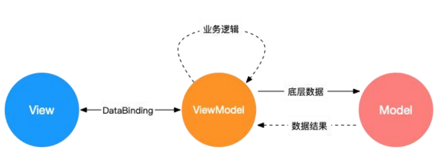

# Vue部分

## 为什么vue的数据data要用return方式返回

不使用return包裹的数据会在项目的全局可见，会造成变量污染；

而使用return包裹后数据中变量只在当前组件中生效，不会影响其他组件。

**官方：**
当一个组件被定义， data 必须声明为返回一个初始数据对象的函数，因为组件可能被用来创建多个实例。

如果 data仍然是一个纯粹的对象，则*所有的实例将共享引用同一个数据对象*！

过提供 data 函数，每次创建一个新实例后，我们能够调用 data函数，从而**返回初始数据的一个全新副本数据对象**。

## vue响应式原理

是Vue的核心特性之一，**数据驱动视图**，我们**修改数据视图随之响应更新**

- 当 一 个 Vue 实 例 创 建 时 ， Vue 会 **遍 历 data 中 的 属 性** ， 用 **Object.defineProperty将 它 们 转 为 getter/setter**

- 每个组件实例都对应一个 **watcher** 实例，它会在组件渲染的过程中**把“接触”过的数据 property 记录为依赖**。之后当**依赖项的 setter 触发时，会通知 watcher**，从而使它**关联的组件重新渲染。**


**实现：**

数据劫持+发布订阅

(数据劫持就是Object.defineProperty)

1、实现一个监听器 `Observer` ，用来劫持并监听所有属性，如果属性发生变化，就通知订阅者；

2、实现一个订阅器 `Dep`，用来收集订阅者，对监听器 `Observer` 和 订阅者 `Watcher` 进行统一管理；

3、实现一个订阅者 `Watcher`，可以收到属性的变化通知并执行相应的方法，从而更新视图；

4、实现一个解析器 `Compile`，可以解析每个节点的相关指令，对模板数据和订阅器进行初始化。


**关键理解**

- 在 obsever 中使用Dep，在 **get** 中添加 **Dep.target** (观察者)，在 **set** 中 触发 **notify** (通知)

  - ```javascript
    // 获取值
    get() {
        // 在这里添加观察者对象 Dep.target 表示观察者
        Dep.target && dep.addSub(Dep.target)
        return value
    },
     // 设置值
        set(newValue) {
            if (newValue === value) return
            value = newValue
            self.walk(newValue)
            // 触发通知 更新视图
            dep.notify()
        },  
    ```

    

- 由**dep收集依赖**，dep中会有一个sub数组用于存储收集到的观察者（收集依赖）

  - ```javascript
    class Dep {
      constructor() {
        // 存储观察者
        this.subs = []
      }
      // 添加观察者
      addSub(sub) {
        // 判断观察者是否存在 和 是否拥有update方法
        if (sub && sub.update) {
          this.subs.push(sub)
        }
      }
      // 通知方法
      notify() {
        // 触发每个观察者的更新方法
        this.subs.forEach((sub) => {
          sub.update()
        })
      }
    }
    ```

    

- 当**Observer发现响应式属性在setter中更新**，会**调用dep的notify方法**来通知之前收集依赖中的所有相关watcher

- **wathcer调用update实现视图更新**（watcher在compile编译阶段被创建）


## vue双向数据绑定

！！！vue是响应式的，默认数据不是双向绑定的，但是提供了实现数据双向绑定的手段，我们可以通过v-model的语法糖来实现

`MVVM` 数据双向绑定主要是指：**数据变化更新视图，视图变化更新数据**，如下图所示：


- 双向数据绑定通常是指我们使用的`v-model`指令的实现，是`Vue`的一个特性，也可以说是一个`input`事件和`value`的语法糖。
-  `Vue`通过`v-model`指令为组件添加上`input`事件处理（监听oninput方法）和`value`属性的赋值。

```javascript
<template>
   <!-- 这里添加了input时间的监听和value的属性绑定 -->
   <input @input='onInput' :value='localValue' />
   <span>{{localValue}}</span>
</template>
<script>
  export default{
    data(){
      return {
        localValue:'',
      }
    },
    methods:{
      onInput(v){
         //在input事件的处理函数中更新value的绑定值
         this.localValue=v.target.value;
         console.log(this.localValue)
      }
    }
  }
</script>
```

v-model 本质上不过是语法糖，v-model 在内部为不同的输入元素使用不同的属性并抛出不同的事件：

- text 和 textarea 元素使用 value 属性和 input 事件；
- checkbox 和 radio 使用 checked 属性和 change 事件；
- select 字段将 value 作为 prop 并将 change 作为事件。

- 如果在自定义组件中，v-model 默认会利用名为 value 的 prop 和名为 input 的事件

## vue对于对象，数组的响应式动态更新

！！！由于 JavaScript 的限制，Vue **不能检测**数组和对象的变化

 Vue2 会在**初始化实例时对 property 执行 getter/setter 转化**，对于自定义新增的数据无法实现响应式

**对象property更新**

```javascript
var vm = new Vue({
  data:{
    a:1
  }
})
// `vm.a` 是响应式的，因为在初始化实例时候将a执行了getter/setter转化
vm.b = 2
// `vm.b` 是非响应式的，直接在根元素上动态添加了属性，不允许
```

- 对于已经创建的实例，Vue **不允许动态添加根级别的响应式 property**。必须在初始化时侯在data中定义好

- 可以使用 `Vue.set(object, propertyName, value)` 方法向**嵌套对象添加响应式 property。**

  ```javascript
  Vue.set(vm.someObject, 'b', 2)
  //还可以使用 vm.$set 实例方法，这也是全局 Vue.set 方法的别名：
  this.$set(this.someObject,'b',2)
  ```

- 为已有对象添加多个property，由于**直接添加在已有对象上的property无法实现响应式**，所以不能直接使用object.assgin()，**需整合创建为一个新对象**

  ```javascript
  // 代替 `Object.assign(this.someObject, { a: 1, b: 2 })`
  this.someObject = Object.assign({}, this.someObject, { a: 1, b: 2 })
  ```


**数组元素更新**

**Vue 不能检测以下数组的变动：**

1. 当你**利用索引直接设置一个数组项**时，例如：`vm.items[indexOfItem] = newValue`
2. 当你**修改数组的长度**时，例如：`vm.items.length = newLength`

**解决**

1.使用数组方法更改数组

```javascript
// Array.prototype.splice
vm.items.splice(indexOfItem, 1, newValue)
```

2.使用Vue.set

```javascript
// Vue.set
Vue.set(vm.items, indexOfItem, newValue)
//vm.$set
vm.$set(vm.items, indexOfItem, newValue)
```


**原因：**

vue出于对性能的考虑，没有对数组元素做响应式，**可以做数组的响应式，但是太耗性能**

```javascript
//vue.js关于observer的部分源码
export class Observer {
  // ......
  constructor (value: any) {
    this.value = value
    this.dep = new Dep()
    this.vmCount = 0
    def(value, '__ob__', this)
    if (Array.isArray(value)) {
      // 这里对数组进行单独处理
      if (hasProto) {
        protoAugment(value, arrayMethods)
      } else {
        copyAugment(value, arrayMethods, arrayKeys)
      }
        //数组处理
      this.observeArray(value)
    } else {
      // 对对象遍历所有键值
      this.walk(value)
    }
  }
  walk (obj: Object) {
    const keys = Object.keys(obj)
    for (let i = 0; i < keys.length; i++) {
      defineReactive(obj, keys[i])
    }
  }
  observeArray (items: Array<any>) {
    for (let i = 0, l = items.length; i < l; i++) {
      observe(items[i])
    }
  }
}
```

vue 对对象是采取 `Object.keys`然后 `defineReactive` 所有键值

而对数组并没这样做，而是**只 `observe` 了每个元素的值，数组的下标因为没有被监听**，所以直接通过下标修改值是不会更新视图的。

！！！而数组方法能够响应式，是因为 Vue 对数组的方法进行了 `def` 操作

## vue异步更新

Vue 在更新 DOM 时是**异步**执行的。

- 只要**侦听到数据变化，Vue 将开启一个队列，并缓冲在同一事件循环中发生的所有数据变更。**

- 如果同一个 **watcher 被多次触发，只会被推入到队列中一次**。在缓冲时**去除重复数据**以避免不必要的计算和 DOM 操作

- 在**下一个的事件循环“tick”中，Vue 刷新队列并执行实际 (已去重的) 工作**。
- 所以如果想**操作更新后的dom就需要使用$nextTick(callback)在回调中操作**

**内部细节**

Vue 在内部对异步队列尝试使用原生的 `Promise.then`、`MutationObserver` 和 `setImmediate`

如果执行环境不支持，则会采用 `setTimeout(fn, 0)` 代替。

## vue组件通信

### 父子组件通信(9种方式)


#### **props（父传子）**

在父级组件中给子级组件添加自定义属性

```
<template>
...
<prop-test :msg="msgForPropTest" />
...
</template>
...
data() {
    return {
      msgForPropTest: "app给proptest组件的一封信",
    };
  },
...
```

然后再在子级组件中添加props配置接收（有三种方式接收）

```
//1数组
props:['msg']
//2对象	声明接收数据类型
props:[{msg:String}]
//3验证对象
props:{
     msg: {
     type: String, //指定值类型
     required: true, //是否为必传项
     default: "", //默认值，如没有父组件没有传递，则默认为空对象
     //一般required与default不一起使用
    },
}

```

**总结: **

**prop 只可以从上一级组件传递到下一级组件（父子组件），即所谓的单向数据流。而且 prop 只读，不可被修改，所有修改都会失效并警告。**

#### **自定义事件（子传父）**

父组件在子组件身上绑定自定义事件

```
...
<prop-test  @emitMsgToApp="emitMsgToApp" />
...
 methods: {
    emitMsgToApp(msg) {
      this.msgFromPropTest = msg;
    },
}

```

子组件使用**$emit**调用自定义事件

```
...
<button @click="sendMsgToApp" style="width=100px,height=50px">
      发送信息给app
    </button>
...
methods: {
    sendMsgToApp() {
      this.$emit("emitMsgToApp", this.msgToApp);
    },
  },
```

#### **parent&&children**（父子组件间通信，局限：不能用于非父子组件通信）

- **类型**：`Vue instance`

- **详细**：

  指定已创建的实例之父实例，在两者之间建立父子关系。子实例可以用 `this.$parent` 访问父实例，子实例被推入父实例的 `$children` 数组中。

  > 节制地使用 `$parent` 和 `$children` - 它们的主要目的是作为访问组件的应急方法。更推荐用 props 和 events 实现父子组件通信
  >
  > 要注意边界情况，如在`#app`上拿`$parent`得到的是`new Vue()`的实例，在这实例上再拿`$parent`得到的是`undefined`，而在最底层的子组件拿`$children`是个空数组。也要注意得到`$parent`和`$children`的值不一样，`$children` 的值是数组，而`$parent`是个对象

```js
父组件操作子组件数据
//methods
changeChildrenData() {
      this.$children.forEach((child) => {
        if (child.childrenData) {
          child.childrenData = "children值被改变了";
        }
      });
    },
    
//子组件获取父组件数据
//可操作重写父组件数据
getParentData() {
      return this.$parent.parentData;
    },
```

#### **provide/inject**（父传子，可跨父子组件间通信）

`provide`/ `inject` 是`vue2.2.0`新增的api, 简单来说就是父组件中通过`provide`来提供变量, 然后再子组件中通过`inject`来注入变量。

> 注意: 这里不论子组件嵌套有多深, 只要调用了`inject` 那么就可以注入`provide`中的数据，而不局限于只能从当前父组件的props属性中回去数据

provide inject，但是这种方式，官方不推荐，因为**这个方法真的是太不好管控了**，比如说我在根组件provide了this，孙孙重孙组件去使用了this里面的一个变量，这时候很难去跟踪到这个变量的出处了，而且你也并不知道，项目中哪个组件有用到这个变量，有没有在其他组件中进行改变，所以这个api在项目中很少人使用，但是很多人拿来写组件用

```javascript
//父组件
provide: {
    demo: "来自APP的 provide demo ",
        //function无法正常传递
    funcdeom: () => {
      return "funcdemo";
    },
  }
//子组件
inject: {
    demo: {
      from: "demo",
    },
    func: {
      from: "funcdeom",
    },
  }
//可以将inject作为props或者data//这里以data为例
data() {
    return {
      appProvideDemo: this.demo,
      appProvideFunc: this.func,
    };
  }

```


#### **ref/refs**（父子组件通信）

在父组件中给子组件加上ref标记

```
...
<prop-test ref="proptestmsg"/>
...
```

然后可以在父组件中使用this.$refs.proptestmsg获取此组件

```
getPropTestData() {
      return this.$refs.proptestmsg.msgToApp;
    },
```

#### **事件总线（无限制）**

缺点是**碰到多人合作时，会导致代码的维护性较低，代码可读性也较低**

`eventBus` 又称为事件总线，在vue中可以使用它来作为沟通桥梁的概念, 就像是所有组件共用相同的事件中心，可以向该中心注册发送事件或接收事件， 所以组件都可以通知其他组件。

> eventBus也有不方便之处, 当项目较大,就容易造成难以维护的灾难

1.事件总线的安装可以直接在当前的vue实例上面安装（main.js）

```
new Vue({
  render: h => h(App),
  beforeCreate() {
    Vue.prototype.$bus = this;
  },
}).$mount('#app')
```

使用方法为	**this.$bus**

2.新建一个js文件在其中创建一个vue实例用来充当事件总线（event-bus.js）

```
import Vue from 'vue'
export const EventBus = new Vue();
```

使用方法为先引入EventBus再使用，可以全局挂载，也可以局部使用

```
//全局挂载，类似于1方法只不过bus=EventBus这个新实例
import { EventBus } from "@/event-bus";
new Vue({
  render: h => h(App),
  beforeCreate() {
    Vue.prototype.$bus = EventBus;
  },
}).$mount('#app')
//这样全局挂载后可以使用this.$bus

按需局部挂载
即哪个组件要用就在哪挂载
```

**事件总线总体使用实例**

```
//app.vue中挂载方法
  mounted() {
   //第一种或者EventBus全局挂载
    this.$bus.$on("changeAppData", this.changeAppData);
    //引入的新建vue实例作为事件总线
    // EventBus.$on("changeAppData", this.changeAppData);
  },
   methods: {
    changeAppData(msg) {
      this.parentData = msg;
    }
  }
//子组件调用
changeParentData() {
      this.$bus.$emit("changeAppData", "proptest组件改变了App组件的值");
      // EventBus.$emit(
      //   "changeAppData",
      //   "proptest组件通过EventBus改变了App组件的值"
      // );
    },
```

#### **attr&&listener**

在vue2.4中，为了解决跨组件通信，引入了`$attrs` 和`$listeners`，

- `$attrs`  用于父组件传递数据给子组件

- `$listeners `用于子组件传递数据到父组件

新增了`inheritAttrs` 选项。

- **$attr**（父传子）
- 相当于父组件将数据流往下走，需要的子组件就自己用props捕获，剩下的由$attrs管理

 **在版本2.4以前**，默认情况下父作用域的不被认作props的属性百年孤独，将会“回退”且作为普通的HTML特性应用在子组件的根元素上。

```
//父组件
<template>
  <div>
    <child-dom :foo="foo" :bar="bar"></child-dom>
  </div>
</template>
//子组件
 props: ["foo"]
```

剩下的bar就会被退在子组件根元素上


可以利用`inheritAttrs`选项控制，默认值为true即允许默认回退行为, 

将`inheritAttrs`的值设为**false**, 这些默认的行为会禁止掉。然后通过实例属性 `$attrs` ,可以将这些特性生效，且可以通过`v-bind` 绑定到子组件的非根元素上。

```
//父组件
<attr-test
      :age="attr_age"
      :name="attr_name"
      :phone="attr_phone"
    ></attr-test>
    
//AttrTest子组件内
<template>
  <div>
    <h2>这是attrtest组件</h2>
    <p>{{ $attrs }}</p>
  </div>
</template>
...
inheritAttrs: false, //禁止默认回退
props: ["age", "name"]
```


**未使用props声明的phone存在了$attrs中**

attrs还可以继续传递给下一子组件

```
//在attr-test组件中引入attr-test-child作为子组件
//为子组件绑定$attrs
<attr-test-child v-bind="$attrs"></attr-test-child>

//在attr-test-child中使用data接收
data() {
    return {
      attrsFromAttrTest: this.$attrs,
    };
  }
```


```
或者也可以用props接收
props: {
    phone: {
      type: String,
      default() {
        return this.$attrs.phone;
      },
    },
  }
```

！！！props接收之后attrs就不复存在了，props接收数据的优先级高于data，这时候如果再用data接收一次就取不到数据


- **$listeners**（子组件传递数据到父组件）
- 本质是父组件准备自定义方法，然后由$listeners传递给子组件，子组件emit触发事件

```
//app组件内
<attr-test
      @updateName="changeAttr_name"
      @updateAge="changeAttr_age"
></attr-test>

//attr-test组件内
//$listeners传递
<attr-test-child v-bind="$attrs" v-on="$listeners"></attr-test-child>

//attr-test-child组件内
//emit调用
changeAppAttrName() {
      this.$emit("updateName", "黄睿奇");
    },
```

#### 父子组件双向数据绑定

**利用v-model双向数据绑定+props传值实现**

这里写一个小demo，点击子组件内容同时+1父子组件绑定的值

1.在父组件app中定义一个data{...clickValue=0,}

2.使用v-model为子组件addone绑定clickValue

```
  <add-one v-model="clickValue"></add-one>
```

此时在子组件身上就了一个**$attr属性value**，且**value=父组件中的clickValue**

3.在子组件中使用**props接收value**（由于是v-model绑定的所以固定以value声明），额外定义一个localValue来存储并同步父组件的value值

```js
props: {
    value: {
      type: Number,
      default: 0,
    },
  },
data(){
localValue:0
},
//为了创建后同步
watch: {
    value(v) {
    this.localvalue = v;
    },
},
create(){
//为了创建时同步父组件的value值js
this.localValue=this.value
}
```

4.子组件在模板中显示value并为相应dom添加点击事件

```vue
<template>
  <div @click="addCount">双向数据绑定测试 click {{ value }}</div>
</template>
...
methods: {
    addCount() {
      this.localvalue++;
      //父组件中给子组件添加v-model双向数据绑定时添加了input事件处理
      //使用emit通知父组件更新
      this.$emit("input", this.localvalue);
    },
  },
```

click事件处理将localValue+1并$emit通知父组件更新

## vue设计一个弹窗组件

**基本思路**

1.定义弹窗模板

```vue
<template>
  <transition name="tipMove">
    <div class="tipBox" v-if="isShowTip">
      {{ message }}
    </div>
  </transition>
</template>
//定义动画，css部分省略，主要就是fixed定位，采取less语法
```

2.props传值

```js
message: "app手动创建的tipBox",
isShowTip: true,//是否显示
isAuto: true,//是否自动关闭
duringTime:2000//显示时间
```

3.自定义事件控制关闭

```js
closeTip() {
      if (!this.autoClock) {
        this.autoClock = setTimeout(() => {
          this.$emit("update:isShowTip", false);//通知父组件修改props值，可以利用update
          clearTimeout(this.autoClock);//清除计时器好习惯
          this.autoClock = null;
        }, this.duringTime + 250);//250为动画的过渡时间
      }
    },

//对应的父组件写法
<tip-box 
:isShowTip="tipIsShow"
@update:isShowTip="(val) => (tipIsShow = val)"
></tip-box>   

//.sync修饰符是@update:自定义属性名的语法糖
<tip-box :isShowTip.sync="tipIsShow"></tip-box>        
```

**组件方式**

据上，来构建vue文件，在父组件中引入并使用

```js
<tip-box
      :message="tipMsg"
      :isShowTip="tipIsShow"
      @update:isShowTip="(val) => (tipIsShow = val)"
      :isAuto="tipAutoControl"
      :duringTime="tipDuring"
    ></tip-box>   
```

**函数方式**

定义tipTool.js

1.Vue.extends()创建子类构造器

2.利用构造器创建实例并挂载

3.绑定自定义事件（原先是由父组件绑定然后子组件触发，改为函数创建方式需要子组件内部处理）

4.domAPI将组件根元素插入文档中

```js
export const createTipBox = (propsData) => {
    //Vue.extend创建组件构造器
    const Ctor = Vue.extend(TipBox)
    //创建组件实例并挂载
    const tipvm = new Ctor({ propsData }).$mount()
    //组件方式中由外层调用的父级组件提供props数据，故由父级控制数据变化进而控制弹窗
    //这里是函数式的创建构造器，由外部普通变量提供参数，所以需要组件自己监听
    tipvm.$on('update:isShowTip', (flag) => {
        tipvm.isShowTip = flag;
    })
    //通过原生dom API的方式将组件根元素插入文档
    document.body.appendChild(tipvm.$el)
    return tipvm;
}
```

**插件方式**

插件方式可以将上面两种方式功能集成在一起

1.src目录下创建plugins文件夹/index.js

2.引入刚才的组件和函数js文件，install方法安装插件

```js
import TipBox from '@/components/TipBox/index.vue'
import { createTipBox } from '@/components/TipBox/tipbox'

export default {
    install(Vue) {
        Vue.component(TipBox.name, TipBox)
        Vue.prototype.$myTipBox = createTipBox;
    }
}
```

3.在main.js中引入并结合Vue.use使用插件

## MVVM、MVC、MVP的区别

- **MVC**

MVC 通过分离 Model、View 和 Controller 的方式来组织代码结构。

当用户与页面产生交互的时候，Controller 中的事件触发器调用 Model 层来完成对 Model 的修改，然后 Model 层再去通知 View 层更新。


其中 View 负责**页面的显示逻辑**

Model 负责**存储页面的业务数据， 以及对相应数据的操作**，**View 和 Model 应用了观察者模式**（view订阅model的更新）

Controller 层是 View 层和 Model 层的纽带，它主要负责**用户与应 用的响应操作。** 

**！！！注意**：

- 业务逻辑被放置在model层，能够更好的复用和修改增加业务
- View 层和 Model 层耦合在一起， 当项目逻辑变得复杂的时候，可能会造成代码的混乱，并且可能会对 代码的复用性造成一些问题

- **MVP**

MVC 中的 Controller 只知道 Model 的接口，因此它没有办法控制 View 层的更新，

MVP 模式中， View 层的接口暴露给了 Presenter 因此可以**在 Presenter 中将 Model 的变化和 View 的变化绑定在一起，以此来实现 View 和 Model 的同步更新**。

这样就**实现了对 View 和 Model 的解耦**， Presenter 还包含了其他的响应逻辑


- **MVVM**

**MVVM 分为 Model、View、ViewModel**

 Model 代表数据模型，**数据和业务逻辑都在 Model 层中定义**；

 View 代表 UI 视图，负责**数据的展示；** 

ViewModel 负责**监听 Model 中数据的改变并且控制视图的更新，处理用户交互操作**



**view 和 ViewModel 之间有着双向数据绑定的联系。**

因此当 Model 中 的数据改变时会触发 View 层的刷新，View 中由于用户交互操作而改 变的数据也会在 Model 中同步

**好处：**

这种模式实现了 **Model 和 View 的数据自动同步，因此开发者只需要 专注于数据的维护操作即可，而不需要自己操作 DOM**

**1. 低耦合**。视图（View）可以独立于Model变化和修改，一个ViewModel可以绑定到不同的"View"上，当View变化的时候Model可以不变，当Model变化的时候View也可以不变。

**2. 可重用性**。你可以把一些视图逻辑放在一个ViewModel里面，让很多view重用这段视图逻辑。

**3. 独立开发**。开发人员可以专注于业务逻辑和数据的开发（ViewModel），设计人员可以专注于页面设计，

**4. 可测试**。界面素来是比较难于测试的，测试可以针对ViewModel来写

**5.自动更新dom**。利用双向绑定，数据更新后视图⾃动更新,让开发者从 繁琐的⼿动 dom

**缺点：**

**Bug 很难被调试**

因为使⽤双向绑定的模式，当你看到界⾯异常了， **有可能是你 View 的代码有 Bug，也可能是 Model 的代码有问题。**

数 据绑定使得⼀个位置的 **Bug 被快速传递到别的位置**，要定位原始出问 题的地⽅就变得不那么容易了。

数据绑定的声明是**指令式地写 在 View 的模版当中的，这些内容是没办法去打断点 debug 的**

**内存限制**

对于⼤型的图形应⽤程序，**视图状态较多，model 也会很⼤**，⻓期持有，**不释放内存就造成了大量内存开销**，ViewModel 的构建和维护 的成本都会⽐较⾼

## slot是什么？有什么作用？原理是什么？

**slot（插槽），是vue的内容分发机制**

组件内部的模板引擎使用 slot 元素作为**承载分发内容的出口**。

插槽 **slot 是子组件的一个模板 标签元素**，元素是否显示，以及怎么显示是由父组件决 定的。

slot 又分三类，**默认插槽，具名插槽和作用域插槽。**

**插槽内部可以放任意内容，包括组件**

- **默认插槽**

当 slot 没有指定 name 属性值的时候一个 默认显示插槽，一个组件内只能有一个匿名插槽default

```vue
//组件：slot-demo
<template>
    <div>
        <slot>默认插槽内容</slot>
    </div>
</template>
//使用插槽
<slot-demo>此处填入插槽内容</slot-demo>
```

- **具名插槽**

带有具体名字的插槽，也就是带有 name 属性的 slot，一 个组件可以出现多个具名插槽。

定义：

组件内部使用<slot>标签加上name属性绑定组件内插槽具体名称（v-slot自能定义在template上）

使用：

使用组件插槽定义template并配合v-slot：name指定插槽名称

特殊：

默认插槽使用具名插槽

<template v-slot:default>

```vue
//组件
<div class="container">
  <header>
    <slot name="header"></slot>
  </header>
  <footer>
    <slot name="footer"></slot>
  </footer>
</div>
//组件插槽使用
<base-layout>
  <template v-slot:header>
    <h1>Here might be a page title</h1>
  </template>
  <template v-slot:footer>
    <p>Here's some contact info</p> 
  </template>
</base-layout>
```

**具名插槽缩写**

**v-slot:替换为#**

```vue
<template #header>...</template>
<template v=slot:header>...</template>
```


- **作用域插槽**

```vue
//插槽定义
<span>
  <slot>{{ user.lastName }}</slot>
</span>
//插槽使用
//！！！！！此时在父级作用域不能拿到子级的user
<current-user>
  {{ user.firstName }}
</current-user>
```

作用域插槽使得**插槽内容能够访问子组件中才有的数据**，

为了让 `user` 在父级的插槽内容中可用，我们可以将 `user` 作为 `<slot>` 元素的一个 **attribute** 绑定上去：

绑而此时绑定在 `<slot>` 元素上的 attribute 被称为**插槽 prop**

```vue
<span>
  <slot v-bind:user="user">//绑定user为插槽prop
    {{ user.lastName }}
  </slot>
</span>
//再次在父组件中使用
<current-user>
  <template v-slot:default="slotProps">//父组件使用v-slot声明获取插槽prop
    {{ slotProps.user.firstName }}
  </template>
</current-user>
```

- **动态插槽**

```vue
  //dynamicSlotName为父组件的一个data
  <template v-slot:[dynamicSlotName]>
  ...
  </template>
```

**父组件获取插槽prop的方式**

1.独占默认插槽（默认插槽）

```vue
<template v-slot:default="slotProps">//如获取user：slotProps.user
//缩写
//不带参数的 v-slot 被假定对应默认插槽
<template v-slot="slotProps">
```

默认插槽的缩写语法**不能**和具名插槽混用，因为它会导致作用域不明确：

```vue
<!-- 无效，会导致警告 -->
<current-user v-slot="slotProps">
  {{ slotProps.user.firstName }}
  <template v-slot:other="otherSlotProps">
    slotProps 在这里不能被使用
  </template>
</current-user>
```

2.具名插槽prop

```vue
 <template v-slot:other="otherSlotProps">
```

3.解构插槽prop

插槽prop支持es5解构语法

```vue
 <template v-slot:other="{user}">
 //将解构出来的user重命名为person
  <template v-slot:other="{user:person}">
```


## $nextTick原理及作用

引入异步更新队列机制的原因：

如果是同步更新，则多次对一个或多个属性赋值，会频繁触发 UI/DOM 的渲染，异步更新可以减少一些无用渲染

**Vue 的 nextTick 其本质是对 JavaScript 执行原理 EventLoop 的 一种应用**

核 心 是 利 用 了 如 Promise 、 MutationObserver 、 setImmediate、setTimeout 的**原生 JavaScript 方法来模拟对应的 微/宏任务的实现**

本质是为了**利用 JavaScript 的这些异步回调任务队列来实现 Vue 框架中自己的异步回调队**

nextTick满足实际应用中对 DOM 更新数据时机的后续逻辑处理 

**使用nextTick的场景**

1.在数据变化后执行的某个操作，而这个操作**需要使用随数据变化而变 化的 DOM 结构**的时候，这个操作就需要方法在 nextTick()的回调函 数中。

2.如果在 created()钩子进行 DOM 操作，也一定要 放在 nextTick()的回调函数中。

 因为在 created()钩子函数中，**页面的 DOM 还未渲染，这时候也没办 法操作 DOM**，所以，此时如果想要操作 DOM，必须将操作的代码放在 nextTick()的回调函数中。

## Vue单页应用与多页应用的区别

- SPA

**SPA 单页面应用（SinglePage Web Application）**

指只有一个主页 面的应用，一开始**只需要加载一次 js、css 等相关资源。所有内容都 包含在主页面**，对每一个功能模块组件化。单页应用跳转，就是切换 相关组件，**仅仅刷新局部资源**

- MPA

**MPA 多页面应用 （MultiPage Application）**

指有多个独立页面的 应用，**每个页面必须重复加载 js、css 等相关资源**。多页应用跳转， **需要整页资源刷新**

- 区别


## Vue 中封装的数组方法有哪些，其如何实现页面更新

在vue中使用Object.defineProperty对数据进行数据劫持，但是此方法**并不能监听到数组内部的变化，数组长度变化，数组截取值变化**等，所以需要对这些操作进行**hack**让Vue能够监听到其中的变化

- Vue.set() 方法利用索引为数组添加响应式元素：

```
Vue.set(Array, index, newValue) 或者 this.$set(Array, index, newValue)
```

- vue 将被侦听的数组的变异方法（**改变原数组的方法**）进行了包裹，所以他们也将会触发视图更新：

```
push()：向数组的末尾添加一个或多个元素
pop()：删除数组的最后一个元素
unshift()：向数组的开头添加一个或更多元素
shift()：删除数组的第一个元素
sort()：对数组的元素进行排序
reverse()：颠倒数组中元素的顺序
splice()：向/从数组中添加/删除项目，然后返回被删除的项目（Vue.set() 对于数组的处理其实就是调用了 vue 包裹后的 splice 方法）
```

**vue响应式数组方法原理**


首先获取到这个数组 的--ob--，也就是它的 Observer 对象，如果有新的值，就调用 observeArray 继续对新的值观察变化，然后手动调用 notify， 通知渲染 watcher，执行 update

## Vue的data中的某一个属性值的变化，视图会立即同步执行重新渲染吗？

Vue 在更新 DOM 时是异步执行的。

只要侦听到数据变化， Vue 将开启一个队列， 并缓冲在同一事件循环中发生的所有数据变更。 

如果**同一个 watcher 被多次触发，只会被推入到队列中一次**。

这种在 缓冲时去除重复数据对于避免不必要的计算和 DOM 操作是非常重要的。然后，**在下一个的事件循环 tick 中，Vue 刷新队列并执行实际 （已去重的）工作。**

## 子组件可以直接改变父组件的数据吗

子组件不可以直接改变父组件的数据。这样做主要是为了维护父子组 件的单向数据流。

如果这样做了，Vue 会在浏览器的控制台中 发出警告

**为什么建议更改？**

这是为了防止意外的改变父组件状态，使得应用的数据 流变得难以理解，导致数据流混乱。如果破坏了单向数据流，当应用 复杂时，debug 的成本会非常高。

**提倡的更改方式**

通过 **$emit** 派发一个自定义事件，父组件接收到后，由父组件 修改。

## vue的优点

- **轻量级框架**：只关注视图层，是一个构建数据的视图集合，大小只有 几十 kb 
- **简单易学**：国人开发，中文文档，不存在语言障碍 ，易于理解和学习
- **双向数据绑定**：保留了 angular 的特点，在数据操作方面更为简单
- **组件化**：保留了 react 的优点，实现了 html 的封装和重用，构 建单页面应用方面有着独特的优势；
- **视图，数据，结构分离**：使数据的更改更为简单，不需要进行逻辑代 码的修改，只需要操作数据就能完成相关操作
- **虚拟 DOM**：dom 操作是非常耗费性能的，不再使用原生的 dom 操作 节点，极大解放 dom 操作，但具体操作的还是 dom 不过是换了另一 种方式
- **运行速度更快**：相比较于 react 而言，同样是操作虚拟 dom，就性 能而言， vue 存在很大的优势

## assets和static的区别

**相同点：**assets 和 static 两个都是存放静态资源文件。项目中所 需要的资源文件图片，字体图标，样式文件等

**不同点：**

- assets 中存放的静态资源文件在项目打包时会**将 assets 中放置的静态资源文件进行打包（压缩体积）**
- **static 中放置的静态资源文件就不会要走打包 压缩格式化等流程**，而是直接进入打包好的目录
- static 中的资源文件由于没有进行压缩等操作，所以文件的体积也 就相对于 assets 中打包后的文件提交较大点。

**总结：**

项目需要的样式文件 js 文件等都可以放置在 assets 中，走打包这一流程。减少体积。

而项目中引入的第三方的 资源文件如 iconfoont.css 等文件可以放置在 static 中，因为这 些引入的第三方文件已经经过处理，不再需要处理，直接上传

## delete和Vue.delete删除数组的区别

- delete 只是被删除的元素变成了 **empty/undefined** 其他的元素的 **键值还是不变**。 
- Vue.delete **直接删除了数组 改变了数组的键值**。

## Vue模板编译原理

明确：vue中的**template**无法被浏览器解析并渲染，这并不是浏览器的标准，不是正确的HTML语法

vue模板编译目的：将template转化为浏览器可识别的HTML元素

过程：将 **template 转化成一 个 JavaScript 函数**，浏览器就可以**执行这一个函数并渲染出对 应的 HTML 元素**，让浏览器能够正确识别，这一个转化的过程，就称为模板编译。

1.解析parse

使用大量的**正则表达式对 template 字符串进行解析，将 标签、指令、属性等转化为抽象语法树 AST**

2.优化optimize

**遍历 AST，找到其中的一些静态节点并进行标记**，方便在 页面重渲染的时候进行 **diff 比较时，直接跳过这一些静态节点**，优 化 runtime 的性能

3.生成

将最终的 **AST 转化为 render 函数字符**

## v-if和v-for优先级

v-for 优先于 v-if 被解析

如果同时出现，每次渲染都会**先执行循 环再判断条件**，无论如何循环都不可避免，浪费了性能

如果条件出现在循环内部，可**通 过计算属性提前过滤掉那些不需要显示的项**。

## Vue组件化的理解

1.组件是**独立和可复用的代码组织单元**。是 Vue 核心特性之 一，开发者使用小型、独立和通常可复用的组件构建大型应用； 

2.组件化开发能**大幅提高应用开发效率、测试性、复用性**等；

3.组件使用按分类有：页面组件、业务组件、通用组件； 

4.vue 的组件是基于配置的，我们通常编写的组件是组件配置而非组 件，框架后续会生成其构造函数，它们基于 VueComponent，扩展于 Vue； 

5.vue 中常见组件化技术有：属性 prop，自定义事件，插槽等，它们 主要用于组件通信、扩展等；

6**.合理的划分组件，有助于提升应用性 能**；

7.组件应该是高内聚、低耦合的； 

8.遵循单向数据流的原则。

## Vue设计原则的理解

**1.渐进式 JavaScript 框架**

Vue 被设计 为可以自底向上逐层应用。

Vue 的核心库只关注视图层，不仅易于上 手，还便于与第三方库或既有项目整合。

当与现代化的工 具链以及各种支持类库结合使用时，Vue 也完全能够为复杂的单页应 用提供驱动。

**2.易用性**

vue 提供**数据响应式、声明式模板语法和基于配置的组件** 系统等核心特性。

我们只需要关注应用的核心业务即可，只要 会写 js、html 和 css 就能轻松编写 vue 应用。

**3.灵活性**

渐进式框架的最大优点就是灵活性，如果应用足够小，我 们可能仅需要 vue 核心特性即可完成功能；

随着应用规模不断扩大， 我们才可能逐渐引入路由、状态管理、vue-cli 等库和工具，**不管是 应用体积还是学习难度都是一个逐渐增加的平和曲线。** 

**4.高效性**

超快的虚拟 DOM 和 diff算法使我们的应用拥有最佳的性能 表现。

vue3 中引入 Proxy 对数据响应式 改进以及编译器中对于静态内容编译的改进都会让 vue 更加高效

## Vue的生命周期

每个 Vue 实例在被创建时都要经过一系列的初始化过程

——例如，需要设置**数据监听、编译模板、将实例挂载到 DOM 并在数据变化时更新 DOM 等**。

同时在这个过程中也会运行一些叫做**生命周期钩子**的函数，这给了用户在不同阶段添加自己的代码的机会

！！！注意点：

**不要在选项 property 或回调上使用箭头函数**，比如

```
created: () => console.log(this.a)
vm.$watch('a', newValue => this.myMethod())
```

因为箭头函数并没有 `this`，`this` 会作为变量一直向上级词法作用域查找，直至找到为止，

**！容易导致错误**

```
Uncaught TypeError: Cannot read property of undefined
Uncaught TypeError: this.myMethod is not a function
```

生命周期钩子

**1.beforeCreate（创建前）**：数据观测和初始化事件还未开始，此时 **data 的响应式追踪、event/watcher 都还没有被设置**，也就是说**不能访问到 data、computed、watch、methods 上的方法和数据。** 

**2.created（创建后）** ：实例创建完成，实例上配置的 options 包括 **data、computed、watch、methods 等都配置完成，但是此时渲染节点还未挂载到 DOM，所以不能访问到** el 属性。 

**3.beforeMount（挂载前）**：在挂载开始之前被调用，相关的 render 函数首次被调用。实例已完成以下的配置：**编译模板，把 data 里面 的数据和模板生成 html**。**此时还没有挂载 html 到页面上**。

**4.mounted（挂载后）**：在 el 被新创建的 vm.$el 替换，并挂载到实例上去之后调用。实例已完成以下的配置：**用上面编译好的 html 内 容替换 el 属性指向的 DOM 对象**。完成模板中的 html 渲染到 html 页 面中。此过程中进行 ajax 交互。 

**5.beforeUpdate（更新前）**：响应式数据更新时调用，此时虽然**响应式数据更新了，但是对应的真实 DOM 还没有被渲染。** 

**6.updated（更新后）** ：在由于数据更改导致的虚拟 DOM 重新渲染和 打补丁之后调用。**此时 DOM 已经根据响应式数据的变化更新了**。调 用时，组件 DOM 已经更新，所以可以执行依赖于 DOM 的操作。然而 在大多数情况下，应该避免在此期间更改状态，因为这可能会导致更 新无限循环。该钩子在**服务器端渲染期间不被调用。** 

**7.beforeDestroy（销毁前）**：实例销毁之前调用。**这一步，实例仍 然完全可用，this 仍能获取到实例**。 

**8.destroyed（销毁后）**：实例销毁后调用，调用后，Vue 实例指示 的所有东西都会解绑定，所有的事件监听器会被移除，所有的子实例 也会被销毁。该钩子在**服务端渲染期间不被调用**


## Vue子组件和父组件执行顺序

父组件解析或触发在子组件之前，但在处理过程中，子组件处理完毕后才会回到父组件继续当前事务

**加载渲染过程：** 

**(父组件挂载需要用到子组件)**

1.父组件 beforeCreate ----> 父组件 created  ----> 父组件 beforeMount 

2.子组件 beforeCreate ----> 子组件 created ----> 子组件 beforeMount ----> 子组件 mounted 

3.父组件 mounted 

**更新过程：** 

1.父组件 beforeUpdate 

2.子组件 beforeUpdate  ----> 子组件 updated 

3.父组件 updated 

**销毁过程：** 

1.父组件 beforeDestroy 

2.子组件 beforeDestroy  ----> 子组件 destroyed 

3.父组件 destoryed

## created和mounted的区别

**created:在模板渲染成 html 前调用**，即通常初始化某些属性值，然 后再渲染成视图。

 **mounted:在模板渲染成 html 后调用**，通常是初始化页面完成后，再 对 html 的 dom 节点进行一些需要的操作。

## 一般在哪个生命周期请求异步数据

**created \ beforeMount \ mounted**

以上三个钩子中**data皆可用**，可以支持服务端返回的数据进行赋值

**推荐在created进行请求**

- 能更快获取到服务端数据，减少页面加载时间，用户体验更好；
-  SSR 不支持 beforeMount 、mounted 钩子函数，放在 created 中有 助于一致性

## keep-alive生命周期

keep-alive 是 Vue 提供的一个内置组件，用来对组件进行缓存—— 在**组件切换过程中将状态保留在内存中，防止重复渲染 DOM**

若一个组件包裹了keep-alive则会多出两个生命周期：

**deactivated、activated。**

同时，**beforeDestroy 和 destroyed 就 不会再被触发了，因为组件不会被真正销毁**

- 当组件被切换，会被缓存到内存中、触发 deactivated 生命周期； 

- 当组件被切回来时，再去缓存里找这个组件、触发 activated 钩子函数

## 路由的hash模式

- **hash模式**

开发中的默认模式，它的 URL 带着一个#，例如： http://www.abc.com/#/vue，它的 hash 值就是#/vue

**特点：**

hash会**出现在URL里面，但是不会出现在HTTP请求**中，对后端完全没有影响。所以**改变 hash 值，不会重新加载页面。**

这种模 式的浏览器支持度很好，**低版本的 IE 浏览器也支持这种模式**。

hash 路由被称为是前端路由，已经成为 SPA（单页面应用）的标配。

**原理：haschange事件**

当 URL 的片段标识符更改时，将触发**hashchange**事件 (跟在＃符号后面的 URL 部分，包括＃符号)

```js
// http://www.abc.com/#/react 跳转到
// http://www.abc.com/#/vue
window.onhaschange=function(event){
console.log(event.oldURL,event.newURL)
let hash=location.hash.slice(1)//vue
}
//或者
window.addEventListener('hashchange', callback)
```

**好处**

在页面的 hash 值发生变化时， 无需向后端发起请求，**window 就可以监听事件的改变**

除此之外，**hash 值变化其对应的 URL 都会被浏览器记录下来**，这样浏览器就能实现页面的前进和后退。虽然是没有请求后端服务器，但是页面的 hash 值和对应的 URL 关联起来

## 路由的history模式

- **history模式**

history 模式的 URL 中没有#，它使用的是**传统的路由分发模式**，即用户在输入一个 URL 时，服务器会接收这个请求，并解析这个 URL，然后做出相应的逻辑处理

**特点**

比如： http://abc.com/user/id。相比 hash 模式**更加好看**。

但是，history 模式**需要后台配置支持**。**如果后台没有正确配置，访问时会返回 404**

**API：**

- 修改历史状态：HTML5 History Interface 中 新 增 的 **pushState() 和 replaceState()** 方法，改变浏览器历史记录而不更新页面

```js
history.pushState() 方法向当前浏览器会话的历史堆栈中添加一个状态（state）
replaceState()方法使用`state objects`, `title`,和 `URL` 作为参数， 修改当前历史记录实体
```

！！！调用 `history.pushState()` 或者 `history.replaceState()` 不会触发 `popstate` 事件。

！！！`popstate` 事件只会在浏览器某些行为下触发，比如点击后退按钮（或者在 JavaScript 中调用 `history.back()` 方法）。即，在同一文档的两个历史记录条目之间导航会触发该事件。

**示例**

假设 `http://mozilla.org/foo.html` 页面下执行

```js
var stateObj = { foo: "bar" };
history.pushState(stateObj, "", "bar.html");
//添加一个状态,此时改变地址栏url为：http://mozilla.org/bar.html
```

不会加载bar.html

然后执行

```js
var stateObj = { foo: "111" };
history.replaceState(stateObj, "", "bar2.html");
//覆盖了原先的stateobj,且地址改变：http://mozilla.org/bar2.html
```

不会加载 `bar2.html` 页面，甚至不会检查 bar2.html 是否存在


- 切换历史状态

包括 **forward()、back()、go()**三个方法，对应浏 览器的前进，后退，跳转操作

虽然 history 模式丢弃了丑陋的#。但是，它也有自己的缺点，就是 在**刷新页面的时候，如果没有相应的路由或资源，就会刷出 404 来**。 如果想要切换到 history 模式，就要进行以下配置（后端也要进行配 置）


## hash模式和history模式的区别

- pushState() 设置的新 URL 可以是与**当前 URL 同源的任意 URL**；而 hash 只可修改 # 后面的部分，因此**只能设置与当前 URL 同文档的 URL**
- pushState() 设置的**新 URL 可以与当前 URL 一模一样**，这样也会把 记录添加到栈中；而 hash 设置的新值**必须与原来不一样才会触发**动 作将记录添加到栈中
- pushState() 通过 **stateObject 参数可以添加任意类型的数据**到记 录中；而 **hash 只可添加短字符串**
- pushState() 可额外设置 title 属性供后续使用
- hash 模式下，仅 **hash 符号之前的 url 会被包含在请求**中；history 模式下， **前端的 url 必须和实际向后端发起请求的 url 一致**，如果没有对用的 路由处理，将返回 404

## vue-router跳转和location.href跳转有什么区别

- 使用 location.href= /url 来跳转，简单方便，但是刷新了页面；
- 使用 history.pushState( /url ) ，无刷新页面，静态跳转
- router.push( /url ) 来跳转，使用了 diff 算法，实现了按需加载，减少dom的消耗，其本质还是利用了history.pushState()

## 什么是prop逐级穿透

需要从父组件向子组件传递数据时，会使用 [props](https://cn.vuejs.org/guide/components/props.html)。

但是如果在**多层级嵌套的组件中**，某个深层的子组件需要一个**较远的祖先组件中的部分数据**，在props传递的过程中形成了一颗巨大的组件props树。


 `<Footer>` 组件可能根本不关心这些 props，但为了使 `<DeepChild>` 能访问到它们，仍然需要定义并向下传递。

如果组件链路非常长，可能会影响到更多这条路上的组件。这一问题被称为**“prop 逐级透传”**，显然是我们希望尽量避免的情况。

**解决：provide/inject**

`provide`作为**依赖提供者**。任何后代的组件树，无论层级有多深，都可以通过`inject`**注入**由父组件提供给整条链路的依赖。


## vue状态管理模式

- **state**，驱动应用的数据源；
- **view**，以声明方式将 **state** 映射到视图；
- **actions**，响应在 **view** 上的用户输入导致的状态变化。

以下是一个表示“单向数据流”理念的简单示意：


## Vuex原理

**官方的一段话**

Vuex 是一个专为 Vue.js 应用程序开发的**状态管理模式**。

它采用**集中式存储**管理应用的所有组件的状态，并以相应的规则保证状态以一种可预测的方式发生变化（**vuex的应用核心就是srore仓库**）

通俗的理解就是把组件的共享状态抽取出来，以一个全局单例模式管理

store是一个包含**多种state状态的响应式容器**，若 store 中的state状态发生变化，那么相应的组件也会相应地得 到高效更新


**应用流程：**

- 组件会触发（dispatch）一些事件或 动作，也就是图中的 Actions
- 在 vuex 中，数据是集中管理的，不能直接去更改数据，所以会把这个动作提 交（Commit）到 Mutations 中;
- Mutations 根据action去相应改变（Mutate）State 中的数据; 
- State 中的数据被改变之后，就会重新渲染（Render）到 组件中，组件展示更新后的数据，完成一个流程

**各个模块核心功能：**

**Vue Components∶ Vue 组件。**HTML 页面上，负责接收用户操作等交 互行为，执行 dispatch 方法触发对应 action 进行回应。 

- **dispatch∶操作行为触发方法，**是唯一能执行 action 的方法。 

**actions∶ 操作行为处理模块。**

- 负责处理组件dispatch的 所有交互行为。包含同步/异步操作，支持多个同名方法，按照注册 的顺序依次触发。
- **向后台 API 请求的操作**，包括 触发其他 action 以及**提交 mutation** 的操作。
- 提供 Promise 的封装，以支持 action 的**链式触发**。

- **commit∶状态改变提交操作方法**。对 mutation 进行提交，是唯一能 执行 mutation 的方法。

**mutations∶状态改变操作方法。**

- 是 Vuex 修改 state 的唯一推荐方法， 其他修改方式在严格模式下将会报错。
- 该方法**只能进行同步操作**，且 **方法名只能全局唯一**。
  - 如果是异步的则无法跟踪状态的实时改变

**state∶ 页面状态管理容器对象。**集中存储组件中需要共享的data，**全局唯一**，以进行统一的状态管理。利用 Vue 的细粒度数据响应机制来进行 高效的状态更新。 

**getters∶ state 对象读取方法**（可以认为是 store 的计算属性）。就像computed一样，getter 的返回值**会根据它的依赖被缓存起来**，且只有当它的**依赖值发生了改变才会被重新计算。**

**modules：store模块化**

- 当应用较为复杂，需要**共享的数据较多时**，state对象以及store对象都会变得很**臃肿，不利于代码维护**。
- 将store分割为不同模块，**每个模块拥有自己的state、mutation、action、getter并且可以嵌套子模块**。使数据管理起来更加结构清晰，方便管理。

**home/index.js**

```js
//home模块小仓库
const state = {}
const mutations = {}
const actions = {};
const getters = {}
export default {
    state,
    mutations,
    actions,
    getters
}
```

然后再在`store/index.js`中汇总聚合各个小仓库

```js
import home from './home'
import search from './search'
//对外暴露一个Store类的实例
export default new Vuex.Store({
    modules: {
        home,
        search
    }
})
```

## vuex和localStorge的区别

- vuex存储在内存中（**各种格式数据**）
- localStorge存储在本地（**以键值对方式存储，只支持字符串类型**）
  - 存储对象需要 JSON 的 stringify 和 parse 方法进行处理。 

！！！**读取内存比读取硬盘速度要**

**应用场景**

- Vuex 是一个专为 Vue.js 应用程序开发的状态管理模式。集中式管理组件共享状态，并以相应的规则保证状态以一 种可预测的方式发生变化。**vuex 用于组件之间的传值**

- localstorage 是本地存储，是将数据存储到浏览器的方法，一般是 在**跨页面传递数据时使用**

！！！**vuex实现数据的响应式，localStorge不能**

**持久化**

刷新页面vuex存储的数据会丢失，localStorge不会

## vuex和单纯的全局对象有什么区别

1. vuex的状态存储是**响应式的**，store中的状态变化，那么对应的组件也会相应的更新
2. **不能直接改变**store中的state，state改变的唯一途径是提交commit到mutation（这样可以方便地跟踪每一个状态 的变化，从而能够实现一些工具帮助更好地了解我们的应用）

## 为什么vuex的mutation不能做异步操作

vuex状态更新的唯一推荐途径是mutation

每个mutation执行完成对应一个新的状态变更，这样做的目的是为了**更加方便地跟踪每一个状态的变化。**

所以开发者工具devtools就可以**存储快照，实现time-travel**

反之，如果mutation是**异步操作，那么就无法知道状态更新的具体时间节点，无法进行状态追踪**

## defineProperty和proxy的区别

vue2初始化遍历data，使用Object.defineProperty 把这些属性全部转为 getter/setter

！！！Object.defineProperty 是 ES5 中一个**无法 shim 的特性**，这也就 是 Vue 不支持 IE8 以及更低版本浏览器的原因。

- defineProperty

1.**后期添加或删除对象的属性，vue2无法检测**。因为添加或删除的对象 没 有 在 初 始 化 进 行 响 应 式 处 理 ， 只 能 通 过 $set 来 调 用 Object.defineProperty()处理或一些经过包裹的数组方法

2.**无法监控数组下标和数组长度**，因为vue2出于对性能的考量没有对数组做依赖收集


Vue3 使用 Proxy 来监控数据的变化。Proxy 是 ES6 中提供的功能， 其作用为：用于定义基本操作的自定义行为（如属性查找，赋值，枚举，函数调用等）

- proxy

1.**Proxy 直接代理整个对象而非对象属性**，这样只需做一层代理就可 以监听同级结构下的所有属性变化，包括新增属性和删除属性。 

2.Proxy 可以监听数组的变化

## vue3为什么要用proxy

vue2中defineProperty会改变原始数据，而proxy是对象的虚拟表示，作为对象的代理

```js
new Proxy(target,handler)
```

- `target` 被代理的对象，它可以是任何类型的对象，包括内置的数组，函数甚至是另一个代理对象。
- `handler` 被代理对象上的自定义行为

```
handler.get 拦截器
handler.set 捕获器
```

这些处理器可在访问或修改原始对象上的属性时进行拦截，实现完全的代理

**proxy优点**

- 不需用使用 Vue.$set 或 Vue.$delete 触发响应式。 

- 全方位的数组变化检测，消除了 Vue2 无效的边界情况。 
- 支持 Map，Set，WeakMap 和 WeakSet。

## 虚拟dom解析过程

1. 对将要插入文档中的dom树结构进行分析，**使用js对象将其表示出来并保存该对象树**
2. 页面的状态发生改变，需要对页面的 DOM 的结构进行调整的时候， 首先**根据变更的状态，重新构建起一棵对象树**
3. **新旧对象树进行比较，记录两棵树的差异**
4. 最后将记录的**有差异的地方应用到真实dom树**（即更新视图）

## vue中key的作用

1. **v-if使用key**（标识一个独立元素）

使用 v-if 来 实现元素切换的时候，如果切换前后含有相同类型的元素，那么这个元素就会被复用，防止不需要的复用可以为元素标识key，使用key的元素不会被复用

2. **v-for使用key**（高效的更新渲染虚拟 DOM）

v-for更新已渲染过的元素列 表时，它**默认使用“就地复用”的策略**

如果数据项的顺序发生了改 变，Vue **不会移动 DOM 元素来匹配数据项**的顺序，而是**简单复用此 处的每个元素**

为每个列表项提供一个 key 值，以便 Vue 来跟踪元素的身份，从而高效的实现复用。这个时候 key 的作用是为 了**高效的更新渲染虚拟 DOM**

**原因：**key 是为 Vue 中 **vnode 的唯一标记**，通过这个 key，diff 操作可 以**更准确、更快速**

- 更准确：因为带 key 就不是就地复用了，在 sameNode 函数 a.key === b.key 对比中可以避免就地复用的情况。所以会更加准确。

- 更快速：利用 **key 的唯一性生成 map 对象来获取对应节点**，比遍历 方式更快速

## diff算法原理

林三心：https://juejin.cn/post/6994959998283907102#comment

**Diff算法是一种对比算法**。对比新旧**虚拟dom中的差异节点**，找出这个`虚拟节点`，并只更新这个虚拟节点所对应的`真实节点`，而不用更新其他部分，实现`精准`地更新真实DOM，进而`提高效率`。

- **同层对比**


**对比流程：**

当数据改变时，会触发`setter`，并且通过`Dep.notify`去通知所有`订阅者Watcher`，订阅者们就会调用`patch方法`，给真实DOM打补丁，更新相应的视图


**patch方法**

对比当前同层的虚拟节点**是否为同一种类型的标签**

- 是：继续执行`patchVnode方法`进行深层比对
- 否：没必要比对了，直接整个节点替换成`新虚拟节点`

**sameNode方法**

判断是否为同一类型节点

```js
function sameVnode(oldVnode, newVnode) {
  return (
    oldVnode.key === newVnode.key && // key值是否一样
    oldVnode.tagName === newVnode.tagName && // 标签名是否一样
    oldVnode.isComment === newVnode.isComment && // 是否都为注释节点
    isDef(oldVnode.data) === isDef(newVnode.data) && // 是否都定义了data
    sameInputType(oldVnode, newVnode) // 当标签为input时，type必须是否相同
  )
}
```

**patchVnode方法**

**以newVnode为基准更新oldVnode**

找到对应的`真实DOM`，称为`el`

判断`newVnode`和`oldVnode`是否指向同一个对象，如果是，那么直接`return`

如果他们都有文本节点并且不相等，那么将`el`的文本节点设置为`newVnode`的文本节点。

如果`oldVnode`有子节点而`newVnode`没有，则删除`el`的子节点

如果`oldVnode`没有子节点而`newVnode`有，则将`newVnode`的子节点真实化之后添加到`el`

如果两者都有子节点，则执行`updateChildren`函数比较子节点，这一步很重要

## 直接操作dom和虚拟dom+diff算法谁更优秀

尤雨溪回答：https://www.zhihu.com/question/31809713/answer/53544875

这是一个性能 vs. 可维护性的取舍，框架的意义在于为你掩盖底层的 DOM 操作，让你用更声明式的方式来描述你的目的，从而让你的代码更容易维护。

**没有任何框架可以比纯手动的优化 DOM 操作更快**，因为框架的 DOM 操作层需要应对任何上层 API 可能产生的操作，它的实现必须是**普适的**。

框架给你的保证是，**你在不需要手动优化的情况下，我依然可以给你提供过得去的性能**。


**使用虚拟DOM算法的损耗计算：** 总损耗 = 虚拟DOM增删改+（与Diff算法效率有关）真实DOM差异增删改+**（较少的节点）排版与重绘**

**直接操作真实DOM的损耗计算：** 总损耗 = 真实DOM完全增删改+**（可能较多的节点）排版与重绘**


在一个大型列表所有数据都变了的情况下，重置 innerHTML 其实是一个还算合理的操作，这时候直接操作真实dom的代价与之相比又要稍好一些，所以不是绝对的

## @hook

问题引入：如何实现父组件监听子组件的声明周期

- **自定义事件**

```vue
// 父组件
<template>
  <div>
    <Child
      @mounted="onMounted"
      @updated="onUpdated"
      @beforeDestroy="onBeforeDestroy"
    ></Child>
  </div>
</template>

// 子组件
...
  mounted () {
	  this.$emit('mounted')
  }
  updated () {
	  this.$emit('updated')
  }
  beforeDestroy () {
	  this.$emit('beforeDestroy')
  }
...
```

父组件给子组件传递了多个回调，依赖于子组件在自身生命周期通过vm.$emit调用

缺点：

子组件必须是我们自己编写的组件，若是一个第三方库则无法满足需求（第三方库不能保证自身生命周期通过vm.$emit调用）


- **@hook**

```vue
// 父组件
<template>
  <div>
    <Child
      @hook:mounted="onMounted"
      @hook:updated="onUpdated"
      @hook:beforeDestroy="onBeforeDestroy"
    ></Child>
  </div>
</template>

// 子组件
<!--无-->
```

可以看到代码非常简洁，同时支持所有的组件使用

**为什么支持？（官方文档也没有介绍hook）**

源码解读：

在vue2源码的`lifecycle.js`文件里，我们发现`vue`的生命周期的各个阶段都会去调用一个`callHook`函数，它支持两个参入，分别是实例`vm`和对应的生命周期钩子名称。

而`callHook`里面就执行了`vm.$emit('hook:' + hook)`


所以我们在只需在父组件中为子组件绑定`@hook:mounted`，也就是执行了`vm.$emit(hook:mounted)`

那么在vue2内部执行生命周期钩子的时候就会自动调用`vm.$emit('hook:mounted')`


## vue3.0有什么更新


## 简述mixin、extends的覆盖逻辑

 

## Vue和React的区别