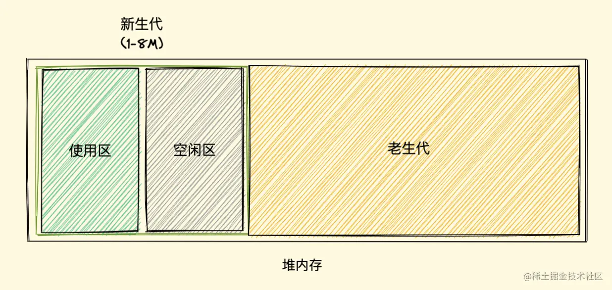
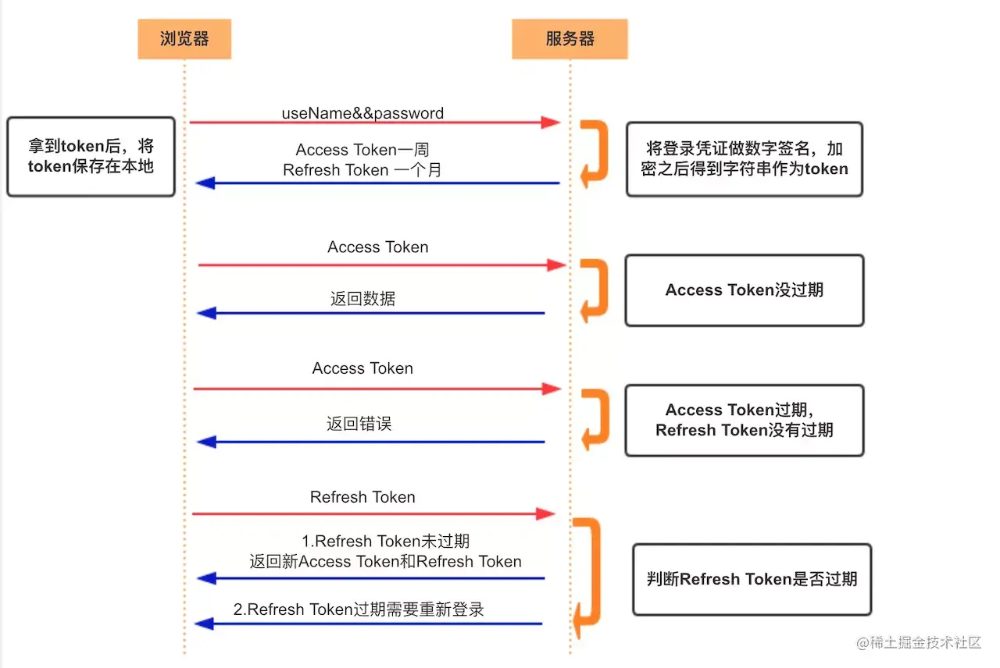

## 浏览器包含哪些进程

浏览器是多进程的，拿Chrome来说，我们每打开一个Tab页就会产生一个进程

**为什么浏览器要多进程**

1.我们假设浏览器是单进程，那么某个Tab页崩溃了，就影响了整个浏览器，体验有多差

2.同理如果插件崩溃了也会影响整个浏览器

**四大进程**

- Browser进程
  - **浏览器的主进程(负责协调、主控)，该进程只有一个**
  - 负责浏览器界面显示，与用户交互。如前进，后退等
  - 负责各个页面的管理，创建和销毁其他进程
  - 将渲染(Renderer)进程得到的内存中的Bitmap(位图)，绘制到用户界面上
  - 网络资源的管理，下载等
- 第三方插件进程
  - **每种类型的插件对应一个进程**，当使用该插件时才创建
- GPU进程
  - **该进程也只有一个**，用于3D绘制等等
- 渲染进程(重点)
  - 即通常所说的浏览器内核(Renderer进程，内部是多线程)
  - **每个Tab页面都有一个渲染进程，互不影响**
  - 主要作用为**页面渲染，脚本执行，事件处理**等

## 简述渲染进程Renderer

页面的渲染，JS的执行，事件的循环，都在渲染进程内执行

**！！！渲染进程是多线程的**

**渲染进程Renderer的主要线程**（GUI渲染线程，js解析线程，事件触发线程，定时器触发线程，异步http请求线程）

**GUI渲染线程**

- 负责渲染浏览器界面，解析HTML，CSS，构建DOM树和RenderObject树，布局和绘制等
  - 解析html代码(HTML代码本质是字符串)转化为浏览器认识的节点，生成DOM树，也就是DOM Tree
  - 解析css，生成CSSOM(CSS规则树)
  - 把DOM Tree 和CSSOM结合，生成Rendering Tree(渲染树)
- **当我们修改了一些元素的颜色或者背景色，页面就会重绘(Repaint)**
- **当我们修改元素的尺寸，页面就会回流(Reflow)**
- 当页面需要Repaing和Reflow时**GUI线程执行，绘制页面**
- **回流(Reflow)比重绘(Repaint)的成本要高**，我们要尽量避免Reflow和Repaint
- GUI渲染线程与JS引擎线程是互斥的
  - 当JS引擎执行时GUI线程会被挂起(相当于被冻结了)
  - GUI更新会被保存在一个队列中等到JS引擎空闲时立即被执行

**！！！注意：**

1.浏览器为了能够使`宏任务`和`DOM任务`有序的进行，会在一个`宏任务`执行结果后，在下一个`宏任务`执行前，`GUI渲染线程`开始工作，对页面进行渲染

2.当一个`宏任务`执行完，会在渲染前，将执行期间所产生的所有`微任务`都执行完

**执行顺序：宏任务 --> 微任务 --> 渲染**

（微任务优先级高于宏任务，这里的执行顺序是指从上一轮微任务执行完毕，渲染完毕，开始任务队列取出并执行下一个宏任务）

**JS引擎线程**

- JS引擎线程就是JS内核，负责处理Javascript脚本程序，运行代码(例如V8引擎)
- JS引擎一直等待着任务队列中任务的到来，然后加以处理
  - 浏览器同时只能有一个JS引擎线程在运行JS程序，所以**js是单线程运行的**
  - 一个Tab页(renderer进程)中无论什么时候都只有一个JS线程在运行JS程序
- GUI渲染线程与JS引擎线程是互斥的，js引擎线程会阻塞GUI渲染线程
  - **我们常遇到的JS执行时间过长，造成页面的渲染不连贯，导致页面渲染加载阻塞(就是加载慢)**
  - 例如浏览器渲染的时候遇到`<script>`标签，就会停止GUI的渲染，然后js引擎线程开始工作，执行里面的js代码，等js执行完毕，js引擎线程停止工作，GUI继续渲染下面的内容。所以如果js执行时间太长就会造成页面卡顿的情况

**事件触发线程**

- **属于浏览器而不是JS引擎，用来控制事件循环，并且管理着一个事件队列(task queue)**
- 当js执行碰到事件绑定和一些异步操作(如setTimeOut，也可来自浏览器内核的其他线程，如鼠标点击、AJAX异步请求等)，会走事件触发线程**将对应的事件添加到对应的线程中**(比如定时器操作，便把定时器事件添加到定时器线程)
- 当对应的事件符合触发条件被触发时，如异步事件得到结果，该线程会把事件添加到待处理队列的队尾，等待JS引擎的处理
- 因为JS是单线程，所以这些待处理队列中的事件都得排队等待JS引擎处理

**定时触发器线程**

- `setInterval`与`setTimeout`所在线程
- 浏览器定时计数器并不是由JavaScript引擎计数的(因为JavaScript引擎是单线程的，如果处于阻塞线程状态就会影响记计时的准确)
- 通过单独线程来计时并触发定时(计时完毕后，添加到事件触发线程的事件队列中，等待JS引擎空闲后执行)，这个线程就是定时触发器线程，也叫定时器线程
- W3C在HTML标准中规定，规定要求`setTimeout`中低于4ms的时间间隔算为4ms

**异步http请求线程**

- 在XMLHttpRequest在连接后是通过浏览器新开一个线程请求
- 将检测到状态变更时，如果设置有回调函数，异步线程就产生状态变更事件，将这个回调再放入事件队列中再由JavaScript引擎执行
- 简单说就是当执行到一个http异步请求时，就把异步请求事件添加到异步请求线程，等收到响应(准确来说应该是http状态变化)，再把回调函数添加到事件队列，等待js引擎线程来执行

定时触发线程只管理定时器且**只关注定时不关心结果**，定时结束就把回调扔给事件触发线程

异步http请求线程只管理http请求**只关注请求与获取不关心结果**，请求结束把回调扔给事件触发线程

事件触发线程**只关心异步回调入事件队列**

JS引擎线程**只会执行执行栈中的事件**

执行栈中的代码执行完毕，就会读取事件队列中的事件并添加到执行栈中继续执行，这样反反复复就是我们所谓的**事件循环(Event Loop)**

## 浏览器垃圾回收机制

**什么是垃圾回收机制？**

`GC` 即 `Garbage Collection` ，程序工作过程中会产生很多 `垃圾`，这些垃圾是程序不用的内存或者是之前用过了，以后不会再用的内存空间

而 `GC` 就是负责回收垃圾的，他工作在引擎内部，所以对于我们前端来说，`GC` 过程是相对比较无感的，这一套无感的操作也就是常说的 `垃圾回收机制` 了

**为什么需要垃圾回收机制？**

程序的运行需要内存，只要程序提出要求，操作系统或者运行时就必须提供内存，那么对于持续运行的服务进程，必须要及时释放内存，否则，内存占用越来越高，轻则影响系统性能，重则就会导致进程崩溃

**垃圾回收策略**

**！！！可达性**

在 JavaScript 内存管理中有一个概念叫做 `可达性`，就是那些以某种方式可访问或者说可用的值，它们被保证存储在内存中，**反之不可访问则需回收**

`JavaScript` 垃圾回收机制的原理说白了也就是**定期找出那些不再用到的内存（变量），然后释放其内存**

- **标记清除法**

标记清除（Mark-Sweep），目前在 `JavaScript引擎` 里这种算法是最常用的，到目前为止的大多数浏览器的 `JavaScript引擎` 都在采用标记清除算法，只是各大浏览器厂商还对此算法进行了优化加工，且不同浏览器的 `JavaScript引擎` 在运行垃圾回收的频率上有所差异

**两个过程**

1.标记：标记阶段即为所有活动对象做上标记

2.清除：清除阶段则把没有标记（也就是非活动对象）销毁

整个标记清除算法大致过程就像下面这样

1.垃圾收集器在运行时会给内存中的所有变量都加上一个标记，**假设内存中所有对象都是垃圾，全标记为0**

2.然后从各个根对象开始遍历，**把不是垃圾的节点改成1**

3.**清理所有标记为0的垃圾，销毁并回收它们所占用的内存空间**

4.**最后，把所有内存中对象标记修改为0，等待下一轮垃圾回收**

优点：实现简单

缺点：清除之后剩余的对象位置不变而导致的空闲内存不连续，出现了 `内存碎片`

优化方法：标记整理法

标记结束后，标记整理算法会将不需要清理的对象向内存的一端移动，最后清理掉边界的内存


- **引用计数法**

引用计数（Reference Counting）把 `对象是否不再需要` 简化定义为 `对象有没有其他对象引用到它`，如果没有引用指向该对象（零引用），对象将被垃圾回收机制回收，目前很少使用这种算法

它的策略是跟踪记录每个变量值被使用的次数

- 当声明了一个变量并且将一个引用类型赋值给该变量的时候这个值的引用次数就为 1
- 如果同一个值又被赋给另一个变量，那么引用数加 1
- 如果该变量的值被其他的值覆盖了，则引用次数减 1
- 当这个值的引用次数变为 0 的时候，说明没有变量在使用，这个值没法被访问了，回收空间，垃圾回收器会在运行的时候清理掉引用次数为 0 的值占用的内存

```
let a = new Object() 	// 此对象的引用计数为 1（a引用）
let b = a 		// 此对象的引用计数是 2（a,b引用）
a = null  		// 此对象的引用计数为 1（b引用）
b = null 	 	// 此对象的引用计数为 0（无引用）
...			// GC 回收此对象
```

缺点：循环引用造成垃圾回收失败，计数器的额外开销

## v8引擎对GC的优化

V8 的垃圾回收策略主要基于**分代式垃圾回收机制**

V8 中将堆内存分为**新生代和老生代两区域**，采用不同的垃圾回收器也就是不同的策略管理垃圾回收

- 新生代的对象为**存活时间较短的对象**，简单来说就是新产生的对象，通常只支持 `1～8M` 的容量
- 老生代的对象为**存活事件较长或常驻内存的对象**，简单来说就是经历过多次新生代垃圾回收后还存活下来的对象，容量通常比较大

V8 整个堆内存大=新生代+老生代


**新生代垃圾回收**

新生代对象是通过 `Scavenge` 的算法进行垃圾回收，

在 `Scavenge算法` 的具体实现中，主要采用了一种复制式的方法即 `Cheney算法` 

`Cheney算法` 中将堆内存一分为二为`使用区`和`空闲区`



新加入的对象存放到使用区，当使用区快被写满时，执行一次垃圾清理操作

回收过程

1.**标记复制：对使用区中的活动对象做标记**，标记完成之后将使用区的**活动对象复制进空闲区并进行排序**（避免内存碎片）

2.**垃圾清理：**清空当前使用区

3.**角色互换：**把原来的使用区标识为空闲区，把原来的空闲区标识为使用区

4.**老生代触发：**当一个对象经过多次复制后依然存活，移动至老生代，采用老生代的垃圾回收策略进行管理

5.**25%内存触：**如果复制一个对象到空闲区时空间占用超过了 25%，那么这个对象会被直接晋升到老生代空间中

设置为 25% 的比例的原因是，当完成 `Scavenge` 回收后，空闲区将翻转成使用区，继续进行对象内存的分配，**若占比过大，将会影响后续内存分配**


**老生代垃圾回收**

**直接沿用标记整理法**

**标记阶段，**从一组根元素开始，递归遍历这组根元素，遍历过程中能到达的元素称为活动对象，没有到达的元素就可以判断为非活动对象

**整理阶段，**将不需要清理的对象向内存的一端移动

**清除阶段，**老生代垃圾回收器会直接将非活动对象，也就是数据清理掉


并行回收、增量标记、懒性清理...

更多看这里：https://juejin.cn/post/6981588276356317214#heading-11

## 内存泄漏

垃圾被回收了啥事没有，垃圾没被回收就是内存泄漏。

代码中依然要主动避免一些**不利于引擎做垃圾回收操作**，因为不是所有无用对象内存都可以被回收的，那当不再用到的对象内存，没有及时被回收时，我们叫它 `内存泄漏（Memory leak）`。

- **不正当闭包**

```javascript
function fn2(){
  let test = new Array(1000).fill('isboyjc')
  return function(){
    return test//使得外部可以访问test
  }
}
let fn2Child = fn2()
fn2Child()
```

`return` 的函数中存在函数 `fn2` 中的 `test` 变量引用，所以 `test` 并不会被回收，也就造成了内存泄漏。

**解决**：把外部的引用关系置空

```
fn2Child=null
```


- **隐式全局变量**

对于全局变量，垃圾回收器很难判断这些变量什么时候才不被需要，所以全局变量通常不会被回收

```javascript
func fn3(){
test= new Array(1000).fill('isboyjc')//不使用let,const,var声明
}
```

**解决**：在开发中我们可以使用`严格模式`或者通过 `lint` 检查来避免这些情况的发生，从而降低内存成本

**扩展**：

1.我们在使用全局变量存储数据时，要确保使用后将其置空或者重新分配，即在使用完将其置为 `null` 即可

2.！！！特别是在使用全局变量做**持续存储大量数据的缓存**时，我们一定要记得**设置存储上限并及时清理**，不然的话数据量越来越大，内存压力也会随之增高。


- **游离dom引用**

进行 DOM 时会使用变量缓存 DOM 节点的引用，但移除节点的时候，我们应该同步释放缓存的引用，否则游离的子树无法释放。

```html
<div id="root">
  <ul id="ul">
    <li></li>
    <li></li>
    <li id="li3"></li>
    <li></li>
  </ul>
</div>
<script>
  let root = document.querySelector('#root')
  let ul = document.querySelector('#ul')
  let li3 = document.querySelector('#li3')
  
  // 由于ul变量存在，整个ul及其子元素都不能GC
  root.removeChild(ul)
  
  // 虽置空了ul变量，但由于li3变量引用ul的子节点，所以ul元素依然不能被GC
  ul = null
  
  // 已无变量引用，此时可以GC，但是造成了ul游离结点
  li3 = null
</script>
```


- **遗忘的定时器**

```javascript
// 获取数据
let someResource = getData()
setInterval(() => {
  const node = document.getElementById('Node')
	if(node) {
    node.innerHTML = JSON.stringify(someResource))
	}
}, 1000)
```

如若没有调用clearInterval来清除定时器，定时器将一直执行，someResource无法回收

**解决：**

当不需要 `interval` 或者 `timeout` 时，最好调用 `clearInterval` 或者 `clearTimeout`来清除

另外，浏览器中的 `requestAnimationFrame` 也存在这个问题，我们需要在不需要的时候用 `cancelAnimationFrame` API 来取消使用。


- **遗忘的事件监听**

当事件监听器在组件内挂载相关的事件处理函数，而在组件销毁时不主动将其清除时，其中引用的变量或者函数不会被回收，造成内存泄漏

以vue为例

```vue
<template>
  <div></div>
</template>

<script>
export default {
  created() {
    window.addEventListener("resize", this.doSomething)//挂载resize事件监听
  },
  beforeDestroy(){
    window.removeEventListener("resize", this.doSomething)//清除事件监听
  },
  methods: {
    doSomething() {
      // do something
    }
  }
}
</script>
```


- **遗忘的监听者模式**

实现了监听者模式并在组件内挂载相关的事件处理函数，而在组件销毁时不主动将其清除时，其中引用的变量或者函数都被认为是需要的而不会进行回收

**如果内部引用的变量存储了大量数据，可能会引起页面占用内存过高，造成内存泄漏**

以vue为例

```vue
<template>
  <div></div>
</template>

<script>
export default {
  created() {
    eventBus.on("test", this.doSomething)//事件总线挂载方法
  },
  beforeDestroy(){
    eventBus.off("test", this.doSomething)//取消方法挂载
  },
  methods: {
    doSomething() {
      // do something
    }
  }
}
</script>
```


- **遗忘的Map\Set对象**

当使用 `Map` 或 `Set` 存储对象时，同 `Object` 一致都是**强引用**，如果不将其主动清除引用，其同样会造成内存不自动进行回收。

```javascript
let obj = {id: 1}
let user = {info: obj}
let set = new Set([obj])
let map = new Map([[obj, 'hahaha']])

// 重写obj
obj = null//由于是强引用，即使置obj为null也不能清除set和map 

console.log(user.info) // {id: 1}
console.log(set)//Set(1){{...}}
console.log(map)//Map(1){{...}=>'hahaha'}
```

解决：使用weakMap或weakSet

```javascript
let obj = {id: 1}
let weakSet = new WeakSet([obj])
let weakMap = new WeakMap([[obj, 'hahaha']])

// 重写obj引用
obj = null
// {id: 1} 将在下一次 GC 中从内存中删除
//回收之后weakSet和weakMap中的对应使用也会清除
```


- **未清理的Console输出**

我们之所以在控制台能看到数据输出，是因为浏览器保存了我们输出对象的信息数据引用，也正是因此未清理的 `console` 如果输出了对象也会造成内存泄漏。

## 内存三大件

其实前端关于内存方面主要有三个问题，我把它们亲切的称作内存三大件：

`内存泄漏` 我们说很久了，**对象已经不再使用但没有被回收，内存没有被释放，即内存泄漏**，那想要避免就避免让无用数据还存在引用关系，也就是多注意我们上面说的常见的几种内存泄漏的情况。

`内存膨胀` 即在**短时间内内存占用极速上升到达一个峰值**，想要避免需要使用技术手段减少对内存的占用。

`频繁 GC` 同这个名字，就是 GC 执行的特别频繁，一般出现在**频繁使用大的临时变量导致新生代空间被装满的速度极快，而每次新生代装满时就会触发 GC**，频繁 GC 同样会导致页面卡顿，想要避免的话就不要搞太多的临时变量，因为临时变量不用了就会被回收，这和我们内存泄漏中说避免使用全局变量冲突，其实，只要把握好其中的度，不太过分就 OK。

## 浏览器缓存机制

### 缓存的好处

1.缓解服务器压力，不用每次都去请求某些数据了。

2.提升性能，打开本地资源肯定会比请求服务器来的快。

3.减少带宽消耗，当我们使用缓存时，只会产生很小的网络消耗（打开本地资源也会有网络消耗）

### Web缓存种类： 

数据库缓存，CDN缓存，代理服务器缓存，浏览器缓存。


所谓浏览器缓存其实就是指在本地使用的计算机中开辟一个内存区，同时也开辟一个硬盘区作为数据传输的缓冲区，然后用这个缓冲区来暂时保存用户以前访问过的信息。


### 浏览器缓存过程

强缓存，协商缓存

#### 概念扫盲

- **expires**

**是HTTP1.0控制网页缓存的字段**，值为一个时间戳，为服务器返回的该**请求结果缓存的到期时间**，意思是，再次发送请求时，如果未超过过期时间，直接使用该缓存，如果过期了则重新请求。

**缺点**：判断是否过期是用本地时间来判断的，本地时间是可以自己修改的。

- **Cache-Control**

**是HTTP1.1中控制网页缓存的字段**，当Cache-Control，expires都存在时，Cache-Control优先级更高，主要取值为：

public：资源客户端和服务器都可以缓存。

privite：资源只有客户端可以缓存。

no-cache：客户端缓存资源，但是是否缓存需要经过协商缓存来验证。

no-store：不使用缓存。

max-age：缓存保质期。


**Cache-Control使用了max-age相对时间，解决了expires的问题。**

- **pragma**

**这个是HTTP1.0中禁用网页缓存的字段**，其取值为no-cache，和Cache-Control的no-cache效果一样。


**一张图总结**


#### 强缓存

- **强缓存是当我们访问URL的时候，不会向服务器发送请求，直接从缓存中读取资源，但是会返回200的状态码。**

**强缓存过程**

**第一次进入页面：**

请求服务器，然后服务器进行应答，浏览器会根据**response Header**来判断是否对资源进行缓存

如果响应头中**expires、pragma或cache-control**字段，代表强缓存，浏览器就会把资源缓存在**memory cache 或 disk cache**

**第二次请求时：**

浏览器判断请求参数，如果**符合强缓存条件就直接返回状态码200，从本地缓存中拿数据**。

否则把**响应参数存在request header**请求头中，**看是否符合协商缓存，符合则返回状态码304，不符合则服务器会返回全新资源**

流程如下图


#### 协商缓存

协商缓存就是**强缓存失效后**，浏览器**携带缓存标识向服务器发送请求**，由**服务器根据缓存标识来决定是否使用缓存**的过程。

主要有以下两种情况：

1.协商缓存生效，**返回304**


2.协商缓存失效，返回200和请求结果


**如何设置协商缓存？**

**Last-Modified / If-Modified-Since**

Last-Modified是服务器响应请求时，返回该资源文件在服务器**最后被修改的时间。**


If-Modified-Since则是**客户端再次发起该请求时，携带上次请求返回的Last-Modified值**，

通过此字段值告诉服务器该资源上次请求返回的最后被修改时间。

服务器收到该请求，发现请求头含有If-Modified-Since字段，则会**根据If-Modified-Since的字段值与该资源在服务器的最后被修改时间做对比**，若服务器的资源最后被修改时间**大于If-Modified-Since的字段值，则重新返回资源，状态码为200**；**否则则返回304，代表资源无更新，可继续使用缓存文件**。


**Etag / If-None-Match**

Etag是服务器响应请求时，**返回当前资源文件的一个唯一标识(由服务器根据文件生成的一个hash值)。**


If-None-Match是客户端再次发起该请求时，**携带上次请求返回的唯一标识Etag值**，

通过此字段值告诉服务器该资源上次请求返回的唯一标识值。

服务器收到该请求后，发现该请求头中含有If-None-Match，则会根据If-None-Match的字段值与该资源在服务器的Etag值做对比，

**一致则返回304，代表资源无更新**，继续使用缓存文件；**不一致则重新返回资源文件，状态码为200**。


> ### Etag / If-None-Match优先级高于Last-Modified / If-Modified-Since，同时存在则只有Etag / If-None-Match生效。

### 存储位置

存储**图像和网页等资源主要缓存在disk cache**

**操作系统缓存文件等资源大部分都会缓存在memory cache**中。具体操作浏览器自动分配

查找浏览器缓存时会按顺序查找: **Service Worker-->Memory Cache-->Disk Cache-->Push Cache**

**1. Service Worker**

是运行在**浏览器背后的独立线程，一般可以用来实现缓存功能**。使用 Service Worker的话，**传输协议必须为 HTTPS**。因为 Service Worker 中**涉及到请求拦截，所以必须使用 HTTPS 协议来保障安全**。Service Worker 的缓存与浏览器其他内建的缓存机制不同，它可以让我们**自由控制缓存哪些文件、如何匹配缓存、如何读取缓存**，并且**缓存是持续性的**。

**2. Memory Cache**

**内存中的缓存，主要包含的是当前中页面中已经抓取到的资源，例如页面上已经下载的样式、脚本、图片等**。读取内存中的数据肯定比磁盘快，内存缓存虽然读取高效，可是**缓存持续性很短，会随着进程的释放而释放**。一旦我们关闭 Tab 页面，内存中的缓存也就被释放了。

**3. Disk Cache**

**存储在硬盘中的缓存，读取速度慢点，但是什么都能存储到磁盘中**，比之 Memory Cache 胜在容量和存储时效性上。

在所有浏览器缓存中，Disk Cache 覆盖面基本是最大的。它会**根据 HTTP Header 中的字段判断哪些资源需要缓存，哪些资源可以不请求直接使用，哪些资源已经过期需要重新请求**。

并且即使在跨站点的情况下，相同地址的资源一旦被硬盘缓存下来，就不会再次去请求数据。**绝大部分的缓存都来自 Disk Cache。**

**4.prefetch cache(预取缓存)**

link标签上带了prefetch，再次加载会出现。

prefetch是预加载的一种方式，**被标记为prefetch的资源，将会被浏览器在空闲时间加载。**

**5. Push Cache**

Push Cache（推送缓存）是 **HTTP/2 中的内容**，当**以上三种缓存（serviec\memory\disk）都没有命中时，它才会被使用**。它只在会话（Session）中存在，**一旦会话结束就被释放，并且缓存时间也很短暂，在Chrome浏览器中只有5分钟左右**，同时它也并非严格执行HTTP头中的缓存指令。

### 缓存方案

目前的项目大多使用这种缓存方案的：

- HTML: 协商缓存；
- css、js、图片：强缓存，文件名带上hash。

### 强缓存与协商缓存的区别

1. 强缓存不发请求到服务器，所以有时候资源更新了浏览器还不知道，但是协商缓存会发请求到服务器，所以资源是否更新，服务器肯定知道。

2. **大部分web服务器都默认开启协商缓存**。

###  刷新对于强缓存和协商缓存的影响

1. 当ctrl+f5**强制刷新网页时，直接从服务器加载，跳过强缓存和协商缓存**。

2. 当f5**普通刷新网页时，跳过强缓存，但是会检查协商缓存**。

3. 浏览器地址栏中写入URL，回车 浏览器发现缓存中有这个文件了，不用继续请求了，直接去缓存拿。（最快）

## 什么是cookie

- **HTTP 是无状态的协议（对于事务处理没有记忆能力，每次客户端和服务端会话完成时，服务端不会保存任何会话信息**）：每个请求都是完全独立的，服务端无法确认当前访问者的身份信息，无法分辨上一次的请求发送者和这一次的发送者是不是同一个人。
- 所以服务器与浏览器为了进行会话跟踪（知道是谁在访问我），就必须主动的去维护一个状态，这个状态用于**告知服务端前后两个请求是否来自同一浏览器**。而这个状态需要通过 cookie 或者 session 去实现。
- **cookie 存储在客户端：** cookie 是**服务器发送到用户浏览器并保存在本地的一小块数据，它会在浏览器下次向同一服务器再发起请求时被携带并发送到服务器上。**
- **cookie 是不可跨域的：** 每个 cookie 都会**绑定单一的域名**，无法在别的域名下获取使用，**一级域名和二级域名之间是允许共享使用的**（**靠的是 domain）**。

**cookie 重要的属性**

| 属性           | 说明                                                         |
| -------------- | ------------------------------------------------------------ |
| **name=value** | 键值对，设置 Cookie 的名称及相对应的值，都必须是**字符串类型** - 如果值为 Unicode 字符，需要为字符编码。 - 如果值为二进制数据，则需要使用 BASE64 编码。 |
| **domain**     | 指定 cookie 所属域名，默认是当前域名                         |
| **path**       | **指定 cookie 在哪个路径（路由）下生效，默认是 '/'**。 如果设置为 `/abc`，则只有 `/abc` 下的路由可以访问到该 cookie，如：`/abc/read`。 |
| **maxAge**     | cookie 失效的时间，单位秒。如果为整数，则该 cookie 在 maxAge 秒后失效。如果为负数，该 cookie 为临时 cookie ，关闭浏览器即失效，浏览器也不会以任何形式保存该 cookie 。如果为 0，表示删除该 cookie 。默认为 -1。 - **比 expires 好用**。 |
| **expires**    | 过期时间，在设置的某个时间点后该 cookie 就会失效。 一般浏览器的 cookie 都是默认储存的，当关闭浏览器结束这个会话的时候，这个 cookie 也就会被删除 |
| **secure**     | 该 cookie 是否仅被使用安全协议传输。安全协议有 HTTPS，SSL等，在网络上传输数据之前先将数据加密。默认为false。 当 secure 值为 true 时，cookie 在 HTTP 中是无效，在 HTTPS 中才有效。 |
| **httpOnly**   | **如果给某个 cookie 设置了 httpOnly 属性，则无法通过 JS 脚本 读取到该 cookie 的信息，但还是能通过 Application 中手动修改 cookie，所以只是在一定程度上可以防止 XSS 攻击，不是绝对的安全** |
|                |                                                              |

**使用 cookie 时需要考虑的问题**

- 因为存储在客户端，容易被客户端篡改，使用前需要验证合法性
- **不要存储敏感数据，比如用户密码，账户余额**
- 使用 **httpOnly** 在一定程度上提高安全性（无法通过js脚本读取）
- 尽量减少 cookie 的体积，能存储的数据量不能超过 4kb
- 设置正确的 domain 和 path，减少数据传输
- **cookie 无法跨域**
- 一个浏览器针对一个网站最多存 20 个Cookie，浏览器一般只允许存放 300 个Cookie
- **移动端对 cookie 的支持不是很好，而 session 需要基于 cookie 实现，所以移动端常用的是 token**

## 什么是 Session

- **session 是另一种记录服务器和客户端会话状态的机制**
- **session 是基于 cookie 实现的，session 存储在服务器端，sessionId 会被存储到客户端的cookie 中**


- session 认证流程：
  - 用户第一次请求服务器的时候，服务器根据用户提交的相关信息，**创建对应的 Session**，请求返回时将此 Session 的唯一标识信息 **SessionID 返回给浏览器**
  - 浏览器接收到服务器返回的 **SessionID 并将其存入到 Cookie** ，同时 **Cookie 记录此 SessionID 属于哪个域名**
  - 当用户第二次访问服务器的时候，**请求会自动判断此域名下是否存在 Cookie 信息，如果存在自动将 Cookie 信息也发送给服务端**，服务端会从 Cookie 中获取 SessionID
  - **再根据 SessionID 查找对应的 Session 信息**，如果没有找到说明用户没有登录或者登录失效，如果找到 Session 证明用户已经登录可执行后面操作。

根据以上流程可知，**SessionID 是连接 Cookie 和 Session 的一道桥梁**，大部分系统也是根据此原理来验证用户登录状态。


**使用 session 时需要考虑的问题**

- 将 session 存储在服务器里面，当**用户同时在线量比较多时，这些 session 会占据较多的内存**，需要在服务端定期的去清理过期的 session
- 当网站采用**集群部署**的时候，会遇到多台 web 服务器之间如何做 **session 共享的问题**。因为 session 是由单个服务器创建的，但是处理用户请求的服务器不一定是那个创建 session 的服务器，那么该服务器就无法拿到之前已经放入到 session 中的登录凭证之类的信息了。
- 当**多个应用要共享 session 时，除了以上问题，还会遇到跨域问题**，因为不同的应用可能部署的主机不一样，需要在各个应用做好 cookie 跨域的处理。
- **sessionId 是存储在 cookie 中的，假如浏览器禁止 cookie 或不支持 cookie 怎么办？** 一般会把 sessionId 跟在 url 参数后面即重写 url，所以 session 不一定非得需要靠 cookie 实现
- **移动端对 cookie 的支持不是很好，而 session 需要基于 cookie 实现，所以移动端常用的是 token**

## 什么是token

**Acesss Token**

- **访问资源接口（API）时所需要的资源凭证**
- **简单 token 的组成：** uid(用户唯一的身份标识)、time(当前时间的时间戳)、sign（签名，token 的前几位以哈希算法压缩成的一定长度的十六进制字符串）
- 特点：
  - **服务端无状态化、可扩展性好**
  - **支持移动端设备**
  - 安全
  - 支持跨程序调用
- **token 的身份验证流程：**


1. 客户端使用用户名跟密码请求登录
2. 服务端收到请求，去验证用户名与密码
3. 验证成功后，服务端会签发一个 token 并把这个 token 发送给客户端
4. 客户端收到 token 以后，会把它存储起来，比如放在 cookie 里或者 localStorage 里
5. 客户端每次向服务端请求资源的时候需要带着服务端签发的 token
6. 服务端收到请求，然后去验证客户端请求里面带着的 token ，如果验证成功，就向客户端返回请求的数据

- **每一次请求都需要携带 token，需要把 token 放到 HTTP 的 Header 里**
- **基于 token 的用户认证是一种服务端无状态的认证方式，服务端不用存放 token 数据。用解析 token 的计算时间换取 session 的存储空间，从而减轻服务器的压力，减少频繁的查询数据库**
- **token 完全由应用管理，所以它可以避开同源策略**


**Refresh Token**

- 另外一种 token——refresh token
- refresh token 是专用于刷新 access token 的 token。如果没有 refresh token，也可以刷新 access token，但每次刷新都要用户输入登录用户名与密码，会很麻烦。有了 refresh token，可以减少这个麻烦，客户端直接用 refresh token 去更新 access token，无需用户进行额外的操作。





- Access Token 的有效期比较短，当 Acesss Token 由于过期而失效时，使用 Refresh Token 就可以获取到新的 Token，如果 Refresh Token 也失效了，用户就只能重新登录了。
- **Refresh Token 及过期时间是存储在服务器的数据库中**，只有在申请新的 Acesss Token 时才会验证，不会对业务接口响应时间造成影响，也不需要向 Session 一样一直保持在内存中以应对大量的请求。


**使用 token 时需要考虑的问题**

- 如果你认为用数据库来存储 token 会导致查询时间太长，可以选择放在内存当中。比如 redis 很适合你对 token 查询的需求。
- **token 完全由应用管理，所以它可以避开同源策略**
- **token 可以避免 CSRF 攻击(因为不需要 cookie 了)**
- **移动端对 cookie 的支持不是很好，而 session 需要基于 cookie 实现，所以移动端常用的是 token**


## 什么是 JWT

- JSON Web Token（简称 JWT）一种基于 JSON 的开放标准，是目前最流行的**跨域认证**解决方案。是一种**认证授权机制**。
- JWT 的声明一般被用来在身份提供者和服务提供者间传递被认证的用户身份信息，以便于从资源服务器获取资源。
- 可以使用 HMAC 算法或者是 RSA 的公/私秘钥对 JWT 进行签名。因为数字签名的存在，这些传递的信息是可信的。

**生成 JWT**

[jwt.io/](https://link.juejin.cn?target=https%3A%2F%2Fjwt.io%2F)
[www.jsonwebtoken.io/](https://link.juejin.cn?target=https%3A%2F%2Fwww.jsonwebtoken.io%2F)

- JWT 认证流程：

  - 用户输入用户名/密码登录，服务端认证成功后，会返回给客户端一个 JWT

  - 客户端将 token 保存到本地（通常使用 localstorage，也可以使用 cookie）

  - 当用户希望访问一个受保护的路由或者资源的时候，需要请求头的 Authorization 字段中使用Bearer 模式添加 JWT，其内容看起来是下面这样

  - ```
    Authorization: Bearer <token>
    ```


- 服务端的保护路由将会检查请求头 Authorization 中的 JWT 信息，如果合法，则允许用户的行为
- **因为 JWT 是自包含的（内部包含了一些会话信息），因此减少了需要查询数据库的需要**
- 因为 **JWT 并不使用 Cookie 的，所以你可以使用任何域名提供你的 API 服务而不需要担心跨域**资源共享问题（CORS）
- 因为用户的状态不再存储在服务端的内存中，所以这是一种**无状态的认证机制**


**使用 JWT 时需要考虑的问题**

- 因为 JWT 并**不依赖 Cookie 的**，所以你可以使用任何域名提供你的 API 服务而**不需要担心跨域资源共享问题**（CORS）
- JWT 默认是不加密，但也是可以加密的。**生成原始 Token 以后，可以用密钥再加密一次。**
- **JWT 不加密的情况下，不能将秘密数据写入 JWT。**
- JWT 不仅可以用于认证，也可以用于交换信息。**有效使用 JWT，可以降低服务器查询数据库的次数。**
- JWT 最大的优势是服务器不再需要存储 Session，使得服务器认证鉴权业务可以方便扩展。但这也是 JWT 最大的缺点：由于服务器不需要存储 Session 状态，因此使用过程中无法废弃某个 Token 或者更改 Token 的权限。也就是说**一旦 JWT 签发了，到期之前就会始终有效，除非服务器部署额外的逻辑。**
- JWT 本身包含了认证信息，一旦泄露，任何人都可以获得该令牌的所有权限。为了减少盗用，**JWT的有效期应该设置得比较短**。对于一些比较重要的权限，使用时应该再次对用户进行认证。
- JWT 适合一次性的命令认证，**颁发一个有效期极短的 JWT，即使暴露了危险也很小，由于每次操作都会生成新的 JWT，因此也没必要保存 JWT，真正实现无状态。**
- 为了减少盗用，JWT 不应该使用 HTTP 协议明码传输，**要使用 HTTPS 协议传输。**

## Cookie 和 Session 的区别

- **安全性：** Session 比 Cookie 安全，**Session 是存储在服务器端的，Cookie 是存储在客户端的**。
- **存取值的类型不同**：**Cookie 只支持存字符串数据**，想要设置其他类型的数据，需要将其转换成字符串，**Session 可以存任意数据类型。**
- **有效期不同：** **Cookie 可设置为长时间保持**，比如我们经常使用的默认登录功能，**Session 一般失效时间较短**，客户端关闭（默认情况下）或者 Session 超时都会失效。
- **存储大小不同：** **单个 Cookie 保存的数据不能超过 4K，Session 可存储数据远高于 Cookie**，但是当访问量过多，会占用过多的服务器资源。

## Token 和 Session 的区别

- Session 是一种**记录服务器和客户端会话状态的机制，使服务端有状态化，可以记录会话信息**。而 Token 是**令牌**，**访问资源接口（API）时所需要的资源凭证**。Token **使服务端无状态化，不会存储会话信息。**
- Session 和 Token 并不矛盾，**作为身份认证 Token 安全性比 Session 好**，因为每一个请求都有签名还能防止监听以及重放攻击，而 Session 就必须依赖链路层来保障通讯安全了。**如果你需要实现有状态的会话，仍然可以增加 Session 来在服务器端保存一些状态。**
- 所谓 Session 认证只是简单的把 User 信息存储到 Session 里，因为 SessionID 的不可预测性，暂且认为是安全的。而 Token ，如果指的是 OAuth Token 或类似的机制的话，提供的是 认证 和 授权 ，认证是针对用户，授权是针对 App 。其目的是让某 App 有权利访问某用户的信息。这里的 Token 是唯一的。不可以转移到其它 App上，也不可以转到其它用户上。**Session 只提供一种简单的认证，即只要有此 SessionID ，即认为有此 User 的全部权利**。是需要严格保密的，这个数据应该只保存在站方，不应该共享给其它网站或者第三方 App。所以简单来说：**如果你的用户数据可能需要和第三方共享，或者允许第三方调用 API 接口，用 Token 。如果永远只是自己的网站，自己的 App，用什么就无所谓了。**

## Token 和 JWT 的区别  

**相同：**

- 都是访问资源的令牌
- 都可以记录用户的信息
- 都是使服务端无状态化
- 都是只有验证成功后，客户端才能访问服务端上受保护的资源

**区别：**

- Token：服务端验证客户端发送过来的 Token 时，**还需要查询数据库获取用户信息**，然后验证 Token 是否有效。
- JWT： 将 Token 和 Payload 加密后存储于客户端，**服务端只需要使用密钥解密进行校验（校验也是 JWT 自己实现的）即可，不需要查询或者减少查询数据库**，因为 JWT 自包含了用户信息和加密的数据。

## ETag详解

ETag（Entity-Tag，下文简称：ETag）是[万维网](https://link.juejin.cn/?target=https%3A%2F%2Fen.jinzhao.wiki%2Fwiki%2FWorld_Wide_Web)协议[HTTP](https://link.juejin.cn/?target=https%3A%2F%2Fen.jinzhao.wiki%2Fwiki%2FHypertext_Transfer_Protocol)的一部分，它是 HTTP 为[Web 缓存](https://link.juejin.cn/?target=https%3A%2F%2Fen.jinzhao.wiki%2Fwiki%2FWeb_cache)验证提供的多种机制之一，它允许客户端发出条件请求，一种文件指纹

使得缓存更有效并节省带宽，因为如果缓存内容没有更改，Web 服务器不再需要发送完整的响应

强校验 ETag 匹配表明两个资源表示的内容是**逐字节相同的**，并且所有其它实体字段（例如 Content-Language）也未更改。强 ETag 允许缓存和重组部分响应，就像[字节范围请求](https://link.juejin.cn?target=https%3A%2F%2Fen.jinzhao.wiki%2Fwiki%2FByte_serving)一样。

弱校验 ETag 匹配仅表明这两种表示在[语义上是等效](https://link.juejin.cn?target=https%3A%2F%2Fen.jinzhao.wiki%2Fwiki%2FSemantic_equivalence)的，这意味着出于实际目的它们是可互换的并且可以使用缓存的副本。但是，资源表示不一定逐字节相同，因此弱 ETag 不适用于字节范围请求。弱 ETag 可能适用于 Web 服务器无法生成强 ETag 的情况，例如[动态生成的内容](https://link.juejin.cn?target=https%3A%2F%2Fen.jinzhao.wiki%2Fwiki%2FDynamic_Web_page)。

### ETag生成结论

**1. 对于静态文件（如css、js、图片等），ETag的生成策略是：文件大小的16进制+修改时间**

**2. 对于字符串或Buffer，ETag的生成策略是：字符串/Buffer长度的16进制+对应的hash值**

1. 分布式系统尽量关闭掉`Etag`，因为每一台服务器生成的`Etag`是不同的

其他补充

- 协商缓存想要配合强缓存使用，如果不开启强缓存使用，协商缓存没有意义
- 大部分`web`服务器默认开启协商缓存，且是同时开启`last-modified`和`Etag`

注意场景

1. 分布式系统里`last-modified`需要保持一致，以免负载到不同的机器导致比对失败，从而返回新资源
2. 分布式系统尽量关闭掉`Etag`，因为每一台服务器生成的`Etag`是不同的

## postMessage


## 什么是webwoker

为了利用多核CPU的计算能力，HTML5提出Web Worker标准，允许JavaScript脚本创建多个线程，但是子线程是完 全受主线程控制的，而且不得操作DOM

所以，这个标准并没有改变JavaScript是单线程的本质


## 什么是serviceWorker


## 什么是PWA