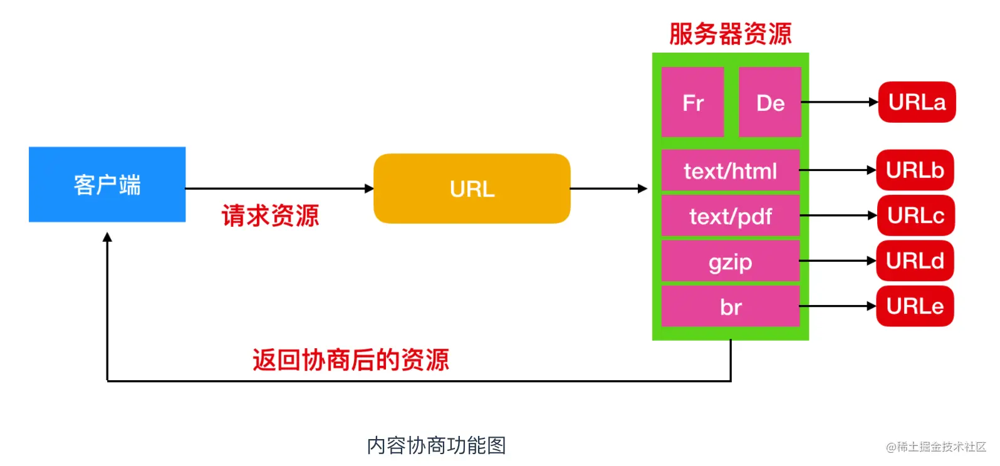
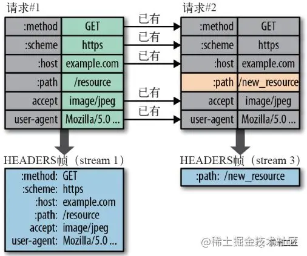
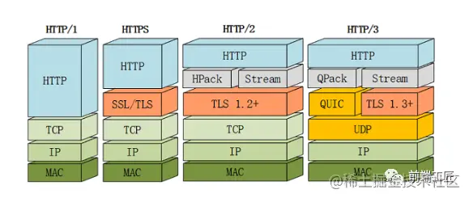
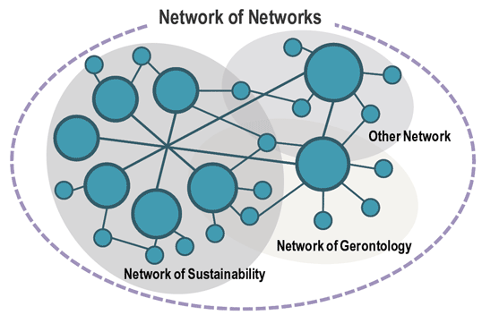
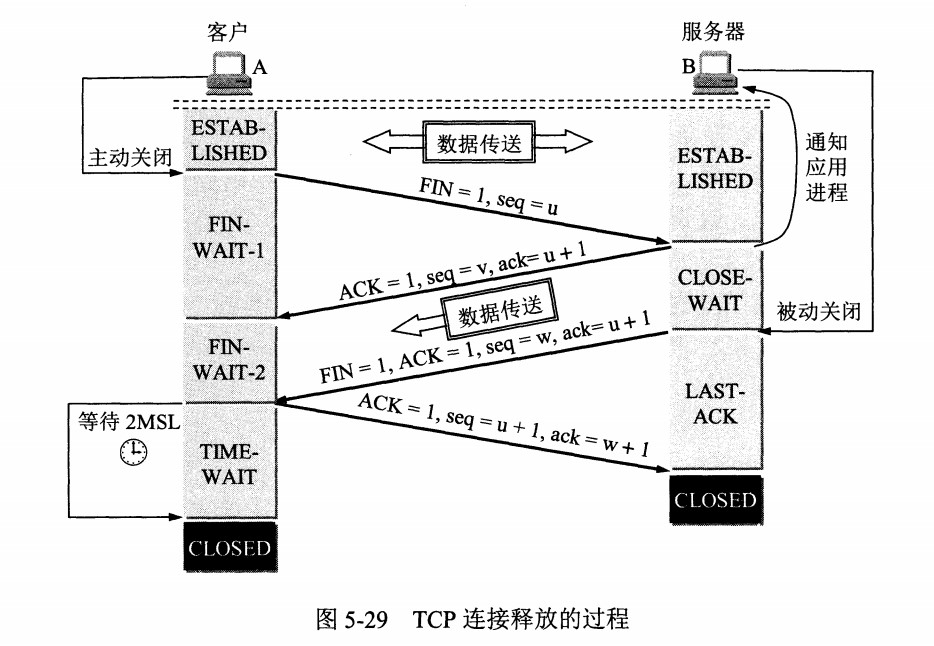
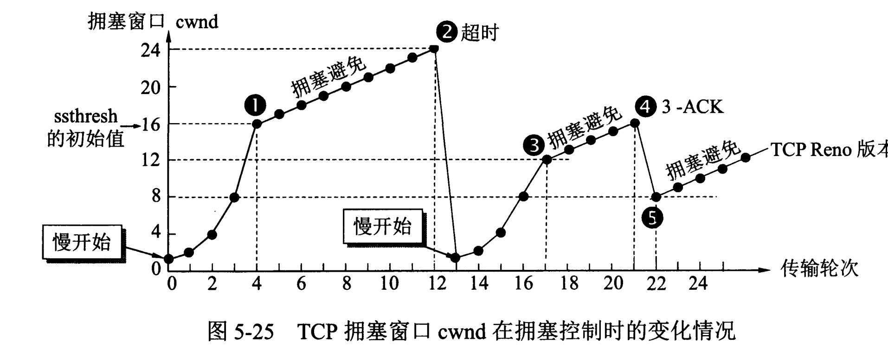
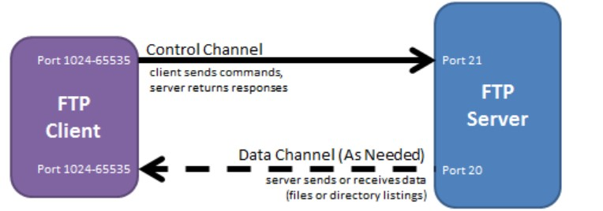

# 网络部分

## 超文本传输

超文本传输协议**http**可以进行文字分割：**超文本（Hypertext）、传输（Transfer）、协议（Protocol）**，它们之间的关系如下


按照范围的大小 协议 > 传输 > 超文本。下面就分别对这三个名次做一个解释。

### 什么是超文本

在互联网早期的时候，我们输入的信息只能保存在本地，无法和其他电脑进行交互。通常都以`文本`即简单字符的形式存在，文本是一种能够被计算机解析的有意义的二进制数据包。

而随着互联网的高速发展，两台电脑之间能够进行数据的传输后，人们不满足只能在两台电脑之间传输文字，还想要传输图片、音频、视频，甚至点击文字或图片能够进行`超链接`的跳转，那么文本的语义就被扩大了，这种语义扩大后的文本就被称为`超文本(Hypertext)`。

### 什么是传输

由传输载体（例如同轴电缆，电话线，光缆）负责把二进制数据包由计算机终端传输到另一个终端的过程称为`传输(transfer)`。

通常我们把传输数据包的一方称为`请求方`，把接到二进制数据包的一方称为`应答方`。

### 什么是协议

网络协议就是网络中(包括互联网)传递、管理信息的一些规范。如同人与人之间相互交流是需要遵循一定的规矩一样，计算机之间的相互通信需要共同遵守一定的规则，这些规则就称为网络协议。

## 网络模型

### 应用层（报文：端口之间）

应用层是**网络应用程序和网络协议存放**的分层，

因特网的应用层包括许多协议，例如我们学 web 离不开的 `HTTP`，电子邮件传送协议 `SMTP`、端系统文件上传协议 `FTP`、还有为我们进行域名解析的 `DNS` 协议。

应用层协议分**布在多个端系统**上，一个端系统应用程序与另外一个端系统应用程序交换信息分组

我们**把位于应用层的信息分组称为 `报文(message)`。**

### 运输层（报文段：程序之间）

因特网的运输层在**应用程序断点之间传送应用程序报文**，在这一层主要有两种传输协议 `TCP`和 `UDP`，利用这两者中的任何一个都能够传输报文，不过这两种协议有巨大的不同。

**TCP** 向它的应用程序提供了**面向连接的服务**

它能够控制并确认报文是否到达，并**提供了拥塞机制来控制网络传输，因此当网络拥塞时，会抑制其传输速率。**

**UDP** 协议向它的应用程序提供了**无连接服务**

它不具备可靠性的特征，**没有流量控制，也没有拥塞控制**。

**我们把运输层的分组称为 `报文段(segment)`**

### 网络层（数据报：主机到主机）

因特网的网络层负责将称为 `数据报(datagram)` 的网络分层从**一台主机移动到另一台主机**。网络层一个非常重要的协议是 `IP` 协议，所有具有网络层的因特网组件都必须运行 IP 协议，IP 协议是一种网际协议，除了 IP 协议外，网络层还包括一些其他网际协议和路由选择协议，一般把网络层就称为 IP 层，由此可知 IP 协议的重要性。

### 链路层（帧：端到端）

为了将分组从一个节点（主机或路由器）运输到另一个节点，网络层必须依靠链路层提供服务。

链路层的例子包括以太网、WiFi 和电缆接入的 `DOCSIS` 协议，因为数据从源目的地传送通常需要经过几条链路，一个数据包可能被沿途不同的链路层协议处理，我们把链路层的分组称为 `帧(frame)`

### 物理层（比特：结点到结点）

虽然链路层的作用是将帧从一个端系统运输到另一个端系统，

而物理层的作用是将帧中的一个个 `比特` 从**一个节点运输到另一个节点**，物理层的协议仍然使用链路层协议，这些协议与实际的物理传输介质有关，例如，以太网有很多物理层协议：关于双绞铜线、关于同轴电缆、关于光纤等等。

五层网络协议的示意图如下


### OSI 模型

我们上面讨论的计算网络协议模型不是唯一的 `协议栈`，ISO（国际标准化组织）提出来计算机网络应该按照7层来组织，那么7层网络协议栈与5层的区别在哪里？


从图中可以一眼看出，OSI 要比上面的网络模型多了 `表示层` 和 `会话层`，其他层基本一致。

**表示层主要包括数据压缩和数据加密以及数据描述**，数据描述使得应用程序不必担心计算机内部存储格式的问题，

而**会话层提供了数据交换的定界和同步功能**，包括建立检查点和恢复方案。

## 浏览器

**HTTP 是一个在计算机世界里专门在两点之间传输文字、图片、音频、视频等超文本数据的约定和规范**

浏览器是使用 HTTP 协议的主要载体


浏览器正式的名字叫做 `Web Broser`，顾名思义，就是检索、查看互联网上网页资源的应用程序，名字里的 Web，实际上指的就是 `World Wide Web`，也就是万维网

## 概念扫盲

### Web 服务器

Web 服务器的正式名称叫做 `Web Server`，Web 服务器一般指的是网站服务器

**浏览器是 HTTP 请求的发起方， Web 服务器就是 HTTP 请求的应答方**，Web 服务器可以向浏览器等 Web 客户端提供文档，也可以放置网站文件，让全世界浏览；可以放置数据文件，让全世界下载。

目前最主流的三个Web服务器是**Apache、 Nginx 、IIS**

### CDN

CDN的全称是`Content Delivery Network`，即`内容分发网络`，

它应用了 HTTP 协议里的**缓存和代理技术**，**代替源站响应客户端的请求**。

CDN 是**构建在现有网络基础之上的网络**，它依靠部署在各地的边缘服务器，通过中心平台的**负载均衡、内容分发、调度**等功能模块，**使用户`就近`获取所需内容，降低网络拥塞，提高用户访问响应速度和命中率**。

CDN的关键技术主要有**`内容存储`和`分发技术`**。

### WAF

WAF 是一种 Web **应用程序防护系统（Web Application Firewall，简称 WAF）**

它是一种通过执行一系列针对HTTP / HTTPS的`安全策略`来**专门为Web应用提供保护的一款产品**，

它是应用层面的`防火墙`，专门检测 HTTP 流量，是防护 Web 应用的安全技术。

WAF 通常位于 Web 服务器之前，可以阻止如 SQL 注入、跨站脚本等攻击，目前应用较多的一个开源项目是 **ModSecurity**，它能够完全集成进 Apache 或 Nginx。

### WebService

WebService 是**一种 Web 应用程序**，**WebService是一种跨编程语言和跨操作系统平台的远程调用技术**。

Web Service 是一种由 **W3C 定义的应用服务开发规范**，使用 client-server 主从架构，通常使用 WSDL 定义服务接口，使用 HTTP 协议传输 XML 或 SOAP 消息，它是**一个基于 Web（HTTP）的服务架构技术**，既可以运行在内网，也可以在适当保护后运行在外网。

### HTML

**HTML 称为超文本标记语言**，是一种标识性的语言。它包括一系列标签．通过这些标签可以将网络上的文档格式统一，使分散的 Internet 资源连接为一个逻辑整体。HTML 文本是由 HTML 命令组成的描述性文本，**HTML 命令可以说明文字，图形、动画、声音、表格、链接等。**

### Web 页面构成

Web 页面（Web page）也叫做文档，是由一个个对象组成的。一个`对象(Objecy)` 只是一个文件，比如一个 HTML 文件、一个 JPEG 图形、一个 Java 小程序或一个视频片段，它们在网络中可以通过 `URL` 地址寻址。多数的 Web 页面含有一个 `HTML 基本文件` 以及几个引用对象。

举个例子，如果一个 Web 页面包含 HTML 文件和5个 JPEG 图形，那么这个 Web 页面就有6个对象：一个 HTML 文件和5个 JPEG 图形。HTML 基本文件通过 URL 地址引用页面中的其他对象。

### TCP/IP

TCP/IP 我们一般称之为`协议簇`， TCP/IP 协议簇中不仅仅只有 TCP 协议和 IP 协议，它是一系列网络通信协议的统称。而其中最核心的两个协议就是 TCP / IP 协议，其他的还有 UDP、ICMP、ARP 等等，共同构成了一个复杂但有层次的协议栈。

- TCP 协议的全称是 `Transmission Control Protocol` 的缩写，意思是`传输控制协议`，**HTTP 使用 TCP 作为通信协议，这是因为 TCP 是一种可靠的协议，而`可靠`能保证数据不丢失。**

- IP 协议的全称是 `Internet Protocol` 的缩写，IP 协议使用 `IP 地址` 来标识互联网上的每一台计算机，它主要解决的是**通信双方寻址的问题**。

### DNS

把 IP 地址转换为便于人类记忆的协议就是 `DNS 协议`。

DNS 的全称是`域名系统（Domain Name System，缩写：DNS）`，它作为**将域名和 IP 地址相互映射的一个分布式数据库**，能够使人更方便地访问互联网。

### URI / URL

输入的地址格式必须要满足 `URI` 的规范。

- `URI`的全称是（Uniform Resource Identifier），中文名称是**统一资源标识符**，使用它就**能够唯一地标记互联网上资源。**

- `URL`的全称是（Uniform Resource Locator），中文名称是**统一资源定位符**，也就是我们俗称的`网址`，它实际上是 URI 的一个子集。

URI 不仅包括 URL，还包括 **URN（统一资源名称**），它们之间的关系如下


### HTTPS

**HTTP 一般是明文传输，很容易被攻击者窃取重要信息**鉴于此，HTTPS 应运而生。

HTTPS 的全称为 `（Hyper Text Transfer Protocol over SecureSocket Layer）`，

 HTTPS 是**以安全为目标的 HTTP 通道**，在 HTTP 的基础上**通过传输加密和身份认证保证了传输过程的安全性**。

HTTPS 在 HTTP 的基础上增加了 `SSL` 层，也就是说 **HTTPS = HTTP + SSL**。

## HTTP协议

### HTTP 请求响应过程

假设访问的 URL 地址为 `http://www.someSchool.edu/someDepartment/home.index`，输入网址点击回车，浏览器内部会进行如下操作

- **DNS服务器会首先进行域名的映射**，找到访问`www.someSchool.edu`所在的地址，然后HTTP 客户端进程在 80 端口发起一个到服务器 `www.someSchool.edu` 的 **TCP 连接**（80 端口是 HTTP 的默认端口）。
- HTTP **客户端通过它的套接字向服务器发送一个 HTTP 请求报文**。该报文中包含了路径 `someDepartment/home.index` 的资源
- HTTP **服务器通过它的套接字接受该报文，进行请求的解析工作**，并从其`存储器(RAM 或磁盘)`中检索出对象 www.someSchool.edu/someDepartment/home.index，并封装对象到 HTTP 响应报文中，通过套接字向客户进行发送。
- HTTP 服务器随即通知 TCP 断开 TCP 连接，**实际上是需要等到客户接受完响应报文后才会断开 TCP 连接。**
- HTTP 客户端**接受完响应报文后，TCP 连接会关闭**。HTTP 客户端从响应中提取出报文中是一个 HTML 响应文件，并检查该 HTML 文件，然后循环检查报文中其他内部对象。
- 检查完成后，HTTP 客户端会把对应的资源通过显示器呈现给用户。

### HTTP 请求特征

从上面整个过程中我们可以总结出 HTTP 进行分组传输是具有以下特征

- 支持客户-服务器模式**c/s**
- **简单快速：**客户向服务器请求服务时，**只需传送请求方法和路径**。请求方法常用的有 GET、HEAD、POST。每种方法规定了客户与服务器联系的类型不同。由于 HTTP 协议简单，使得 HTTP 服务器的程序规模小，因而通信速度很快。
- **灵活：**HTTP **允许传输任意类型的数据对象**。**正在传输的类型由 Content-Type** 加以标记。
- **无连接：**无连接的含义是**限制每次连接只处理一个请求**。**服务器处理完客户的请求，并收到客户的应答后，即断开连接**。采用这种方式可以节省传输时间。
- **无状态**：HTTP 协议是无状态协议。无状态是指协议**对于事务处理没有记忆能力**。缺少状态意味着如果后续处理需要前面的信息，则它必须重传，这样可能导致每次连接传送的数据量增大。另一方面，在服务器不需要先前信息时它的应答就较快。 

### HTTP请求报文

HTTP 协议主要由三大部分组成：

- `请求行（start line）`：描述请求或响应的基本信息；包含三个字段：方法、url、http版本
- `头部字段（header）`：使用 key-value 形式更详细地说明报文；
- `消息正文（entity）`：实际传输的数据，它不一定是纯文本，**可以是图片、视频等二进制数据**。

其中起始行和头部字段并成为 `请求头` 或者 `响应头`，统称为 `Header`；

消息正文也叫做实体，称为 `body`。

HTTP 协议规定每次发送的报文**必须要有 Header**，但是可以没有 body，也就是说**头信息是必须的，实体信息可以没有**。

**而且在 header 和 body 之间必须要有一个空行（CRLF）**


（注：SP代表空格，CR代表回车，LF代表换行）


我们使用上面的那个例子来看一下 http 的请求报文


这是 `http://www.someSchool.edu/someDepartment/home.index` 请求的请求头，

首先，我们看到报文是用普通 **`ASCII` 文本书写**的，这样保证人能够可以看懂。

然后，我们可以看到**每一行和下一行之间都会有换行，而且最后一行（请求头部后）再加上一个回车换行符。**

每个报文的起始行都是由三个字段组成：**方法、URL 字段和 HTTP 版本字段**。


#### HTTP 请求方法

HTTP 请求方法一般分为 8 种，它们分别是

- **`GET 获取资源`**，**GET 方法用来请求访问已被 URI 识别的资源**。指定的资源经服务器端解析后返回响应内容。也就是说，如果请求的资源是文本，那就保持原样返回；

- **`POST 传输实体`**，虽然 GET 方法也可以传输主体信息，但是便于区分，我们一般不用 GET 传输实体信息，反而使用 **POST 传输实体信息，**

- **PUT 传输文件**，**PUT 方法用来传输文件**。就像 FTP 协议的文件上传一样，要求在**请求报文的主体中包含文件内容**，然后保存到请求 URI 指定的位置。

  但是，鉴于 **HTTP 的 PUT 方法自身不带验证机制，任何人都可以上传文件 , 存在安全性问题**，因此一般的 W eb 网站不使用该方法。

  若配合 Web 应用程序的验证机制，或架构设计采用`REST（REpresentational State Transfer，表征状态转移）`标准的同类 Web 网站，就可能会开放使用 PUT 方法。

- **HEAD 获得响应首部**，HEAD 方法和 GET 方法一样，只是**不返回报文主体部分**。用于**确认 URI 的有效性及资源更新的日期时间等。**

- **DELETE 删除文件**，**DELETE 方法用来删除文件**，是与 PUT 相反的方法。DELETE 方法按请求 URI 删除指定的资源。

- **OPTIONS 询问支持的方法**，OPTIONS 方法用来**查询针对请求 URI 指定的资源支持的方法**。

- **TRACE 追踪路径**，TRACE 方法是**让 Web 服务器端将之前的请求通信环回给客户端的方法**。

- **CONNECT** 要求用**隧道协议连接代理**，CONNECT 方法要求**在与代理服务器通信时建立隧道，实现用隧道协议进行 TCP 通信**。主要使用 `SSL（Secure Sockets Layer，安全套接层）`和 TLS`（Transport Layer Security，传输层安全）`协议**把通信内容加 密后经网络隧道传输。**


下面是 HTTP1.0 和 HTTP1.1 支持的方法清单


#### HTTP 请求 URL

HTTP 协议使用 URI 定位互联网上的资源。正是因为 URI 的特定功能，在互联网上任意位置的资源都能访问到。

**一个url=协议+主机+端口+路径+参数（query）+片段（锚点）**

比如 `http://www.example.com:80/path/to/myfile.html?key1=value1&key2=value2#SomewhereInTheDocument` 

- `http://`告诉浏览器使用何种协议。


对于大部分 Web 资源，通常使用 HTTP 协议或其安全版本，HTTPS 协议。

另外，浏览器也知道如何处理其他协议。例如， `mailto:` 协议指示浏览器打开邮件客户端；`ftp:`协议指示浏览器处理文件传输。

- ` www.example.com`指示了需要向网络上的哪一台主机发起请求


`www.example.com` 既是一个域名，也代表管理该域名的机构。也可以直接向主机的 IP 地址发起请求。但直接使用 IP 地址的场景并不常见。

-  `端口`表示用于访问 Web 服务器上资源的入口


两个主机之间要发起 TCP 连接需要两个条件，主机 + 端口。

如果访问的该 Web 服务器使用HTTP协议的标准端口（HTTP为80，HTTPS为443）授予对其资源的访问权限，则通常省略此部分。否则端口就是 URI 必须的部分。

**上面是请求 URL 所必须包含的部分，下面就是 URL 具体请求资源路径**

-  `/path/to/myfile.html` 是 Web 服务器上资源的路径


以端口后面的第一个 `/` 开始，到 `?` 号之前结束，中间的 每一个`/` 都代表了层级（上下级）关系。这个 URL 的请求资源是一个 html 页面。

- `?key1=value1&key2=value2` 是提供给 Web 服务器的额外参数


如果是 GET 请求，一般带有请求 URL 参数，

如果是 POST 请求，则不会在路径后面直接加参数。这些参数是用 & 符号分隔的`键/值对`列表。

- `#SomewhereInTheDocument` 是资源本身的某一部分的一个锚点


锚点代表资源内的一种“书签”，它**给予浏览器显示位于该“加书签”点的内容的指示**。 

例如，在HTML文档上，浏览器将滚动到定义锚点的那个点上；在视频或音频文档上，浏览器将转到锚点代表的那个时间。值得注意的是 **# 号后面的部分，也称为片段标识符，永远不会与请求一起发送到服务器。**

#### Header请求头部

HTTP 的请求标头分为四种： `通用标头`、`请求标头`、`响应标头` 和 `实体标头`

##### 通用标头

通用标头主要有三个，分别是 `Date`、`Cache-Control` 和 `Connection`

- **Date**

Date 是一个通用标头，它可以出现在请求标头和响应标头中，它的基本表示如下

```yaml
Date: Wed, 21 Oct 2015 07:28:00 GMT 
```

表示的是格林威治标准时间，这个时间要比北京时间慢八个小时

- **Cache-Control**

Cache-Control 是一个通用标头，他可以出现在请求标头和响应标头中，Cache-Control 的种类比较多，虽然说这是一个通用标头，但是又一些特性是请求标头具有的，有一些是响应标头才有的。主要大类有 `可缓存性`、`阈值性`、 `重新验证并重新加载` 和`其他特性`

可缓存性是唯一响应标头才具有的特性，我们会在响应标头中详述。

阈值性，这个我翻译可能不准确，它的原英文是 Expiration，我是根据它的值来翻译的，你看到这些值可能会觉得我翻译的有点道理

- `max-age`: 资源被认为仍然有效的最长时间，与 `Expires` 不同，这个请求是**相对于 request标头的时间**，而 Expires 是相对于响应标头。（请求标头）
- `s-maxage`: 重写了 max-age 和 Expires 请求头，仅仅适用于共享缓存，被私有缓存所忽略（这块不理解，看完响应头的 Cache-Control 再进行理解）（请求标头）
- `max-stale`：表示客户端将接受的最大响应时间，以秒为单位。（响应标头）
- `min-fresh`:  表示客户端希望响应在指定的最小时间内有效。（响应标头）

- **Connection**

Connection 决定当前事务（三次握手和四次挥手）完成后，是否会关闭网络连接。

Connection 有两种，一种是`持久性连接`，即一次事务完成后不关闭网络连接

```makefile
Connection: keep-alive
```

另一种是`非持久性连接`，即一次事务完成后关闭网络连接

```arduino
Connection: close
```

HTTP1.1 其他通用标头如下


##### 实体标头

实体标头是描述消息正文内容的 HTTP 标头。实体标头用于 HTTP 请求和响应中。

头部`Content-Length`、 `Content-Language`、 `Content-Encoding` 是实体头。

- **Content-Length** 实体报头指示实体主体的大小，以字节为单位，发送到接收方。
- **Content-Language** 实体报头描述了客户端或者服务端能够接受的语言，例如

```less
Content-Language: de-DE
Content-Language: en-US
Content-Language: de-DE, en-CA
```

- **Content-Encoding** 指示对实体应用了何种编码。用来压缩媒体类型

  常见的内容编码有这几种： **gzip、compress、deflate、identity** ，这个属性可以应用在请求报文和响应报文中

```arduino
Accept-Encoding: gzip, deflate //请求头
Content-Encoding: gzip  //响应头
```

下面是一些实体标头字段


##### 请求标头

上面给出的例子请求报文的属性比较少，下面给出一个 MDN 官网的例子

```yaml
GET /home.html HTTP/1.1
Host: developer.mozilla.org
User-Agent: Mozilla/5.0 (Macintosh; Intel Mac OS X 10.9; rv:50.0) Gecko/20100101 Firefox/50.0
Accept: text/html,application/xhtml+xml,application/xml;q=0.9,*/*;q=0.8
Accept-Language: en-US,en;q=0.5
Accept-Encoding: gzip, deflate, br
Referer: https://developer.mozilla.org/testpage.html
Connection: keep-alive
Upgrade-Insecure-Requests: 1
If-Modified-Since: Mon, 18 Jul 2016 02:36:04 GMT
If-None-Match: "c561c68d0ba92bbeb8b0fff2a9199f722e3a621a"
Cache-Control: max-age=0 
```

- **Host**

Host 请求头**指明了服务器的域名**（对于虚拟主机来说），以及（可选的）**服务器监听的TCP端口号**。

如果没有给定端口号，会自动使用被请求服务的**默认端口（比如请求一个 HTTP 的 URL 会自动使用80作为端口）。**

```makefile
Host: developer.mozilla.org
```

上面的 `Accpet`、 `Accept-Language`、`Accept-Encoding` 都是属于内容协商的请求标头，我们会在下面说明

- **Referer**

当浏览器向 web 服务器发送请求的时候，一般会带上 Referer，**告诉服务器该网页是从哪个页面链接过来的**，服务器因此可以获得一些信息用于处理。

```arduino
Referer: https://developer.mozilla.org/testpage.html
```

- **Upgrade-Insecure-Requests**

向服务器端发送信号，表示客户端优先选择加密及带有身份验证的响应。

```makefile
Upgrade-Insecure-Requests: 1
```

- **If-Modified-Since**

HTTP 的 If-Modified-Since 使其成为`条件请求`：

1.返回200，只有在给定日期的最后一次修改资源后，服务器才会以200状态发送回请求的资源。

2.如果请求从开始以来没有被修改过，响应会返回304并且没有任何响应体

If-Modified-Since 通常会与 If-None-Match 搭配使用，If-Modified-Since 用于**确认代理或客户端拥有的本地资源的有效性**。获取资源的更新日期时间，可通过确认首部字段 `Last-Modified` 来确定。

```yaml
If-Modified-Since: Mon, 18 Jul 2016 02:36:04 GMT
```

- **If-None-Match**

If-None-Match HTTP请求标头使请求成为条件请求。 

**对于 GET 和 HEAD 方法，仅当服务器没有与给定资源匹配的 `ETag` 时，服务器才会以200状态发送回请求的资源。**

对于其他方法，仅当最终现有资源的`ETag`与列出的任何值都不匹配时，才会处理请求。

```sql
If-None-Match: "c561c68d0ba92bbeb8b0fff2a9199f722e3a621a"
```

##### 内容协商

内容协商机制是指**客户端和服务器端就响应的资源内容进行交涉，然后提供给客户端最为适合的资源**。

内容协商会以响应资源的语言、字符集、编码方式等作为判断的标准。





内容协商主要有以下3种类型：

- `服务器驱动协商（Server-driven Negotiation）`

这种协商方式是由服务器端进行内容协商。服务器端会根据请求首部字段进行自动处理

- `客户端驱动协商（Agent-driven Negotiation）`

这种协商方式是由客户端来进行内容协商。

- `透明协商（Transparent Negotiation）`

是服务器驱动和客户端驱动的结合体，是由服务器端和客户端各自进行内容协商的一种方法。


内容协商的分类有很多种，主要的几种类型是 

**Accept、Accept-Charset、Accept-Encoding、Accept-Language、Content-Language**。

- **Accept**

接受请求 HTTP 标头会通告客户端其能够理解的 MIME 类型

> MIME: MIME (Multipurpose Internet Mail Extensions) 是描述消息内容类型的因特网标准。MIME 消息能包含文本、图像、音频、视频以及其他应用程序专用的数据。

MIME 类型其实就是一系列消息内容类型的集合。

`文本文件`： text/html、text/plain、text/css、application/xhtml+xml、application/xml

`图片文件`： image/jpeg、image/gif、image/png

`视频文件`： video/mpeg、video/quicktime

`应用程序二进制文件`： application/octet-stream、application/zip

一般 MIME 类型也会和 `q` 这个属性一起使用，q 是什么？q 表示的是权重，来看一个例子

```bash
Accept: text/html,application/xhtml+xml,application/xml;q=0.9,*/*;q=0.8
```

若想要给显示的**媒体类型增加优先级**，则使用 q= 来额外表示权重值，没有显示权重的时候默认值是1.0 ，我给你列个表格你就明白了

| q    | MIME                  |
| ---- | --------------------- |
| 1.0  | text/html             |
| 1.0  | application/xhtml+xml |
| 0.9  | application/xml       |
| 0.8  | * / *                 |

也就是说，这是一个放置顺序，权重高的在前，低的在后，`application/xml;q=0.9` 是不可分割的整体。

- **Accept-Charset**

accept-charset 属性规定服务器处理表单数据所接受的字符集。

此属性的默认值是 `unknown`，表示表单的字符集与包含表单的文档的字符集相同。

常用的字符集有： UTF-8 - Unicode 字符编码 ； ISO-8859-1 - 拉丁字母表的字符编码

- **Accept-Language**

首部字段 Accept-Language 用来告知服务器用户代理能够处理的自然语言集（指中文或英文等），以及自然语言集的相对优先级。

可一次指定多种自然语言集。 和 Accept 首部字段一样，按权重值 `q`来表示相对优先级。

```css
Accept-Language: en-US,en;q=0.5
```

下面是一个响应头的汇总，基于 HTTP 1.1


### HTTP响应报文

响应报文由三部分组成：

- 状态行(status line)：[HTTP常见响应状态码](#####HTTP常见响应状态码)
- 首部行(header line)：[http响应标头](#####HTTP响应标头)
- 实体体(entity body)。


（注：SP代表空格，CR代表回车，LF代表换行）

##### HTTP响应状态码

以 `2xx` 为开头的都表示请求成功响应。

| 状态码 | 含义                                                         |
| ------ | ------------------------------------------------------------ |
| 200    | 成功响应                                                     |
| 204    | 请求处理成功，但是没有资源可以返回                           |
| 206    | 对资源某一部分进行响应，由Content-Range 指定范围的实体内容。 |

以 `3xx` 为开头的都表示需要进行附加操作以完成请求

| 状态码 | 含义                                                         |
| ------ | ------------------------------------------------------------ |
| 301    | 永久性重定向，该状态码表示请求的资源已经重新分配  URI，以后应该使用资源现有的 URI |
| 302    | 临时性重定向。该状态码表示请求的资源已被分配了新的 URI，希望用户（本次）能使用新的 URI 访问。 |
| 303    | 该状态码表示由于请求对应的资源存在着另一个 URI，应使用 GET 方法定向获取请求的资源。 |
| 304    | 该状态码表示客户端发送附带条件的请求时，服务器端允许请求访问资源，但未满足条件的情况。 |
| 307    | 临时重定向。该状态码与 302 Found 有着相同的含义。            |

以 `4xx` 的响应结果表明客户端是发生错误的原因所在。

| 状态码 | 含义                                                         |
| ------ | ------------------------------------------------------------ |
| 400    | 该状态码表示请求报文中存在语法错误。当错误发生时，需修改请求的内容后再次发送请求。 |
| 401    | 该状态码表示发送的请求需要有通过 HTTP 认证（BASIC 认证、DIGEST 认证）的认证信息。 |
| 403    | 该状态码表明对请求资源的访问被服务器拒绝了。                 |
| 404    | 该状态码表明服务器上无法找到请求的资源。                     |

以 `5xx` 为开头的响应标头都表示服务器本身发生错误

| 状态码 | 含义                                                         |
| ------ | ------------------------------------------------------------ |
| 500    | 该状态码表明服务器端在执行请求时发生了错误。                 |
| 503    | 该状态码表明服务器暂时处于超负载或正在进行停机维护，现在无法处理请求。 |
| 504    | 由作为代理或网关的服务器使用，表示不能及时地从远程服务器获得应答 |

##### HTTP响应标头

响应标头是可以在 HTTP 响应种使用的 HTTP 标头，这听起来是像一句废话，不过确实是这样解释。

并不是所有出现在响应中的标头都是响应标头。还有一些特殊的我们上面说过，有通用标头和实体标头也会出现在响应标头中，比如 `Content-Length` 就是一个实体标头，

但是，在这种情况下，这些实体请求通常称为响应头。下面以一个例子为例和你探讨一下响应头

```yaml
200 OK
Access-Control-Allow-Origin: *
Connection: Keep-Alive
Content-Encoding: gzip
Content-Type: text/html; charset=utf-8
Date: Mon, 18 Jul 2016 16:06:00 GMT
Etag: "c561c68d0ba92bbeb8b0f612a9199f722e3a621a"
Keep-Alive: timeout=5, max=997
Last-Modified: Mon, 18 Jul 2016 02:36:04 GMT
Server: Apache
Set-Cookie: mykey=myvalue; expires=Mon, 17-Jul-2017 16:06:00 GMT; Max-Age=31449600; Path=/; secure
Transfer-Encoding: chunked
Vary: Cookie, Accept-Encoding
x-frame-options: DENY
```

- **Access-Control-Allow-Origin**

`Access-Control-Allow-Origin` 指定一个来源，它告诉浏览器允许该来源进行资源访问。 

例如，要允许源 `https://mozilla.org` 的代码访问资源，可以指定：

```makefile
Access-Control-Allow-Origin: https://mozilla.org
Vary: Origin
```

如果服务器指定单个来源而不是 `*`通配符的话 ，则服务器还应在 Vary 响应标头中包含 `Origin` ，以向客户端指示 服务器响应将根据原始请求标头的值而有所不同。

- **Keep-Alive**

 Keep-Alive 表示的是 Connection 非持续连接的存活时间，如下

```ini
Connection: Keep-Alive
Keep-Alive: timeout=5, max=997
```

Keep-Alive 有两个参数，它们是以逗号分隔的参数列表，每个参数由一个标识符和一个由等号 = 分隔的值组成。

`timeout`：指示空闲连接必须保持打开状态的最短时间（以秒为单位）。

`max`：指示在关闭连接之前可以在此连接上发送的最大请求数。

**上述 HTTP 代码的意思就是限制最大的超时时间是 5s 和 最大的连接请求是 997 个。**

- **Server**

server服务器标头包含**有关原始服务器用来处理请求的软件的信息**。

应该**避免使用过于冗长和详细的 Server 值**，因为它们可能会**泄露内部实施细节**，这可能会使攻击者容易地发现并利用已知的安全漏洞。例如下面这种写法

```arduino
Server: Apache/2.4.1 (Unix)//不可取
```

- **Set-Cookie**

Cookie 又是另外一个领域的内容了，我们后面文章会说道 Cookie，这里需要记住 Cookie、Set-Cookie 和 Content-Disposition 等在其他 RFC 中定义的首部字段，它们不是属于 HTTP 1.1 的首部字段，但是使用率仍然很高。

- **Transfer-Encoding**

首部字段 Transfer-Encoding 规定了传输报文主体时采用的编码方式。

```makefile
Transfer-Encoding: chunked
```

**HTTP /1.1 的传输编码方式仅对分块传输编码有效。**

- **X-Frame-Options**

HTTP 首部字段是可以自行扩展的。所以在 Web 服务器和浏览器的应用上，会出现各种非标准的首部字段。

首部字段 `X-Frame-Options` 属于 HTTP 响应首部，用于控制网站内容在其他 Web 网站的 Frame 标签内的显示问题。

其主要目的是为了防止点击劫持（clickjacking）攻击。

下面是一个响应头的汇总，基于 HTTP 1.1


### http1

**缺点**

1. 高延迟 — 队头阻塞(Head-Of-Line Blocking)（直到http3才真正解决）
2. 无状态特性 — 阻碍交互
3. 明文传输 — 不安全性（没有用户验证，不验证报文完整性）
4. 不支持服务端推送
5. 受阻塞限制的多路复用（开启connection：keeplive，设置timeout）

`队头阻塞`是指当顺序发送的请求序列中的一个请求因为某种原因被阻塞时，在后面排队的所有请求也一并被阻塞，会导致客户端迟迟收不到数据。

**纯净的 HTTP 是没有 cookie 等机制的**，每一个连接都是一个新的连接,每次header都要重复携带大量的固定字段"User Agent""Cookie""Accept""Server"

**http1对于缺点的尝试**

- 将同一页面的资源分散到不同域名下，提升连接上限

**Chrome有个机制，对于同一个域名，默认允许同时建立 6 个 TCP持久连接**（不同浏览器肯不同）

使用持久连接时(keeplive)，虽然能公用一个TCP管道，**但是在一个管道中同一时刻只能处理一个请求**，在当前的请求没有结束之前，其他的请求只能处于阻塞状态。

另外如果在同一个域名下同时有10个请求发生，那么其中4个请求会进入排队等待状态，直至进行中的请求完成。

- `合并小文件减少资源数`。

精灵图，Spriting合并多张小图为一张大图,再用JavaScript或者CSS将小图重新“切割”出来的技术。

- `内联(Inlining)资源`是另外一种防止发送很多小图请求的技巧，将图片的原始数据嵌入在CSS文件里面的URL里，减少网络请求次数。
- `减少请求数量`。拼接(Concatenation)将多个体积较小的JavaScript使用webpack等工具打包成1个体积更大的JavaScript文件,但如果其中1个文件的改动就会导致大量数据被重新下载多个文件。

### https

1.在 HTTP 的传输过程中不会验证通信方的身份，因此 HTTP 信息交换的双方可能会遭到伪装，也就是`没有用户验证`；

2.在 HTTP 的传输过程中，接收方和发送方并`不会验证报文的完整性`

综上，为了结局上述问题，HTTPS 应用而生

```
HTTPS` 的全称是 `Hypertext Transfer Protocol Secure`，它用来在计算机网络上的两个端系统之间进行`安全的交换信息(secure communication)
```

 **HTTPS 是 HTTP 协议的一种扩展**，它本身并不保传输的证安全性，在 HTTPS 中，使用`传输层安全性(TLS)`或`安全套接字层(SSL)`对通信协议进行加密。也就是 HTTP + SSL(TLS) = HTTPS。


HTTPS 协议提供了三个关键的指标

- `加密(Encryption)`， HTTPS **通过对数据加密来使其免受窃听者对数据的监听**，这就意味着当用户在浏览网站时，没有人能够监听他和网站之间的信息交换，或者跟踪用户的活动，访问记录等，从而窃取用户信息。
- `数据一致性(Data integrity)`，数据在传输的过程中**不会被窃听者所修改，用户发送的数据会`完整`的传输到服务端**，保证用户发的是什么，服务器接收的就是什么。
- `身份认证(Authentication)`，是指确认对方的真实身份，也就是`证明你是你`（可以比作人脸识别），它可以防止中间人攻击并建立用户信任。

**认识 SSL/TLS**

`TLS(Transport Layer Security)` 是 `SSL(Secure Socket Layer)` 的后续版本，

它们是**用于在互联网两台计算机之间用于`身份验证`和`加密`的一种协议。**

> 注意：在互联网中，很多名称都可以进行互换。

SSL/TLS 通过为 `X.509` 证书的数字文档将网站和公司的实体信息绑定到`加密密钥`来进行工作。

```
`X.509`：X.509 是`公开密钥`证书的标准格式，这个文档将加密密钥与（个人或组织）进行安全的关联。
```

每一个`密钥对(key pairs)` 都有一个 `私有密钥(private key)` 和 `公有密钥(public key)`

- **私有密钥是独有的，一般位于服务器上，用于解密由公共密钥加密过的信息**；

- 公有密钥是公有的，与服务器进行交互的**每个人都可以持有公有密钥**，用**公钥加密的信息只能由私有密钥来解密**。


HTTPS 并不是一项新的应用层协议，只是 HTTP 通信接口部分由 SSL 和 TLS 替代而已。

通常情况下，HTTP 会先直接和 TCP 进行通信。

在使用 SSL 的 HTTPS 后，则会先演变为和 SSL 进行通信，然后再由 SSL 和 TCP 进行通信。

！！！也就是说，**HTTPS 就是身披了一层 SSL 的 HTTP**。


TLS使用 ECDHE 进行密钥交换，使用 ECDSA 进行签名和认证，然后使用 AES 作为对称加密算法，密钥的长度是 256 位，使用 GCM 作为分组模式，最后使用 SHA384 作为摘要算法。

**TLS 在根本上使用`对称加密`和 `非对称加密` 两种形式。**

- `对称加密(Symmetrical Encryption)`顾名思义就是指**加密和解密时使用的密钥都是同样的密钥**。


**常见对称加密**

`DES` 的全称是 `Data Encryption Standard(数据加密标准)` ，它是用于数字数据加密的对称密钥算法

AES 的全称是`Advanced Encryption Standard(高级加密标准)`，它是 DES 算法的替代者，安全强度很高，性能也很好，是应用最广泛的对称加密算法。

- `非对称加密(Asymmetrical Encryption)` 也被称为`公钥加密`，客户端利用公钥加密，服务器端利用私钥解密


使用公钥加密的文本只能使用私钥解密，同时，使用私钥加密的文本也可以使用公钥解密

常见的比如 DH、DSA、RSA、ECC 等。

### TLS

https://blog.csdn.net/leven98/article/details/123282318

- **机密性**（混和加密）

**TLS 是使用`对称加密`和`非对称加密` 的混合加密方式来实现机密性。**

RSA 的运算速度非常慢，而 AES 的加密速度比较快，而 TLS 正是使用了这种`混合加密`方式。

1. 在通信刚开始的时候使用非对称算法，比如 RSA、ECDHE ，首先解决`密钥交换`的问题。
2. 产生随机数作为对称算法的`会话密钥（session key）`，再用`公钥加密`。
3. 对方拿到密文后用`私钥解密`，取出会话密钥。这样，双方就实现了对称密钥的安全交换。


具体随机数混合加密过程


- CA机构颁发数字证书给鲍勃；
- 爱丽丝和鲍勃进行SSL握手，爱丽丝通过数字证书确定鲍勃的身份；
- 爱丽丝和鲍勃传递三个随机数，第三个随机数通过非对称加密算法进行传递；
- 爱丽丝和鲍勃通过一个对称加密算法生成一个对话密钥，加密接下来的通信内容。


- **完整性**（摘要算法）

MD5，压缩算法，将任意长度的数据，压缩成一种固定长度的字符串

TLS中使用SHA-2

收发双方都有此字符串，用于最后校验


- **身份认证**（私钥加密\公钥解密，CA）
- 唯一性辨别，证明你就是你


私钥只有你一个人所有，能够辨别唯一性

公钥认证问题，谁都可以发布，必须发布经过认证的公钥，才能解决公钥的信任问题

故引入CA（证书认证机构）

流程

- 申请人生成由`私钥`和`公钥`以及证书基本信息，基本信息+公钥组成密钥对CSR
  - CSR是一个编码的文本文件，其中包含公钥和其他包含在证书中的信息（例如域名，组织，电子邮件地址等）
- 申请人将CSR发送给 CA，CA 会验证信息正确与否，如果正确，则**使用颁发的私钥对证书进行数字签名**，然后将签名过后的证书发送给申请人


### http2

**HTTP/2基于SPDY，专注于性能，最大的一个目标是在用户和网站间只用一个连接（connection）** 。


从目前的情况来看，国内外一些排名靠前的站点基本都实现了HTTP/2的部署，使用HTTP/2能带来**20%~60%的效率提升**。

#### SPDY 基础功能

- **多路复用(multiplexing)**，多路复用通过多个请求共用一个连接的方式，降低了 TCP 连接建立和释放的开销，同时提高了带宽的利用率。
- **请求优先级(request prioritization)**，多路复用带来的一个问题是，在共享连接的基础上会存在一些关键请求被阻塞，SPDY **允许给每个请求设置优先级**，这样重要的请求就会优先得到响应。
- **header 压缩**，前面提到的 HTTP 1.x 的 header 很多时候都是重复而且多余的。选择合适的压缩算法可以减小包的大小和数量。**SPDY 对 header 的压缩素可以达到 80% 以上。**

#### SPDY 高级功能

- **服务端推送**，HTTP 只能由客户端发送，服务器只能被动发送响应。不过在开启服务端推送后，服务端通过 **X-Associated-Content  header 会告知服务器会有新的内容被推送过来**
- **服务端暗示**，服务端暗示不会推送内容，只是告诉客户端有新的内容产生，，内容的下载还是需要客户端主动发起请求。服务端暗示通过 X-Subresources header 来通知，一般应用场景是客户端需要先查询服务端状态，然后再下载资源，**可以节约一次查询请求**。


**HTTP/2传输数据量的大幅减少,主要有两个原因:以二进制方式传输和Header 压缩**

- 二进制传输

采用二进制格式传输数据，而非HTTP/1.x 里纯文本形式的报文 ，二进制协议解析起来更高效。**HTTP/2 将请求和响应数据分割为更小的帧，并且它们采用二进制编码**。

把原来的"Header+Body"的消息"打散"为数个小片的**二进制"帧"(Frame)**,用**"HEADERS"帧存放头数据、"DATA"帧存放实体数据**。HTP/2数据分帧后"Header+Body"的报文结构就完全消失了，协议看到的只是一个个的"碎片"。


基于此http2和http1的请求头有这样的变化


**length** 定义了整个 *frame* 的开始到结束，

**type** 定了 frame 的类型，有十种，

**flags** 定义了一些重要的参数，

**stream id** 用作流控制，stream 是连接中的一个**虚拟信道，可以承载双向消息传输**。每个流有唯一整数标识符。为了防止两端 streaam id 冲突，**客户端发起的流具有奇数 id，服务器端发起的流具有偶数 id。**

剩下的 **payload** 就是 request 的正文


**带来的优点**

1.HTTP/2 中，同域名下所有通信都在单个连接上完成，该连接**可以承载任意数量的双向数据流。**

2.每个**数据流都以消息的形式发送，而消息又由一个或多个帧组成。**

3.**多个帧之间可以乱序发送，根据帧首部的流标识可以重新组装**。.stream 之间也可以设置依赖，依赖和优先级都可以动态调整**（每个请求都可以带一个31bit的优先值，0表示最高优先级， 数值越大优先级越低）**，**这样就会解决关键请求被阻塞的问题。**


- **Header 压缩**

HTTP/2并没有使用传统的压缩算法，而是开发了专门的"HPACK”算法，**在客户端和服务器两端建立“字典”，用索引号表示重复的字符串，还采用哈夫曼编码来压缩整数和字符串**，可以达到50%~90%的高压缩率。

具体来说:

- 在客户端和服务器端使用**“首部表”**来跟踪和存储之前发送的键-值对，对于**相同的数据，不再通过每次请求和响应发送**；
- 首部表在HTTP/2的连接存续期内始终存在，**由客户端和服务器共同渐进地更新**;
- 每个新的首部键-值对**要么被追加到当前表的末尾，要么替换表中之前的值**

例如下图中的两个请求， 请求一发送了所有的头部字段，第二个请求则只需要发送差异数据，这样可以减少冗余数据，降低开销




**缺点**

虽然 HTTP/2 解决了很多之前旧版本的问题，但是它还是存在一个巨大的问题，**主要是底层支撑的 TCP 协议造成的**。HTTP/2的缺点主要有以下几点：

1. TCP 以及 TCP+TLS 建立连接的延时
2. TCP 的队头阻塞并没有彻底解决，多个请求是在同一个 TCP 管道中，这样当 HTTP 2.0 **出现丢包时，整个 TCP 都要开始等待重传**，那么就会阻塞该 TCP
3. **多路复用导致服务器压力上升**
4. 多路复用**容易 Timeout**

**解释**

1.

`RTT（Round-Trip Time）`:
 往返时延。表示**从发送端发送数据开始，到发送端收到来自接收端的确认**（接收端收到数据后便立即发送确认），总共经历的时延。

HTTP/2建立TCP连接然后TLS连接，**这样就需要有两个握手延迟过程**：

①在建立TCP连接的时候，需要和服务器进行**三次握手来确认连接成功**，即需要消耗完 1.5 个 RTT 之后才能进行数据传输。

②进行TLS连接，TLS有两个版本——TLS1.2和TLS1.3，每个版本建立连接所花的时间不同，**大致是需要1~2个RTT。**

总之，在传输数据之前，我们需要花掉 3～4 个 RTT。

4.

大批量的请求同时发送，由于 HTTP2 连接内存在多个并行的流，而网络带宽和服务器资源有限，每个流的资源会被稀释，虽然它们开始时间相差更短，但却都可能超时

### http3

基于 UDP 协议的“QUIC”协议，让HTTP跑在QUIC上而不是TCP上，真正“完美”地解决了“队头阻塞”问题。

- **实现了类似TCP的流量控制、传输可靠性的功能**

虽然UDP不提供可靠性的传输，但**QUIC在UDP的基础之上增加了一层来保证数据可靠性传输**。它提供了数据包重传、拥塞控制以及其他一些TCP中存在的特性。

- **实现了快速握手功能**

由于QUIC是基于UDP的，所以QUIC可以**实现使用0-RTT或者1-RTT来建立连接**，这意味着QUIC可以用最快的速度来发送和接收数据，这样可以大大提升首次打开页面的速度。**0RTT 建连可以说是 QUIC 相比 HTTP2 最大的性能优势**。

- **集成了TLS加密功能**

目前QUIC使用的是TLS1.3，相较于早期版本TLS1.3有更多的优点，其中最重要的一点是减少了握手所花费的RTT个数。

- **连接迁移**

TCP 是按照 ip和端口号 确定一个连接的。而 QUIC 则是让客户端生成一个 **Connection ID （64 位）**来区别不同连接。

**只要 Connection ID 不变，连接就不需要重新建立**，即便是客户端的网络发生变化。由于迁移客户端继续使用相同的会话密钥来加密和解密数据包，QUIC 还提供了迁移客户端的自动加密验证。

- **多路复用，彻底解决TCP中队头阻塞的问题**

和TCP不同，QUIC实现了在**同一物理连接上可以有多个独立的逻辑数据流**。实现了单个连接中的多数据流相互独立的传输，就解决了TCP中队头阻塞的问题。


### 总结



- HTTP/1.1有两个主要的缺点：安全不足和性能不高。
- HTTP/2完全兼容HTTP/1，是“更安全的HTTP、更快的HTTPS"，二进制传输、头部压缩、多路复用、服务器推送等技术可以充分利用带宽，降低延迟，从而大幅度提高上网体验；
- QUIC 基于 UDP 实现，是 HTTP/3 中的底层支撑协议，该协议基于 UDP，又取了 TCP 中的精华，实现了即快又可靠的协议。

### 

# 计算机网络复习

**互联网：网络的网络**

网络把主机连接起来，而互连网（internet）是把多种不同的网络连接起来，因此互连网是网络的网络。而互联网（Internet）是全球范围的互连网。



ISP：互联网服务提供商 ISP 可以从互联网管理机构获得许多 IP 地址，同时拥有通信线路以及路由器等联网设备，个人或机构向 ISP 缴纳一定的费用就可以接入互联网。

## IP地址分类


**A类：** 网络号共8位，首位固定为 `0`，接下来连续的7位可以自由设定；主机号为24位

**B类：** 网络号共16位，前两位固定为 `1 0`，接下来连续的14位可以自由设定；主机号为16位

**C类：** 网络号共24位，前三位固定为 `1 1 0`，接下来连续的21位可以自由设定；主机号为8位

**D类：** 为组播地址，共32位，前四位固定为 `1 1 1 0`

**E类：** 为保留地址，共32位，前四位固定为 `1 1 1 1`

## TCP

### TCP三次握手四次挥手

#### 三次握手


假设 A 为客户端，B 为服务器端。

首先 B 处于 LISTEN（监听）状态，等待客户的连接请求。

- A 向 B 发送连接请求报文，SYN=1，ACK=0，选择一个初始的序号 x。（SYN=1表示建立连接请求）

- B 收到连接请求报文，如果同意建立连接，则向 A 发送连接确认报文，SYN=1，ACK=1，确认号为 x+1，同时也选择一个初始的序号 y。

- A 收到 B 的连接确认报文后，还要向 B 发出确认，确认号为 y+1，序号为 x+1。

B 收到 A 的确认后，连接建立。

**三次握手的原因**

第三次握手是为了防止失效的连接请求到达服务器，让服务器错误打开连接。

客户端发送的连接请求如果在**网络中滞留，那么就会隔很长一段时间才能收到服务器端发回的连接确认。**客户端等待一个**超时重传时间之后，就会重新请求连接**。

但是这个滞留的连接请求最后还是会到达服务器，那么服务器就会打开两个连接。

故设计三次握手，**服务器端只有收到确认之后才会发起连接**，连接之后**客户端会忽略服务器之后发送的对滞留连接请求的连接确认**，不进行第三次握手，因此就不会再次打开连接。

#### 四次挥手



以下描述不讨论序号和确认号，因为序号和确认号的规则比较简单。并且不讨论 ACK，因为 **ACK 在连接建立之后都为 1。**

- A 发送连接释放报文，**FIN=1**。

- B 收到之后发出确认，此时 TCP 属于**半关闭状态（close-wait），B 能向 A 发送数据但是 A 不能向 B 发送数据。**

- 当 B 不再需要连接时（数据发送完毕），发送连接释放报文，**FIN=1**。

- A 收到后**发出确认**，进入 **TIME-WAIT** 状态，**等待 2 MSL（最大报文存活时间）后释放连接**。

B 收到 A 的确认后释放连接。进入close


**四次挥手的原因**

客户端发送 FIN 连接释放报文，服务器收到后，进入了 **CLOSE-WAIT** 状态。此状态为了**让服务端处理还未处理完成的事务**，如发送还未传送完毕的数据

传送完毕之后，服务器会发送 **FIN 连接释放报文**。

客户端接收到服务器端的 FIN 报文后进入**TIME-WAIT**，此时，还需要等待一个时间计时器设置的时间 2MSL。才会进入 CLOSED 状态，这么做的理由是

**确保最后一个确认报文能够到达。**

- 如果 B 没收到 A 发送来的确认报文，那么B就会**重新发送连接释放请求报文**，A 等待一段时间就是为了处理这种情况的发生。

也就是为了**让本连接持续时间内所产生的所有报文都得到处理**而不会延续影响到新的连接

### TCP可靠传输

TCP 使用超时重传来实现可靠传输

### TCP滑动窗口


**窗口是缓存的一部分，用来暂时存放字节流。**

发送方和接收方各有一个窗口，接收方通过 TCP 报文段中的**窗口字段告诉发送方自己的窗口大小**，发送方根据这个值和其它信息设置自己的窗口大小。

**发送窗口内的字节都允许被发送，接收窗口内的字节都允许被接收。**

如果发送窗口左部的字节**已经发送并且收到了确认**，那么就将发送窗口向右滑动一定距离，**直到左部第一个字节不是已发送并且已确认的状态**；接收窗口的滑动类似，接收窗口左部字节**已经发送确认并交付主机，就向右滑动接收窗口**。

！！！

接收窗口只会对窗口内**最后一个按序到达的字节进行确认**

例如接收窗口已经收到的字节为 {31, 34, 35}，其中 {31} 按序到达，而 {34, 35} 就不是，因此只对字节 31 进行确认。发送方得到一个字节的确认之后，就知道这个字节之前的所有字节都已经被接收。

### TCP流量控制

**流量控制是为了控制发送方发送速率，保证接收方来得及接收。**

接收方发送的**确认报文中的窗口字段可以用来控制发送方窗口大小，从而影响发送方的发送速率**。

！！！将窗口字段设置为 0，则发送方不能发送数据。

### TCP拥塞控制

如果网络出现拥塞，分组将会丢失，此时发送方会继续重传，从而导致网络拥塞程度更高。

因此当出现拥塞时，应当控制发送方的速率。这一点和流量控制很像，但是出发点不同。**流量控制是为了让接收方能来得及接收，而拥塞控制是为了降低整个网络的拥塞程度。**


TCP 主要通过四个算法来进行拥塞控制

**慢开始、拥塞避免、快重传、快恢复。**

发送方需要维护一个叫做**拥塞窗口（cwnd）**的状态变量

注意拥塞窗口与发送方窗口的区别：**拥塞窗口只是一个状态变量，实际决定发送方能发送多少数据量的是发送方窗口。**



- **慢开始**

发送的最初执行慢开始，令 cwnd = 1，发送方只能发送 1 个报文段；**当收到确认后，将 cwnd 加倍**，因此之后发送方能够发送的报文段数量为：2、4、8 ...

- **拥塞避免**

慢开始让 cwnd 增长速度非常快，从而使得发送方发送的速度增长速度过快，**网络拥塞的可能性也就更高**。

设置一个**慢开始门限 ssthresh**，当 **cwnd >= ssthresh** 时，进入拥塞避免，**每个轮次只将 cwnd 加 1。**

**！！！如果出现了超时**，则令 **ssthresh = cwnd / 2，然后重新执行慢开始。**

- **快重传**

接收方确认已经接收到 M1和 M 2，此时收到 M4（M3丢失），接收方发送对M2的确认，接收方如果收到**三个重复确认**，即意识到下一报文段丢失，此时执行快重传，**立即重传下一个报文段。**


- **快恢复**

在这种情况下，**只是丢失个别报文段，而不是网络拥塞。**

因此**执行快恢复，令 ssthresh = cwnd / 2 ，cwnd = ssthresh，然后执行拥塞避免（cwnd+=1）**


！！！

慢开始和快恢复的**快慢指的是 cwnd 的设定值**，而不是 cwnd 的增长速率。

慢开始 cwnd 设定为 1，而快恢复 cwnd 设定为 ssthresh。

## DNS域名解析

**DNS 是一个分布式数据库，提供了主机名和 IP 地址之间相互转换的服务。**

域名具有层次结构，从上到下依次为：根域名、顶级域名、二级域名。


DNS 可以使用 **UDP 或者 TCP 进行传输，使用的端口号都为 53**

大多数情况下 DNS 使用 UDP 进行传输，这就要求域名解析器和域名服务器都**必须自己处理超时和重传从而保证可靠性**。

在两种情况下会使用 TCP 进行传输：

- 如果返回的响应超过的 512 字节（UDP 最大只支持 512 字节的数据）
- 区域传送（区域传送是主域名服务器向辅助域名服务器传送变化的那部分数据）

## FTP文件传输

FTP 使用 TCP 进行连接，它需要两个连接来传送一个文件：

- **控制连接**：**服务器打开端口号 21 等待客户端的连接**，客户端主动建立连接后，使用这个连接将客户端的命令传送给服务器，并传回服务器的应答。
- **数据连接**：用来传送一个文件数据。


根据**数据连接是否是服务器端主动建立，FTP 有主动和被动两种模式**：

**主动模式：****服务器端主动建立数据连接**，其中服务器端的端口号为 20，客户端的端口号随机，但是必须大于 1024，因为 0~1023 是熟知端口号。



**被动模式：客户端主动建立数据连接**，其中客户端的端口号由客户端自己指定，服务器端的端口号随机。

**主被动区别**

主动模式要求客户端开放端口号给服务器端，**需要去配置客户端的防火墙。**

被动模式只需要服务器端开放端口号即可，**无需客户端配置防火墙。**但是被动模式会**导致服务器端的安全性减弱，因为开放了过多的端口号。**

